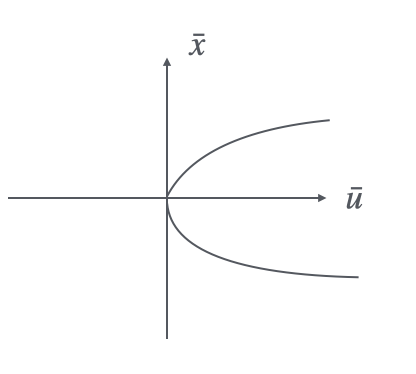

## 1.1 System Formulation
The general continues time and time invariant systems have the following formulations:

$$
\dot{x}(t) = f(x(t), u(t)),
\left\{\begin{aligned}
&x(0) = x_0\\
&t_0 = 0
\end{aligned}\right.
$$

If the system $u(t) = 0$ for all the time, we called the system as autonomous system. The autonomous system have the following formulation:

$$
\dot{x}(t) = f(x(t))
$$

And if the system is a linear system, we can use a linear form to express this system:

$$
\dot{x}(t) = Ax(t) + Bu(t)
$$

## 1.2 Equilibrium
Give the definition of equilibrium of a system:
!!! note
    Giving the equilibrium state $\bar x$, $\exists u = \bar u$, at $t \geq 0$, that makes $f(\bar x, \bar u) = 0$, such a point $(\bar x, \bar u)$ is called equilibrium pair, and $\bar x$ is an isolated equilibrium.

For a general system, the system is equilibria if: $\exists \delta > 0$ that makes $\bar x$ is the only equilibrium contained in the region $B_\delta(\bar{x}) = \{x\in \mathbb{R}^n:||x-\bar{x}||\leq \delta\}$.

To find the equilibrium pairs, we can consider the following 2 conditions:

1. The system is a linear system,

    $$
    \begin{aligned}
    &u(t) = \bar u, t \geq 0\\
    &A\bar x + B\bar u = 0 \\
    \Rightarrow &A\bar x = -B \bar u
    \end{aligned}
    $$

    * if $det(A) \neq 0$, $\bar x = -A^{-1}B\bar u$
    * if $det(A) = 0$, depend on $\bar u$, $\bar x = 0$ or $\bar x = \infty$
  
    !!! example
        $$
        \begin{aligned}
        &\dot{x}(t) = \begin{bmatrix}
        0 & 1\\
        0 & 0
        \end{bmatrix}x(t) + \begin{bmatrix}
        0 \\ 1
        \end{bmatrix}u(t) \\
        &\Rightarrow \left\{\begin{aligned}
        \dot{x}_1(t) &= x_2(t)\\
        \dot{x}_2(t) &= u(t)\\
        \end{aligned}\right.
        \end{aligned}
        $$

        To find the equilibrium, we let $u(t) = \bar u$, for $t \geq 0$, thus, we have:

        $$
        \begin{aligned}
        &\begin{bmatrix}
        0 & 1\\
        0 & 0
        \end{bmatrix} \begin{bmatrix}
        \bar{x}_1\\
        \bar{x}_2
        \end{bmatrix} =- \begin{bmatrix}
        0\\
        1
        \end{bmatrix} \bar{u} \\
        &\Rightarrow \left\{
        \begin{aligned}
        &\text{if } \bar{u} \neq 0 \Rightarrow \bar{x} \text{ not exists }\\
        &\text{if } \bar{u} = 0 \Rightarrow \bar{x} = \begin{bmatrix}
        \alpha\\
        0
        \end{bmatrix}, \alpha \in \mathbb{R}
        \end{aligned}\right.
        \end{aligned}
        $$

2. For a nonlinear system with the form $\dot{x}(t) = f(x(t), u(t))$, we can give the perturbance of the system near the equilibrium pair:

    $$
    \begin{aligned}
    \delta x(t) &= x(t)- \bar{x}\\
    \delta u(t) &= u(t)- \bar{u}
    \end{aligned}
    $$

    Thus, we can get:

    $$
    \begin{aligned}
    \dot{x}(t) &= f(x(t), u(t)) \\
    \delta\dot{x}(t) &= f(\delta x(t) + \bar{x}, \delta u(t) + \bar{u}) \\
    &= \varphi(\delta x(t), \delta u(t))
    \end{aligned}
    $$

    And $(0,0)$ is an equilibrium pair of $\varphi(\delta x(t), \delta u(t))$. $\varphi(0,0) = f(0+\bar{x}, 0+\bar{u}) = 0$.

    To find the equilibrium pair of the system, we still make $u(t) = \bar u$, $\forall t$. Thus, 

    $$
    \dot{x}(t) = f(x(t), \bar{u}) = \varphi_{\bar{u}}(x(t))
    $$

    Solve the $\varphi_{\bar{u}}(x(t)) = 0$, we can find the equilibrium points or ranges.
    !!! example
        $$
        \dot{x}(t) = x^3(t) + u(t)x(t)
        $$

        Let $u(t) = \bar{u}, \forall t$, 

        $$
        \dot{x}(t) = \varphi_{\bar{u}}(x(t)) = -x^3(t) +\bar{u}x(t)
        $$

        And let $\varphi_{\bar{u}}(x(t)) = 0$, 
        
        $$
        \begin{aligned}
        &-\bar{x}^3 + \bar{u}\cdot\bar{x} = 0\\
        &-\bar{x}(\bar{x}^2 - \bar{u}) = 0 \\
        \Rightarrow & \left\{
        \begin{aligned}
        &\text{if } \bar{u} \leq 0 \Rightarrow \bar{x} = 0 \\
        &\text{if } \bar{u} > 0 \Rightarrow \bar{x} = 0 \text{ or } \bar{x} = \pm \sqrt{\bar u} 
        \end{aligned}\right.
        \end{aligned}
        $$

        <figure markdown="span">
            { width="200" }
        </figure>

        