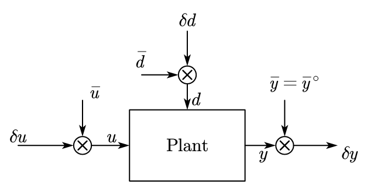
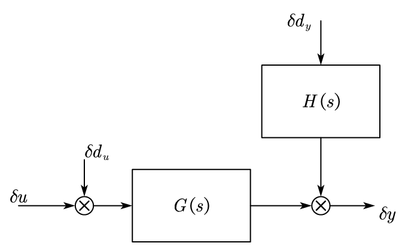
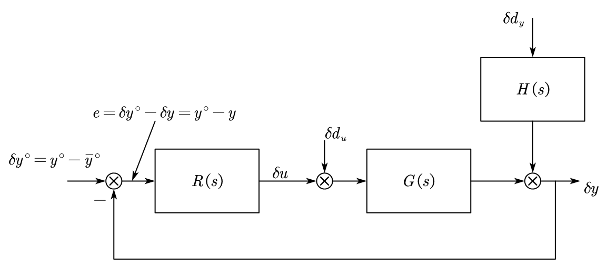
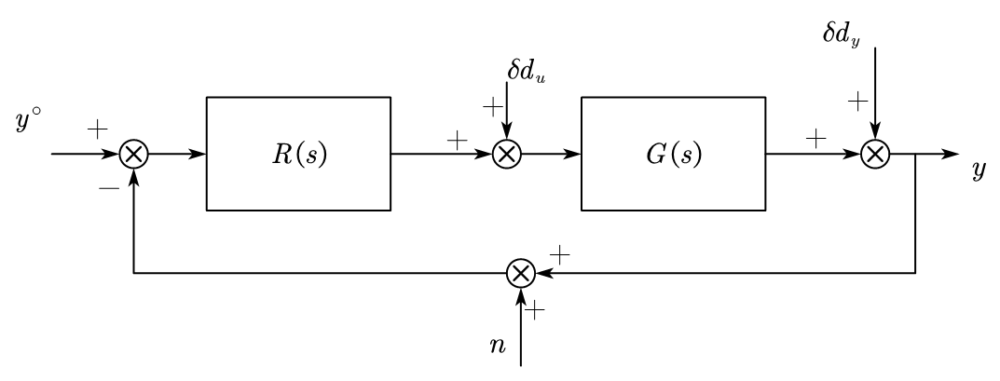
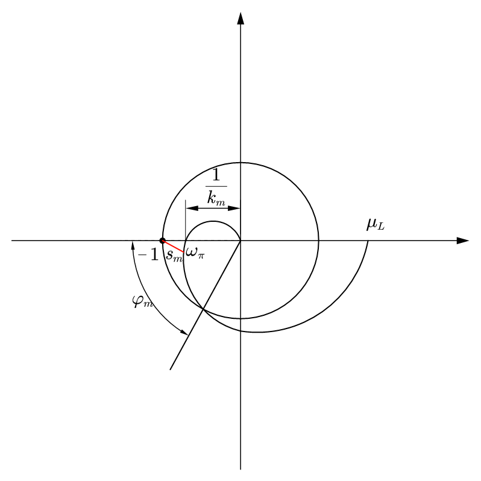
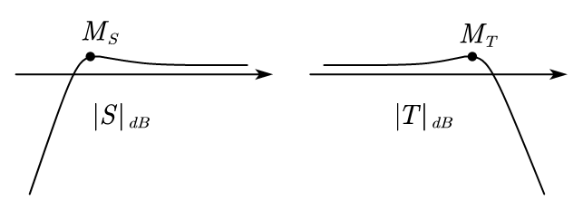
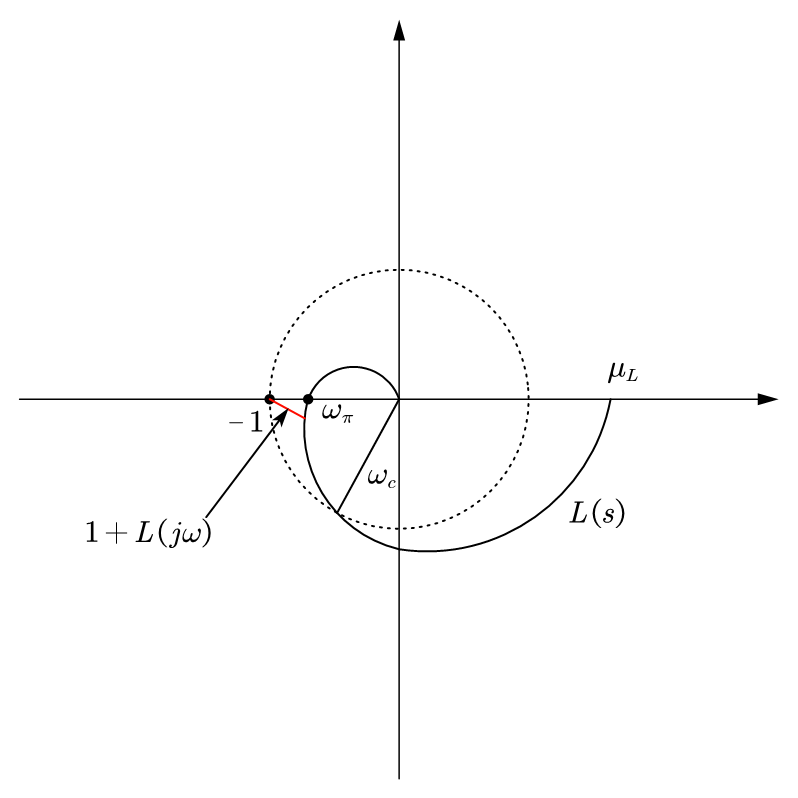
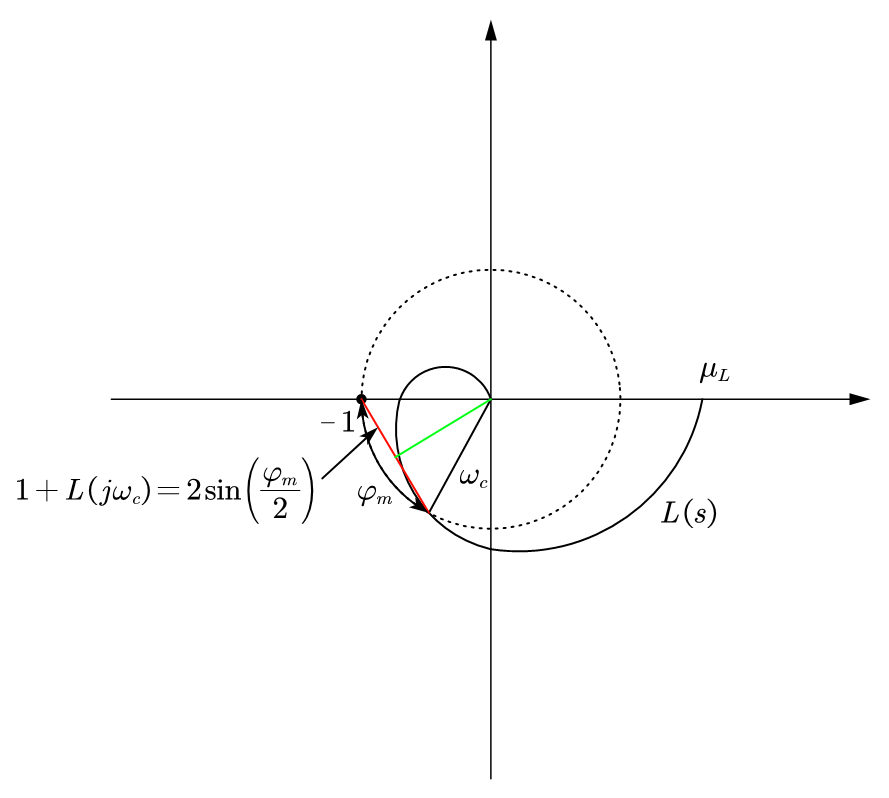

## 1. Control Synthesis Methods

Given the nonlinear model of the system,

$$
\left\{\begin{aligned}
\dot x(t) &= f(x(t), u(t), d(t)) \\
y(t) &= g(x(t), u(t), d(t))
\end{aligned}\right.
$$

Let $\bar y^\circ$ to be the desired value for set-point. consider a equilibrium pair $(\bar x, \bar u)$, have the equilibrium point of $f(x(t), u(t), d(t)) = 0$, $g(x(t), u(t), d(t)) =\bar y^\circ$, we can calculate the linearized model:

$$
\left\{\begin{aligned}
\delta \dot x(t) &= A \delta x(t) + B_u \delta u(t) + B_d \delta d(t)\\
\delta y(t) &= C\delta x(t) + D_u \delta u(t) + D_d \delta d(t)
\end{aligned}\right.
$$

Where $\delta d = d - \bar d$, $\delta u = u - \bar u$, $\delta x = x - \bar x$. Draw the schmetics of the system:

<figure markdown="span">
    { width="400" }
</figure>

To figure out the plant in the figure, we can express our state space function in matrix form:

$$
\begin{aligned}
&\left\{\begin{aligned}
\delta \dot x(t) &= A \delta x(t) + B_u \delta u(t) + \begin{bmatrix} B_u & B_d \end{bmatrix} \begin{bmatrix} \delta d_u(t) \\ \delta d_y(t) \end{bmatrix}\\
\delta y(t) &= C\delta x(t) + D_u \delta u(t) + \begin{bmatrix} D_u & D_d \end{bmatrix} \begin{bmatrix} \delta d_u(t) \\ \delta d_y(t) \end{bmatrix}
\end{aligned}\right. \\
\hfill \\
\Rightarrow & \delta Y(s) = G(s)(\delta U(s) + \delta D_u(s)) + H(s)\delta D_y(s)
\end{aligned}
$$

The system schematic becomes:

<figure markdown="span">
    { width="400" }
</figure>

Our target is to design a regulator $R(s)$ to control the input $\delta u$ within $\delta y$ is affected by the load disturbance $\delta d_u$ and process disturbance $\delta d_y$, and guarantee the stability and performance of the system.

<figure markdown="span">
    { width="600" }
</figure>

This design methods has some drawbacks:

1. The linearized model is a local properity
2. The control scheme depends on $\bar y^\circ$ and $\bar d$, if the value changes, the operating condition changes.

To the robust control design methodology, we neet to implement the controller without $\bar u$ and $\bar y = \bar y^\circ$.

## 2. Sensitivity Functions

We further improving our system schematics, given:

<figure markdown="span">
    { width="600" }
</figure>

For this schematic, we have the system equation:

$$
\begin{aligned}
Y(s) &= T(s)(Y^\circ(s) - N(s)) + S(s)D_y(s) + S(s)G(s)D_u(s) \\
U(s) &= K(s)(Y^\circ(s) - N(s) - D_y(s)) + S(s)D_u(s)
\end{aligned}
$$

Let $L(s) = R(s)G(s)$, we have:

|Description|Formulation|
|---|---|
|Sensitivity function|$S(s) = \frac{1}{1+L(s)}$|
|Complementary sensitiviy function|$T(s) = \frac{L(s)}{1+L(s)}$ |
|Control sensitivity function |$K(s) = \frac{R(s)}{1+L(s)} = R(s)S(s)$|

By looking at the poles of $S(s)$, $T(s)$, $K(s)$, and $G(s)S(s)$, we can check the stability of the system.

### 2.1 Stability Analysis Using Nyquist Criterion

Assume that there have no cancellations in $L(s)$ between singularities with null or positive real part. 

The N&S condition for the system to be A.S. is: 

* The Nyquist diagram of $L(s)$ encircled point $-1+j0$ by $n$ times. $n$ is the number of positive real part poles of $L(s)$.

### 2.2 Bode Criterion

Assume that there have no cancellations in $L(s)$ between singularities with null or positive real part. If:

* $L(s)$ has no positive real part poles
* Exists a unique gain crossover frequency $\omega_c$ (such that $|L(j\omega_c)| = 1$)

The N&S condition for the system to be A.S. is: 

* the static gain $\mu_L$ of $L(s)$ is positive, and
* the phase margin $\varphi_m = \pi - |\angle L(j\omega_c)|$ is positive

### 2.3 Stability Margin

The system is A.S. is not enough for the pratical implementations, we need to do more for the robustness of the control system. The __stability margin__ $s_m$ is a natural index of robustness, which is the shortest distance of the Nyquist diagram to the critical point.

We can represent the gain margin $k_m$ and phase margin $\varphi_m$ in the Nyquist diagram, 

<figure markdown="span">
    { width="400" }
</figure>

## 3. Performance Evaluation within Sensitivity Functions

### 3.1 Complementary Sensitivity Approximations

The complementary sensitivity can be approximated in many cases:

$$
T(s) = \frac{\omega_n^2}{s^2 + 2\xi s + \omega_n^2}
$$

Where $\xi = \sin(\frac{\varphi_m}{2}) \simeq \frac{\varphi_m}{2}$, and $\omega_n \simeq \omega_c$. The small value of $varphi_m$ will leads to an oscillation in the transient, we can give the setting time $T_a \simeq 5 \frac{1}{\xi \omega_c}$. To reduce the oscillation, we must choose a sufficiency high $\varphi_m$.

### 3.2 Sensitivity Design

We recall the system function:

$$
\begin{aligned}
Y(s) &= T(s)(Y^\circ(s) - N(s)) + S(s)D_y(s) + S(s)G(s)D_u(s) \\
U(s) &= K(s)(Y^\circ(s) - N(s) - D_y(s)) + S(s)D_u(s)
\end{aligned}
$$

And the sensitivity function is:

$$
|S(j\omega)| = \frac{1}{|1+L(j\omega)|} \simeq \left\{\begin{aligned}
\frac{1}{|L(j\omega)|}&, & |L(j\omega)| \gg 1, \omega \ll \omega_c \\
1&, & |L(j\omega)| \ll 1, \omega \gg \omega_c
\end{aligned}\right.
$$

* When $|S|$ is small ($|L|$ is big), the spectrum $d_y$ and $d_u$ have a significant harmonic components (low frequency).

The complementary sensitivity function is:

$$
|T(j\omega)| = \frac{|L(j\omega)|}{|1+L(j\omega)|} \simeq \left\{\begin{aligned}
1&, & |L(j\omega)| \gg 1, \omega \ll \omega_c \\
\frac{1}{|L(j\omega)|}&, & |L(j\omega)| \ll 1, \omega \gg \omega_c
\end{aligned}\right.
$$

* When $|T| \simeq 1$ ($|L|$ is big), the spectrum of the reference signal has significant harmonic components (low-midium frequency).
* When $|T|$ is small ($|L|$ is small), the measurement noise $n$ has significant harmonic components (high frequency).

### 3.3 L(s) Design

* $\omega_c \geq \bar \omega_c$ $\Rightarrow$ increase speed of response, reduce low frequency disturbance $d_y$
* $\omega_c \leq \tilde \omega_c$ $\Rightarrow$ limit control action, reduce measurement noise $n$
* $\varphi_m \geq \bar \varphi_m$ $\Rightarrow$ increase stability, robustness, and limit the peaks of $T(j\omega)$
* $g_m \geq \bar g_m$ $\Rightarrow$ increase robustness

### 3.4 Limitaion on Performance

* $T(s) + S(s) = 1$
* There have constraints for the crossover frequency $\omega_c$ when:
    * The system has delay, $e^{-\tau s}G(s)$: the delay will contributes to a negative phase at $\omega_c$, $\varphi_{delay} = -\tau \omega_c$.
    * The system has positive real part zeros, $(1-\tau s)G(s)$, $\tau > 0$: it will limits $\omega_c$ smaller than $\frac{1}{\tau}$, any $\omega_c$ beyond this range will not have an acceptable $\varphi_m$.

## 4. Formulating System Stability within Sensitivity Function

Given the infinity norm of the sensitivity functions:

$$
\begin{aligned}
M_S &= ||S||_\infty = \sup_\omega |S(j\omega)| \\
M_T &= ||T||_\infty = \sup_\omega |T(j\omega)|
\end{aligned}
$$

The bode plot of these functions like below:

<figure markdown="span">
    { width="600" }
</figure>

$S$ behaves like a high pass filter, and $T$ behaves like a low pass filter. $M_S$, $M_T$ is the peak of the bode plot.

### 4.1 Reformulating with stability margin

To reformulate the robustness, we look at the stability margin, given the Nyquist diagram:

<figure markdown="span">
    { width="400" }
</figure>

From the diagram, we can know the stability margin is: $\min_\omega |1 + L(j\omega)|$.

And we know that $S(j\omega) = \frac{1}{1 + L(j\omega)}$, thus we have: $|1 + L(j\omega)| = |S(j\omega)|^{-1}$, we want $|1 + L(j\omega)|$ to be large, $|S(j\omega)|^{-1}$ should be small. This could be expressed as:

$$
M_S \leq \bar M_S
$$

where $\bar M_S$ is the upper bound of the stability margin.

The pick the suitable $|T(j\omega)|$ should be small, $\Rightarrow$ $M_T \leq \bar M_T$. 

$T(s)$ and $S(s)$ are related, there have following relations:

$$
\begin{aligned}
T(s) + S(s) &= 1 \\
|T(j\omega) + S(j\omega)| &= 1, \forall \omega \\
||T(j\omega)| - |S(j\omega)|| &\leq |T(j\omega) + S(j\omega)| = 1, \forall \omega
\end{aligned}
$$

$|M_T - M_S| \leq 1$. A typical choice is: $\bar M_S = 2$, $\bar M_T = 1.5$.

### 4.2 Rephase to Gain Margin

We want to reformulate the system with gain margin, given:

$g_m \geq \bar g_m$ $\Rightarrow$ repharse it in terms of $S$ and $T$.

$$
\begin{aligned}
L(j\omega_\pi) &= -\frac{1}{g_m} \\
|T(j\omega_\pi)| &= \frac{L(j\omega_\pi)}{1+L(j\omega_\pi)} = -\frac{1}{g_m-1} \\
M_T &\geq |T(j\omega_\pi)| = \frac{1}{g_m-1} \\
g_m &\geq 1 + \frac{1}{M_T} \geq  1 + \frac{1}{\bar M_T} \geq \bar g_m
\end{aligned}
$$

and we can know that $g_m \geq \bar g_m$, $\Rightarrow$ $M_T \leq \bar M_T$.

### 4.3 Rephase to Phase Margin

For $M_S$, we have:

$$
\begin{aligned}
M_S &\geq |S(j\omega)| = \frac{1}{|1 - \frac{1}{g_m}|} = \frac{g_m}{g_m - 1} \\
g_m &\geq \frac{M_S}{M_S - 1} \geq \frac{\bar M_S}{\bar M_S - 1} \geq \bar g_m
\end{aligned}
$$

We want to repharse the phase margin $\varphi_m$, we have: $\varphi_m \geq \bar \varphi_m$

<figure markdown="span">
    { width="400" }
</figure>

When $\varphi_m$ is small, we have:

$$
\frac{1}{M_S} \leq |1+L(j\omega_c)| = 2\sin(\frac{\varphi_m}{2}) \simeq \varphi_m
$$

From above equation, we can know: $\varphi_m \geq \frac{1}{M_S}$, 

And we look at the $M_T$, at $\omega_c$, we have $L(j\omega_c) = 1$, thus:

$$
\begin{aligned}
|1+L(j\omega_c)| = |S(j\omega_c)|^{-1} = &|T(j\omega_c)|^{-1} \\
&|T(j\omega_c)| = \frac{|L(j\omega_c)|}{|1+L(j\omega_c)|} = \frac{1}{|1+L(j\omega_c)|}
\end{aligned}
$$

We can get: $\varphi_m \geq \frac{1}{M_S} = \frac{1}{M_T}$.