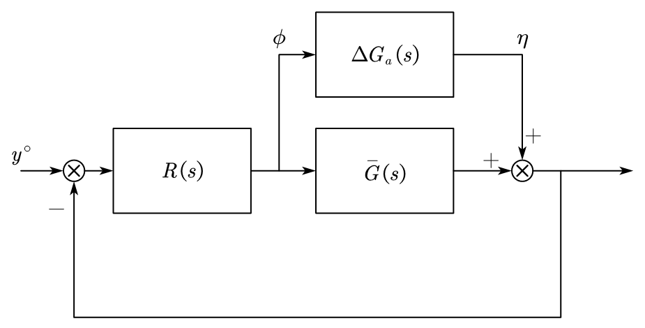

## 1. Review on Sensitivity Functions

First, look at the linear system with disturbance,

<figure markdown="span">
    { width="500" }
</figure>

Give the transfer function of this system:

$$
\begin{aligned}
Y(s) &= T(s)(y^\circ(s)-N(s)) + S(s)D_y(s)+G(s)S(s)D_u(s) \\
U(s) &= K(s)(y^\circ(s)-N(s) - D_y(s)) + S(s)D_u(s)
\end{aligned}
$$

And give the sensitivity functions:

|Description|Formulation|
|---|---|
|Complementary sensitiviy function|$T(s) = \frac{L(s)}{1+L(s)}$ |
|Sensitivity function|$S(s) = \frac{1}{1+L(s)}$|
|Control sensitivity function |$K(s) = R(s)S(s)$|

Where $L(s) = R(s)G(s)$.

We have the Stability margin: $\varphi_m \geq \bar \varphi_m$, $g_m \geq \bar g_m$, 

$\Rightarrow$ $M_T = ||T||_\infty \leq \bar M_T$, $M_S = ||S||_\infty \leq \bar M_S$

And the noise and disturbance distributes like figure below:

<figure markdown="span">
    { width="400" }
</figure>

And we look at the bode diagram of the noise and disturbance distribution,

<figure markdown="span">
    { width="600" }
</figure>

Given a nominal model without considering any disturbance and noise, we have the following schematics:

<figure markdown="span">
    { width="400" }
</figure>

And we designed an $R(s)$ to make this closed loop nominal model A.S.. We want to research the stability of this nominal model at $G(s) \neq \bar G(s)$.

## 2. Additive Uncertainty

We can represent the uncertainty part with nominal part and the error on system:

$$
G(s) = \bar G(s) + \Delta G_\delta(s)
$$

Thus, we can change the system schematics:

<figure markdown="span">
    { width="400" }
</figure>

Assume that: 

1. $\Delta G_\delta (s)$ is A.S. ($\Rightarrow P_G=P_{\bar G}$)
2. There have no zero-pole cancellation between $R(s)$ and $G(s)$ in the positive real part.

Now, we can know the TF of $\eta \to \phi$: $-\frac{R(s)}{1+R(s)\bar G(s)}$

And we can simplify the control schematics:

<figure markdown="span">
    { width="400" }
</figure>

!!! example
    $$
    \begin{aligned}
    \bar G(s) &= \frac{1}{s} \\
    G(s) &= \frac{1}{s} e^{\tau s},\quad (\tau > 0)
    \end{aligned}
    $$
    
    $$
    G(s) = \bar G(s)(1+\Delta G_m(s)) \Rightarrow \Delta G_m(s) = e^{\tau s} - 1
    $$

## 2. Design Specifications in terms of the sensitivity function

Concerning the shape of $S(s)$, 

1. it should be small at low frequency, $\leftarrow$ to compensate the disturbances, amall or null error when tracking a constant $y^\circ$. $M_L$ is integrator in $L(s)$.
2. $\simeq 1$ at high frequency
3. small pick of resonance

* Minimum frequency $\omega_B$,
* $M_S \leq \bar M_S$, where $\bar M_S$ is the robustness of the stability.

This defines a "desired sensitivity function" $S_{desired}(s)$,

We introduce the sensitivity shaping function: $W(s) = S^{-1}_{desired}(s)$

## 3. H-infinity Control Approach

$$
\begin{aligned}
&S(j\omega) < \frac{1}{|W_S(j\omega)|}, \forall \omega \\
\Rightarrow& ||SW_S||_\infty < 1
\end{aligned}
$$

A possible (standard) choice for $W_S$:

$$
W_S(s) = \frac{s/M + \omega_B}{s+A\omega_B}
$$

$A << 1$ is the desired attenuation at low frequency

Design specifications for the complementary function

* shape of $T(s)$
    * $\simeq 1$ at low frequency
    * small at high frequency
    * small pick of resonance

* Max frequency $\omega_{BT}$
* $M_T$ is small enough

Thus, $T_{desired}^{-1}(s) = W_T(s)$, where $W_T$ is the complementary sensitivity shaping function.

$$
\begin{aligned}
&|T(j\omega)| < \frac{1}{W_T(j\omega)}, \forall \omega \\
\Rightarrow& ||SW_S||_\infty < 1
\end{aligned}
$$

A possible (standard) choice for $W_T$ is :

$$
W(s) = \frac{s + \omega_{BT}/M}{As + \omega_{BT}}
$$

And $K_{desired}(s)$ is the desired control sensitivity function, the control sensitivity shaping function is $W_K(s)$,

$$
\begin{aligned}
&K(j\omega) < \frac{1}{|W_K(j\omega)|}, \forall \omega \\
\Rightarrow& ||KW_K||_\infty < 1
\end{aligned}
$$

## 4. H-infinity Control

For $H_\infty$ control, our goal is to design an $R(s)$ such that $||W_SS||_\infty < 1$, $||W_TT||_\infty < 1$, $||W_KK||_\infty < 1$

We can go for more general formulation of $H_\infty$ control,

Missing figure 

Where $z = \begin{bmatrix} z_S & z_T & z_K \end{bmatrix}^T$ is performance variables. $W$ is external signals, and we have: $z = \underbrace{\begin{bmatrix} W_SS & W_TT & W_KK \end{bmatrix}^T}_{G_{ZW}} w$

Now, our goal is to design $R(s)$ to minimize $||G_{ZW}||_\infty$, so that if you obtain that $||G_{ZW}||_\infty < \gamma$, we have $||W_SS||_\infty < \gamma$.

$$
||G_{ZW}||_2^2 = \frac{1}{2\pi} \int_{-\infty}^{\infty} |G_{ZW}(j\omega)|^2 d\omega
$$

$$
W = \begin{bmatrix} du \\ dy \\ y^\circ \\ n \end{bmatrix}
$$

is the vector of exogenous signals, and $u$ is the control input, $v$ is the measured variable.

Missing Figure

Design $R(s)$ such that the $H_2/H_\infty$ norm of the transfer matrix $G_{ZW}$ between $W$ and $Z$ is minimized. 