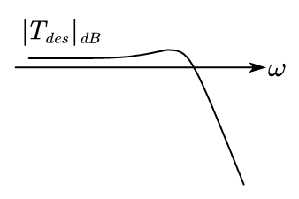

## 1. Review on Sensitivity Functions

First, look at the linear system with disturbance,

<figure markdown="span">
    { width="500" }
</figure>

Give the transfer function of this system:

$$
\begin{aligned}
Y(s) &= T(s)(y^\circ(s)-N(s)) + S(s)D_y(s)+G(s)S(s)D_u(s) \\
U(s) &= K(s)(y^\circ(s)-N(s) - D_y(s)) + S(s)D_u(s)
\end{aligned}
$$

And give the sensitivity functions:

|Description|Formulation|
|---|---|
|Complementary sensitiviy function|$T(s) = \frac{L(s)}{1+L(s)}$ |
|Sensitivity function|$S(s) = \frac{1}{1+L(s)}$|
|Control sensitivity function |$K(s) = R(s)S(s)$|

Where $L(s) = R(s)G(s)$.

We have the Stability margin: $\varphi_m \geq \bar \varphi_m$, $g_m \geq \bar g_m$, 

$\Rightarrow$ $M_T = ||T||_\infty \leq \bar M_T$, $M_S = ||S||_\infty \leq \bar M_S$

And the noise and disturbance distributes like figure below:

<figure markdown="span">
    { width="400" }
</figure>

And we look at the bode diagram of the noise and disturbance distribution,

<figure markdown="span">
    { width="600" }
</figure>

## 2. Additive Uncertainty

Given a nominal model without considering any disturbance and noise, we have the following schematics:

<figure markdown="span">
    { width="400" }
</figure>

And we designed an $R(s)$ to make this closed loop nominal model A.S.. We want to research the stability of this nominal model at $G(s) \neq \bar G(s)$.

We can represent the uncertainty part with nominal part and the error on system:

$$
G(s) = \bar G(s) + \Delta G_a(s)
$$

Thus, we can change the system schematics:

<figure markdown="span">
    { width="400" }
</figure>

Assume that: 

1. $\Delta G_a (s)$ is A.S. ($\Rightarrow P_G=P_{\bar G}$)
2. There have no zero-pole cancellation between $R(s)$ and $G(s)$ in the positive real part.

Now, we can know the TF of $\eta \to \phi$: $-\frac{R(s)}{1+R(s)\bar G(s)}$

And we can simplify the control schematics:

<figure markdown="span">
    { width="400" }
</figure>

There have: $\frac{R(s)}{1+R(s)\bar G(s)} = R(s)\bar S(s) = \bar K(s)$, is A.S.

To make the system above stable, we need to meet the condition: $||\Delta G_a(s)\bar K(s)||_\infty < 1$, we can draw the Nyquist diagram to explain this condition is a sufficient condition to A.S.:

<figure markdown="span">
    { width="400" }
</figure>

For the infinity norm, there have: $||\Delta G_a(s)\bar K(s)||_\infty = \sup_\omega |\Delta G_a(s)\bar K(s)|$. And within the Nyquist stability theorem and the given condition, $\Delta G_a(s)\bar K(s)$ will have no contact to $(-1+j0)$ point, the system is A.S.. But this is not a necessary condition for the stability, because even if $||\Delta G_a(s)\bar K(s)||_\infty \geq 1$, the system could still be stable.

To get the condition above, we can get $|\bar K(j\omega)| < \frac{1}{|\Delta G_a(j\omega)|}, \forall \omega$ $\Rightarrow$ $|\bar K(j\omega)|$ is small when $|\Delta G_a(j\omega)|$ is big (typically in low frequency). And because $|\bar K(j\omega)| = |R(s)\bar||S(s)|$, then $M_S$ is small.

## 3. Multiplcative Uncerntainty

Given the TF,

$$
G(s) = \bar G(s)(1+\Delta G_m(s))
$$

And the schematic below:

<figure markdown="span">
    { width="600" }
</figure>

Assume that $\Delta G_m(s)$ is A.S. $(P_G=P_{\bar G})$.

The TF from $\eta \to \phi$: $-\frac{R(s)\bar G(s)}{1+R(s)\bar G(s)} = -\bar T(s)$. The system schematic can be changed to:

<figure markdown="span">
    { width="400" }
</figure>

The condition of stability is: $||\bar T \Delta G_m||_\infty < 1$.

And to satisfy the condition, we can let ($|\bar T| < \frac{1}{|\Delta G_m|}, \forall \omega$) $\Rightarrow$ ($M_T < \frac{1}{|\Delta G_m|}, \forall \omega$), $M_T$ should be small.

!!! example
    $$
    \begin{aligned}
    \bar G(s) &= \frac{1}{s} \\
    G(s) &= \frac{1}{s} e^{\tau s},\quad (\tau > 0)
    \end{aligned}
    $$
    
    $$
    G(s) = \bar G(s)(1+\Delta G_m(s)) \Rightarrow \Delta G_m(s) = e^{\tau s} - 1
    $$

    We can draw the bode plot:

    <figure markdown="span">
        { width="400" }
    </figure>

    And we continue with additive uncertainty, which gives:

    $$
    G(s) = \bar G(s) +\Delta G_a(s) \Rightarrow \Delta G_a(s) = \frac{1}{s}(e^{\tau s} - 1)
    $$

    Within the $H_\infty$ norm, we have $||\bar K \Delta G_a||_\infty < 1$, we should design a $\bar K$ shown in the bode plot:

    <figure markdown="span">
        { width="400" }
    </figure>

    
!!! example
    $$
    \left\{\begin{aligned}
    G(s) &= \frac{\bar K + \Delta K}{s + a} \\
    \bar G(s) &= \frac{\bar K}{s + a}
    \end{aligned}\right., a > 0
    $$

Given the bode plot for $|S|$ and $|T|$,

<figure markdown="span">
    { width="600" }
</figure>

* $\omega_{BS}$ is the frequency where $|S|_{dB}$ crosses $-3dB$ line from below , and 

* $\omega_{BT}$ is the frequency where $|T|_{dB}$ crosses $-3dB$ line from above.

And the phase margin for this system have: $\varphi_m < 90^\circ$, and $\omega_{BS} < \omega_c < \omega_{BT}$.

## 2. Design Specifications in Terms of the Sensitivity Function

For the design specifications, we need to concern about:

* the shape of $S(s)$:

    1. small at low frequency, $\leftarrow$ for compensating the disturbances, small or null error when tracking a constant $y^\circ$. $\leftarrow$ $M_L$ is large, integrator in $L(s)$.
    2. $\simeq 1$ at high frequency
    3. small pick of resonance

* Minimum frequency $\omega_B$,
* $M_S \leq \bar M_S$, where $\bar M_S$ is the robustness of the stability.

These specifications defines a "desired sensitivity function" $S_{des}(s)$, and its bode plot:

<figure markdown="span">
    { width="300" }
</figure>

We introduce the sensitivity shaping function: $W_S(s) = S^{-1}_{des}(s)$.

### 2.1. H-infinity Control Approach

We want to find a regulator $R(s)$ that satisfying:

$$
\begin{aligned}
&|S(j\omega)| < \frac{1}{|W_S(j\omega)|}, \forall \omega \\
\Rightarrow& ||SW_S||_\infty < 1
\end{aligned}
$$

A possible (standard) choice for $W_S$:

$$
W_S(s) = \frac{s/M + \omega_B}{s+A\omega_B}
$$

We can draw the bode plot:

<figure markdown="span">
    { width="400" }
</figure>

* We want $|\frac{1}{A}|$ to be high, $A \ll 1$ $\Rightarrow$ desired attenuation at low frequency
* $M$ relates to $M_S$

## 3. Design Specifications in Terms of the Complementary Sensitivity Function

For the design specifications, we need to concern about:

* shape of $T(s)$
    1. $\simeq 1$ at low frequency
    2. small at high frequency
    3. small pick of resonance

* Max frequency $\omega_{BT}$
* $M_T$ is small enough

We can draw the desired bode plot for $T(s)$,

<figure markdown="span">
    { width="300" }
</figure>

Give the complementary sensitivity shaping function: $W_T(s) = T_{des}^{-1}(s)$.

$$
\begin{aligned}
&|T(j\omega)| < \frac{1}{W_T(j\omega)}, \forall \omega \\
\Rightarrow& ||TW_T||_\infty < 1
\end{aligned}
$$

A possible (standard) choice for $W_T$ is:

$$
W(s) = \frac{s + \omega_{BT}/M}{As + \omega_{BT}}
$$

And the bode diagram:

<figure markdown="span">
    { width="300" }
</figure>

$A$ is desired attenuation at high frequency.

We can do the same for the control sensitivity function: $W_K(s) = K_{des}^{-1}(s)$.

$$
\begin{aligned}
&K(j\omega) < \frac{1}{|W_K(j\omega)|}, \forall \omega \\
\Rightarrow& ||KW_K||_\infty < 1
\end{aligned}
$$

## 4. General H-infinity Control Approach

To design a $H_\infty$ controller, our goal is to design a $R(s)$ such that:

$$
\begin{aligned}
||W_SS||_\infty &< 1 \\
||W_TT||_\infty &< 1 \\
||W_KK||_\infty &< 1
\end{aligned}
$$

To go for more general formulation of $H_\infty$ control, we draw the system schematics:

<figure markdown="span">
    { width="400" }
</figure>

Where $z = \begin{bmatrix} z_S & z_T & z_K \end{bmatrix}^T$ is the performance variables. $w$ is external signals, and we have: $z = \underbrace{\begin{bmatrix} W_SS & W_TT & W_KK \end{bmatrix}^T}_{G_{ZW}} w$

Now, our goal is to design $R(s)$ to minimize $||G_{ZW}||_\infty$, so that if you obtain that $||G_{ZW}||_\infty < \gamma$, $\Rightarrow$ $||W_SS||_\infty < \gamma$, $||W_KK||_\infty < \gamma$, $||W_TT||_\infty < \gamma$.

### 4.1 H-2 Control

For $H_2$ control, we want to design a $R(s)$ for minimizing:

$$
||G_{ZW}||_2^2 = \frac{1}{2\pi} \int_{-\infty}^{\infty} |G_{ZW}(j\omega)|^2 d\omega
$$

Give the extrogendous signals:

$$
W = \begin{bmatrix} du \\ dy \\ y^\circ \\ n \end{bmatrix}
$$

and $u$ is the control input, $v$ is the measured variable.

<figure markdown="span">
    { width="400" }
</figure>

Design $R(s)$ such that the $H_2/H_\infty$ norm of the transfer matrix $G_{ZW}$ between $W$ and $Z$ is minimized. 