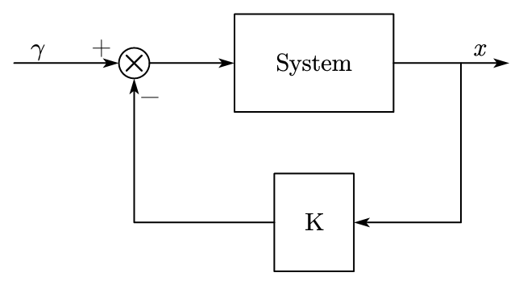
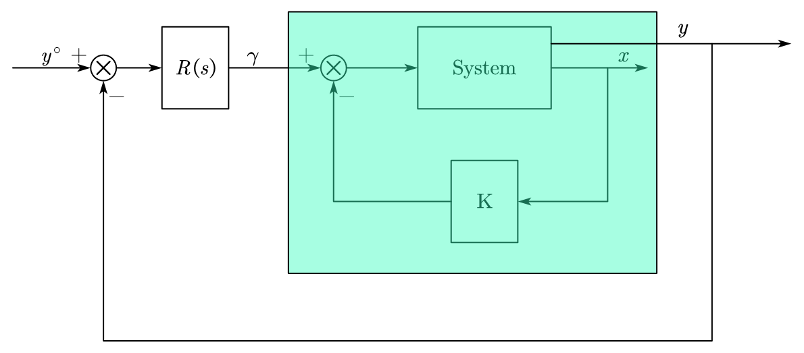
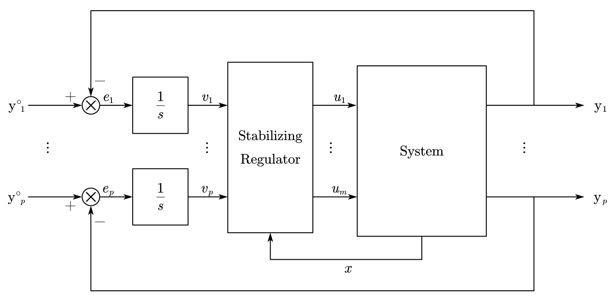
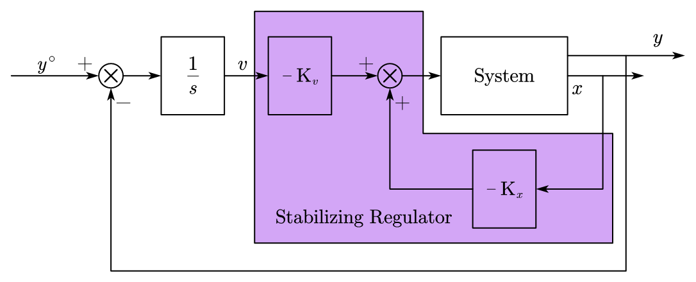
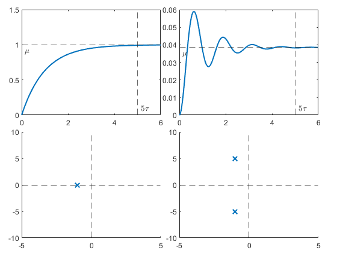
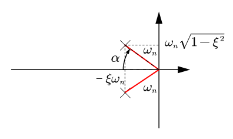

## 1. Pole Placement (Pole Assignment) Method

Given a linear system with the state space equation:

$$
\begin{aligned}
\dot x(t) &= Ax(t) + Bu(t) \\
\end{aligned}
$$

Assume the state is measurable, given the control law:

$$
u(t) = -Kx(t) + \gamma(t)
$$

The feedback control scheme is:

<figure markdown="span">
    { width="300" }
</figure>

This state feedback control could change the system performance and become a new system, we can design a controller based on this new system:

<figure markdown="span">
    { width="500" }
</figure>

Given the enlarged system description:

$$
\dot x_e(t) = Ax_e(t) + Bu(t)
$$ 

* $x_e = \begin{bmatrix} x \\ v \end{bmatrix}$

We recall the MIMO system design in the previous part:

<figure markdown="span">
    { width="500" }
</figure>

For the stabilizing regulator, there have:
 
$$
u = -Kx_e = - \begin{bmatrix} K_x & K_v \end{bmatrix} \begin{bmatrix} x \\ v \end{bmatrix}
$$

By knowing the control law, we can rearrange the control scheme:

<figure markdown="span">
    { width="500" }
</figure>

Replace $u = -Kx(t) + \gamma(t)$ term into the state space equation, we can get:

$$
\begin{aligned}
\dot x(t) &= Ax(t) - BKx(t) + B\gamma(t) \\
&= (A-BK)x(t) + B\gamma(t)
\end{aligned}
$$

The goal of the pole-placement control is:

* Choose a suitable $K$ to set the eigenvalues of $A-BK$ in arbitrarily selected positions.
* An N&S condition for such a $K$ to exist is $(A,B)$ is reachable.


!!! info
    __Proof (necessity)__:

    Assume that $(A,B)$ is not reachable

    $$
    \begin{aligned}
    \begin{bmatrix} \dot x_R \\ \dot x_{NR} \end{bmatrix} = 
    \begin{bmatrix} A_R&A_X \\ 0&A_{NR} \end{bmatrix}
    \begin{bmatrix} x_R \\ x_{NR} \end{bmatrix} + 
    \begin{bmatrix} B_R \\ 0 \end{bmatrix}u
    \end{aligned}
    $$

    And we can design the controller 
    $u = -\begin{bmatrix} K_R & K_{NR} \end{bmatrix} 
    \begin{bmatrix} x_R \\ x_{NR} \end{bmatrix}$
    , replace it to the system dynamics:

    $$
    \begin{aligned}
    \begin{bmatrix} \dot x_R \\ \dot x_{NR} \end{bmatrix} = 
    \begin{bmatrix} A_R-B_RK_R&A_X-B_RK_{NR} \\ 0&A_{NR} \end{bmatrix}
    \begin{bmatrix} x_R \\ x_{NR} \end{bmatrix}
    \end{aligned}
    $$

    And the eigenvalues of $A-BK$ are $\text{eig}(A_R-B_RK_R)\cup \text{eig}(A_X-B_RK_{NR})$

    ---
    __Proof (Sufficiency)__:

    Assume $(A,B)$ is reachable, $m = 1$, $\exists T_{n\times n}$, $\det(T) \neq 0$, such that $\tilde x = Tx$.

    The controllable canonical form of the system have:

    $$
    \tilde A = TAT^{-1} = 
    \left[\begin{array}{c:c}
    \mathbf{0} & \mathbf{I}_{n-1} \\ \hdashline
    -a_0 & \begin{matrix} -a_1&\cdots&-a_{n-1}\end{matrix}
    \end{array}\right]
    $$

    The system characteristic polynomial is:

    $$
    p_A(\lambda) = p_{\tilde A}(\lambda) = \lambda^n + a_{n-1}\lambda^{n-1}+\dots+a_1\lambda + a_0
    $$

    And the controllable canonical form also gives:

    $$
    \begin{aligned}
    \tilde B &= TB = \begin{bmatrix} 0 \\ \vdots \\ 0 \\ 1\end{bmatrix}
    \end{aligned}
    $$

    Given the state feedback control law:

    $$
    u(t) = -\tilde K \tilde x(t) + \gamma(t)
    $$

    Thus we have:

    $$
    \tilde A - \tilde B \tilde K = 
    \left[\begin{array}{c:c}
    \mathbf{0} & \mathbf{I}_{n-1} \\ \hdashline
    (-a_0-\tilde K_0) & \begin{matrix} (-a_1-\tilde K_1)&\cdots&(-a_{n-1}-\tilde K_{n-1})\end{matrix}
    \end{array}\right]
    $$

    The characteristic polynomial of the closed loop system is:

    $$
    \begin{aligned}
    p_{\tilde A - \, \tilde B \tilde K}(\lambda) &= p_{A-BK}(\lambda) = \lambda^n + (a_{n-1}+\tilde K_{n-1})\lambda^{n-1}+\dots+(a_1 + \tilde K_1)\lambda + (a_0 + \tilde K_0) \\
    \end{aligned}
    $$

    And we want to design system into a desired characteristic polynomial function:

    $$
    p_n^*(\lambda) = \prod_{i=1}^n(\lambda - \lambda_i^*) = \lambda^n + \alpha_{n-1}\lambda^{n-1} + \dots + \alpha_0
    $$

    * $\lambda_i^*$ is desired eigenvalues

    We determine the $\tilde K_i = \alpha_i - a_i$, $i=0,\dots,n-1$, and $K=\tilde K T$, in the MIMO case, where $m > 1$, $(A, B)$ is reachable,

    * if $(A, b_i)$ is reachable 

        $$
        \begin{aligned}
        u_j(t) &= 0, &\forall j \neq i \\
        u_i(t) &= -K_ix(t) + \gamma(t) \\
        K &= \begin{bmatrix} 0 & \cdots & K_i & \cdots & 0\end{bmatrix}^T &
        \end{aligned}
        $$

__Steps (Single Input)__:

1. Compute $p^*(\lambda)$ based on the desired set of $n$ eigenvalues, $\lambda_i^*$, $i=1,\dots,n$
2. Compute $p_A(\lambda)$
3. Build $\tilde A$, $\tilde B$ in controllable canonical form
4. Determine the $M_R$ and $\tilde M_R$ $\Rightarrow$ $T = \tilde M_R M_R^{-1}$, where:

    $$
    \begin{aligned}
    M_R &= \begin{bmatrix} B&AB&\cdots&A_{n-1}B\end{bmatrix} \\
    \tilde M_R &= \begin{bmatrix} \tilde B&\tilde A\tilde B&\cdots&\tilde A_{n-1}\tilde B\end{bmatrix} = TM_R\\
    \end{aligned}
    $$

    Where $\tilde A = TAT^{-1}$, and $\tilde B = TB$

5. $\tilde K = \begin{bmatrix} (\alpha_0-a_0) & \cdots & (\alpha_{n-1}-a_{n-1})\end{bmatrix}$
6. $K=\tilde KT$

### 1.1 Ackermann's Formula:

$$
K = \begin{bmatrix} 0&\cdots&0&1\end{bmatrix}M_R p^*(A)
$$

where:

* $p^*(\lambda) = \lambda^n + \alpha_{n-1}\lambda^{n-1} + \dots + \alpha_0$
* $p^*(A) = A^n + \alpha_{n-1}A^{n-1} + \dots + \alpha_0I$

!!! example
    $$
    \begin{aligned}
    &A = \begin{bmatrix} -1&3\\0&2 \end{bmatrix}
    &B = \begin{bmatrix} 1\\2 \end{bmatrix} \\
    &\lambda_1^* = -3 & \lambda_2^* = -4
    \end{aligned}
    $$

    __Method 1__:

    * $p^*(\lambda) = (\lambda + 3)(\lambda + 4) = \lambda^2 + 7\lambda + 12$

    * $M_R = \begin{bmatrix} 1&5\\2&4 \end{bmatrix}$
    * $(A,B)$ is reachable,

    $$
    K = \begin{bmatrix} 0\\1 \end{bmatrix}
    \begin{bmatrix}-\frac46 &\frac56 \\ \frac26 &-\frac16 \end{bmatrix}
    (A^2+7A+12I)=\begin{bmatrix} 2&3 \end{bmatrix}
    $$

    __Method 2__:

    * $(A, B)$ is reachable

    $$
    \begin{aligned}
    A-BK &= \begin{bmatrix} -1-K_1 & 3-K_2 \\ -2K_1 & 2-2K_2 \end{bmatrix} \\
    p_{A-BK}(\lambda) &= \det(\lambda I - (A-BK)) \\
    &= \lambda^2 + (-1+K_1+2K_2) + 4K_1 + 2K_2 - 2
    \end{aligned}
    $$


    * $p^*(\lambda) = \lambda^2 + 7\lambda + 12$
    
    $$
    \left\{\begin{aligned}
    -1 + K_1 + 2K_2 = 7 \\
    4K_1 + 2K_2 - 2 = 12
    \end{aligned}\right. \rightarrow 
    \left\{\begin{aligned}
    K_1=2 \\
    K_2=3
    \end{aligned}\right.
    $$

### 1.2 Effect of Poles on the System Response

The poles have the effect on the transient in the step response:

<figure markdown="span">
    { width="400" }
</figure>

For the complex poles, the system will oscillates, the maximum value in the transient state could be calculated:

$$
s = \frac{y_{\max} - \mu}{\mu} = \exp(\frac{\pi \xi}{\sqrt{1 - \xi^2}})
$$

In a conjugate complex poles system, 

* The natural frequency $\omega_n$ is the length between poles to the origin.
* The damping $\xi$ is associated to the angle $\alpha$ in the figure, $\xi = \cos\alpha$

<figure markdown="span">
    { width="400" }
</figure>

In practice, to realize the pole-placement control, it could be done by executing the matlab function:
```matlab
[k, precision] = place(A, B, P)
```