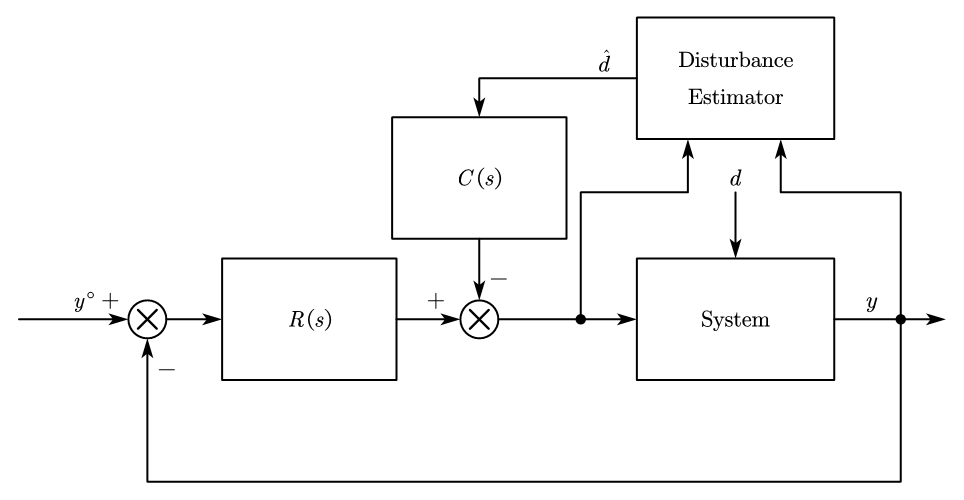
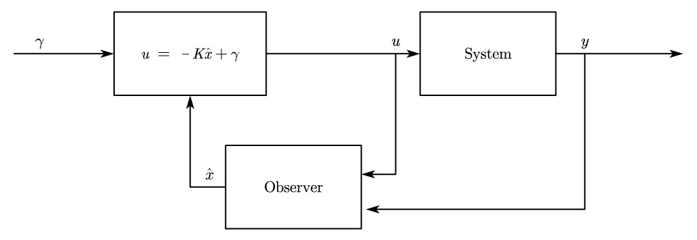
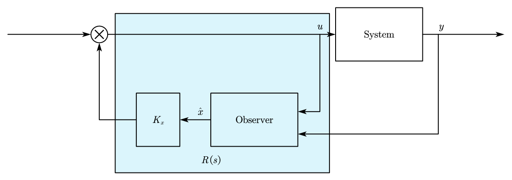
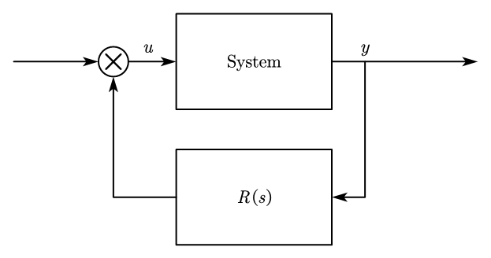
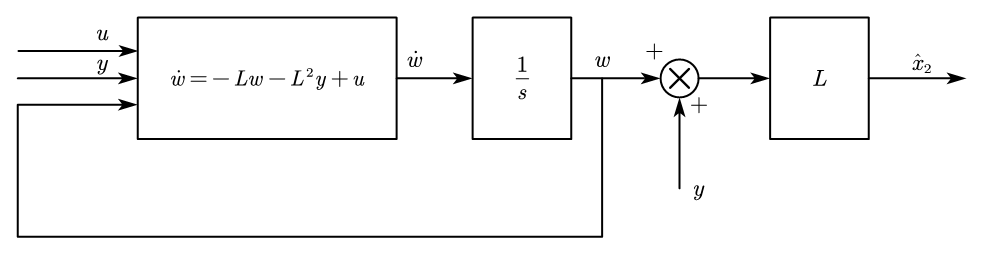
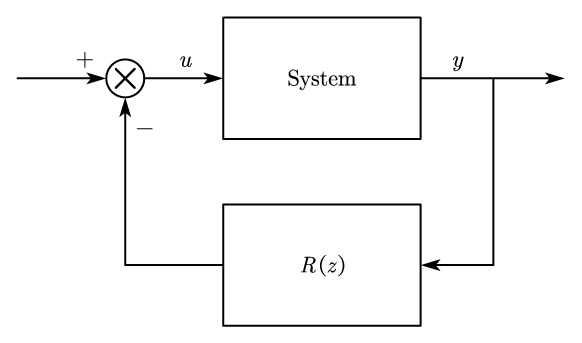

## 1. State Observer (Luenburger Observer (LO) )
### 1.1 Nominal LO Design
Given a linear system,

$$
\begin{aligned}
\dot x(t) &= Ax(t) + Bu(t) \\
y(t) &= Cx(t) + Du(t)
\end{aligned}
$$

Since states cannot be measured directly, we can design a state observer to get the unknown states,

$$
\dot {\hat x} = A\hat x + Bu + L\underbrace{(y-C\hat x -Du)}_{\text{output estimation error}}
$$

* $\hat x$ is the state estimation

Given the state estimation error $e = x - \hat x$, there have:

$$
\begin{aligned}
\dot e &= \dot x - \dot{\hat x} \\
&= Ax + Bu - A \hat x - Bu - L(Cx+Du-C\hat x -Du) \\
&= (A-LC)e
\end{aligned}
$$

The eigenvalue for $(A-LC)$ have: 

$$
\text{eig}(A-LC) = \text{eig}(A-LC)^T = \text{eig}(A^T-C^TL^T)
$$

we can let:

* $\tilde A = A^T$
* $\tilde B = C^T$
* $\tilde K = L^T$

thus we have: $A^T-C^TL^T = \tilde A - \tilde B \tilde K$, Given the observable matrix:

$$
\begin{aligned}
&M_O = \begin{bmatrix} C \\ CA \\ \vdots \\ CA^{n-1}\end{bmatrix} \Rightarrow M_O^T = \begin{bmatrix} \tilde B & \tilde A \tilde B & \cdots & \tilde A^{n-1} \tilde B\end{bmatrix}
\end{aligned}
$$

A N&S condition for the design of an asymptotic observer with arbitrarily specified eigenvalue of the estimation error dynamics is that $(A,C)$ is observable.

Given a system $p = 1$, we can apply Ackermann's formula,

$$
L^T = \begin{bmatrix} 0&\cdots&0&1\end{bmatrix}(M_O^T)^{-1} p^*(A^T)
$$

When the system with $p > 1$, $C  = \begin{bmatrix} C_1 \\ \vdots \\ C_p \end{bmatrix}$

If $(A,C)$ is observable, $\Rightarrow$ $\exists i$, such that $(A, C_i)$ that is observable. We can apply Ackermann's formula on $(A,C_i)$:

$$
\begin{aligned}
L &= \begin{bmatrix} L_1&\cdots&L_p\end{bmatrix} \\
&= \begin{bmatrix} 0&\cdots&0&L_i&0&\cdots&0\end{bmatrix}
\end{aligned}
$$

### 1.2 LO for the System With Disturbances
Given the linear system with disturbances,

$$
\begin{aligned}
&\dot x = Ax + Bu + Md, &x\in\Re^n, u\in\Re^m\\
&y = Cx + Du + Nd, &y\in\Re^p, d\in\Re^r
\end{aligned}
$$

* If $d$ is measurable, we can calculate the estimation error directly:

    $$
    \dot{\hat x} = A \dot{\hat x} + Bu + Md + L(y - C\hat x - Du - Nd)
    $$

    We let $e=x - \hat x$, thus we have:$\dot e=(A-LC)e$

* If $d$ is not measurable:

    $$
    \begin{aligned}
    \dot{\hat x} &= A \dot{\hat x} + Bu + L(y - C\hat x - Du) \\
    e &= x - \hat x \\
    \dot e &= (A-LC) e + (M-LN) d
    \end{aligned}
    $$

    If $d(t) = \bar d$, $\forall t \geq 0$,

    $$
    e_\infty = -(A-LC)^{-1} (M-LN) \bar d
    $$

We can draw the system schematic:

<figure markdown="span">
    { width="600" }
</figure>

### 1.3 Estimation of Constant Disturbances via Observer Design
Motivations:

1. You can estimate the state correctly
2. You can use the disturbances estimation for the disturbance compensation

Consider a system with disturbance:

<figure markdown="span">
    { width="400" }
</figure>

To eliminate the disturbance, we can design a disturbance estimator:

<figure markdown="span">
    { width="400" }
</figure>

If the disturbance is constant, $d(t) = \bar d$, $\forall t$, 

$$
\begin{aligned}
&\dot x = Ax + Bu + Md, &x\in\Re^n, u\in\Re^m\\
&y = Cx + Du + Nd, &y\in\Re^p, d\in\Re^r
\end{aligned}
$$

Since $d$ is constant, $\dot d = 0$, and we have:

$$
\begin{aligned}
\begin{bmatrix} \dot x \\ \dot d \end{bmatrix} &= 
\underbrace{\begin{bmatrix} A&M \\ 0&0 \end{bmatrix}}_{\tilde A}
\begin{bmatrix} x \\ d \end{bmatrix} + 
\underbrace{\begin{bmatrix} B \\ 0 \end{bmatrix}}_{\tilde B} u \\
y &= \underbrace{\begin{bmatrix} C&N \end{bmatrix}}_{\tilde C}
\begin{bmatrix} x \\ d \end{bmatrix} + \underbrace{D}_{\tilde D} u
\end{aligned}
$$

The condition should be satisfied for designing the observer:

* $(\tilde A, \tilde C)$ must be observable $\Leftrightarrow$ $(A,C)$ is observable

* $\text{rank}\begin{bmatrix} A&M \\ 0&0 \end{bmatrix} = n+r \left\{\begin{aligned} 
&r \leq p \quad \text{more output than disturbances} \\
&\text{No invariant zero in 0 in the transfer matrix for } d \text{ to } y
\end{aligned}\right.$

---
__What are the close loop eigenvalues?__

<figure markdown="span">
    { width="500" }
</figure>

We assume the order of the system is $n$, 

$$
\begin{aligned}
\text{system:}&\quad \left\{\begin{aligned}
&\dot x = Ax + Bu \\
&y = Cx + Du
\end{aligned}\right. \\
\text{control law:}&\quad u = -K\hat x + \gamma \\
\text{observer:}&\quad \dot{\hat x} = A \hat x + Bu + L(y-C\hat x -Du)
\end{aligned}
$$

Apply the controller and observer to the system:

$$
\begin{aligned}
\dot x &= Ax - BK \hat x + B\gamma \\
\dot {\hat x} &= A\hat x -BK\hat x + B \gamma + L(y-C\hat x)
\end{aligned} \\
$$

Since we have: $e = x - \hat x$,

$$
\left\{\begin{aligned}
\dot x &= (A-BK)x + BKe + B\gamma \\
\dot e &= (A-LC)e
\end{aligned}\right.
$$

### 1.4 Separation Principle
We can let:

$$
\tilde A = \begin{bmatrix} A-BK&BK \\ 0&A-LC \end{bmatrix}
$$

The eigenvalue of $\tilde A$ are the union of the eigenvalue of $A-BK$ and $A-LC$, it means that we can design controller and observer independently.

## 2. Stabilizing Regulator Transfer Matrix

<figure markdown="span">
    { width="500" }
</figure>

We replaced observer with the transfer matrix $R(s)$, 

<figure markdown="span">
    { width="300" }
</figure>

to find the expression of $R(s)$,

$$
\begin{aligned}
\text{control law: }& \quad u = -K\hat x \\
\text{observer: }& \quad \dot{\hat x} = A \hat x + Bu + L(y-C\hat x)
\end{aligned}
$$

We have:

$$
\begin{aligned}
\dot{\hat x} &= \overbrace{(A-BK-LC)}^{\tilde A} \hat x + \overbrace{L}^{\tilde B}y  \\
u &= \underbrace{-K}_{\tilde C}\hat x
\end{aligned}
$$

The transfer matrix is:

$$
R(s) = K(sI - (A-BK-LC))^{-1}L
$$

## 3. Reduced Order Observer (RO)
For the linear system with the state space equation below:

$$
\left\{\begin{aligned}
\dot x &= Ax + Bu \\
y &= Cx
\end{aligned}\right.
$$

We can transfer the system into canonical form,

$$
\begin{aligned}
\tilde x &= Tx \\
\tilde A &= TAT^{-1} \\
\tilde B &= TB \\
\tilde C &= CT^{-1} = \begin{bmatrix} \mathbf I&\mathbf 0 \end{bmatrix}
\end{aligned}
$$

* $T = \begin{bmatrix} C \\ T_1 \end{bmatrix}$, $\det T \neq 0$
* $(A,C)$ should be observable

We have the output part $y$ and other unknown states $x_v$, $\tilde x = \begin{bmatrix} y \\ \tilde x_v \end{bmatrix}$, thus:

$$
\begin{aligned}
\dot y &= \tilde A_{11}y + \tilde A_{12} \tilde x_v + \tilde B_1 u \\
\dot {\tilde x}_v &= \tilde A_{21}y + \tilde A_{22}\tilde x_v + \tilde B_2 u
\end{aligned}
$$

We can let:

* $z = \dot y - \tilde A_{11}y - \tilde B_1 u = \tilde A_{12} \tilde x_v$
* $\eta = \tilde A_{21}y + \tilde B_2 u$

and we can simplify the system:

$$
\left\{\begin{aligned}
&\dot {\tilde x}_v = \tilde A_{22}\tilde x_v + \eta \\
&z = \tilde A_{12} \tilde x_v
\end{aligned}\right.
$$

Now this new system have $n-p$ states,

$$
\begin{aligned}
\dot{\hat{\tilde x}}_v &= \tilde A_{22} \hat{\tilde x}_v + \eta + L(z-\tilde A_{12}\hat{\tilde x}_v) \\
\dot{\tilde e}_v &= (\tilde A_{22} - L\tilde A_{12})\tilde e
\end{aligned}
$$

* $(\tilde A_{22}, \tilde A_{12})$ must be observable

For this system, we can apply the observer design:

$$
\begin{aligned}
\dot{\hat{\tilde x}}_v &= \tilde A_{22} \hat{\tilde x}_v + \tilde A_{21}y + \tilde B_2 u + L(\dot y - \tilde A_{11}y - \tilde B_1 u-\tilde A_{12}\hat{\tilde x}_v) \\
\end{aligned}
$$

Let $w = \tilde x_v - Ly$, 

$$
\begin{aligned}
\dot w &= (\tilde A_{22} - L\tilde A_{12})w + (\tilde A_{21} - L\tilde A_{11})Ly + 
\tilde A_{21}y + \tilde B_2 u - L\tilde A_{11}y - L\tilde B_1 u \\
\end{aligned}
$$

And we have: $\hat{\tilde x}_v = w + Ly$,

$$
\hat x = T^{-1} \hat{\tilde x}_v = T^{-1}
\begin{bmatrix} y\\ \hat{\tilde x}_v \end{bmatrix}
$$

!!! example
    $$
    \left\{\begin{aligned}
    &\dot x_1 = x_2 \\
    &\dot x_2 = u \\
    &y = x_1
    \end{aligned}\right.
    $$

    * $A = \begin{bmatrix} 0&1\\0&0 \end{bmatrix}$, $B = \begin{bmatrix} 0\\1 \end{bmatrix}$, $C = \begin{bmatrix} 1&0 \end{bmatrix}$
    * $(A,C)$ is observable

    let $z = \dot y$, We have $\left\{\begin{aligned} &\dot y = x_2 \\ &\dot x_2 = u \\ &z = x_2 \end{aligned}\right.$, 
    
    from these equations:

    $$
    \begin{aligned}
    \dot {\hat x}_2 &= u + L(z - \hat x_2) \\
    &= u + L(\dot y - \hat x_2)
    \end{aligned}
    $$

    let $w = \hat x_2 - Ly$,

    $$
    \begin{aligned}
    \dot w &= \dot{\hat x}_2 - L\dot y \\
    &= u - L\hat x_2 \\
    &= -L(\hat x_2 - Ly) - L^2y + u \\
    &= -Lw - L^2y + u
    \end{aligned}
    $$

    And because there have: $\hat x_2 = w + Ly$, we can draw the block diagram:

    <figure markdown="span">
        { width="600" }
    </figure>

    Thus all the states could be obtained: $\hat x = \begin{bmatrix} y \\ \hat x_2 \end{bmatrix}$

## 4. Pole placement and State Observer in Discrete Time Systems
Given the discrete time system with state space equation:

$$
\begin{aligned}
x(k+1) &= Ax(k) + Bu(k) \\
y(k) &= Cx(k) + Du(k)
\end{aligned}
$$

Assume all the states can be observed directly, thus:

* $y(k) = x(k)$

And we can design the state feedback controller for the system,

$$
u = -Kx(k) + \gamma(k)
$$

Apply the controller to the system, we can get the closed loop function:

$$
x(k+1) = \underbrace{(A-BK)}_{\bar A_{cl}}x(k) + B\gamma(k)
$$

To make sure the controller is feasible, it should meet the condition:

* $(A, B)$ is reachable

When designing the eigenvalues, we need to consider the stability regions of the system

---
Since not all the state could be obtained directly, for estimating the state, there have following methods:

* Predictor: use the info up to $K$ to estimate $x(k+1)$
* Filter: use the info up to $K$ to estimate $x(k)$

### 4.1 Predictor
We can design a state estimator with predicted states:

$$
\hat x(k+1|k) = A\hat x(k|k-1) + Bu(k) + L(y(k) - C\hat x(k|k-1) - Du(k))
$$

And the estimation error is:

$$
\begin{aligned}
e(k) &= x(k) - \hat x(k|k-1) \\
e(k+1) &= (A-LC)e(k)
\end{aligned}
$$

To make the observer design feasible,

* $(A, C)$ must be observable

If all the eigenvalues of $A-LC$ are set to 0, then you get a deadbeat observer (for the finite number of $x$, the estimation error goes to $0$)

!!!example
    $$
    \bar A = \mathbf 0_{3\times 3}
    $$

    $$
    \begin{aligned}
    e(k+1) &= \bar Ae(k) = 0
    \end{aligned}
    $$

### 4.2 Filter
We can design a state estimator with current states:

$$
\hat x(k+1|k+1) = A\hat x(k|k) + Bu(k) + L(y(k+1) - C(A\hat x(k|k) + Bu(k)) - Du(k+1))
$$

And the estimation error is:

$$
\begin{aligned}
e(k+1|k+1) &= x(k+1) - \hat x(k+1|k+1) \\
&= (A-L\underbrace{CA}_{\tilde C})e(k|k)
\end{aligned}
$$

To make the observer design feasible,

* $(A, \tilde C)$ must be observable

!!!info
    __Proof__:

    $$
    \tilde M_o = 
    \begin{bmatrix} \tilde C \\ \tilde CA \\ \vdots \\ \tilde CA^{n-1} \end{bmatrix} = 
    \begin{bmatrix} \tilde CA \\ \tilde CA^2 \\ \vdots \\ \tilde CA^{n} \end{bmatrix} = M_o A
    $$

    This is observable when $A$ is non singular and $(A, C)$ is observable

If $A$ is singular, $(A, \tilde C)$ is not observable even if $(A,C)$ is observable and $\lambda = 0$ is in the unobservable part.

!!!example
    For a system:

    $$
    \begin{aligned}
    x(k+1) &= Ax(k) \\
    z(k) &= CAx(k)
    \end{aligned}
    $$

    * $x(0) = v$, $v$ is the eigenvector assume to $\lambda = 0$
    * $x(1) = Av = \lambda v = 0$
    * $x(k) = 0$, $k\geq 1$
    * $z(0) = CAV = 0$ 
    * $z(k) = 0$, $k \geq 0$

### 4.3 Regulator Transfer Matrix
For the discrete time system:

$$
\begin{aligned}
x(k+1) &= Ax(k) + Bu(k) \\
y(k) &= Cx(k)
\end{aligned}
$$

Within the predictor:

$$
\hat x(k+1|k) = A\hat x(k|k-1) + Bu(k) + L(y(k) - C\hat x(k|k-1) - Du(k))
$$

And control law:

$$
u(k) = -Kx(k|k-1)
$$

We can draw the system schematics:

<figure markdown="span">
    { width="300" }
</figure>

And we can ge the expression for $R(z)$:

$$
U(z) = -\underbrace{K(zI - A + BK + LC)^{-1}L}_{R(z)} Y(z)
$$

* $R(z)$ is strictly proper

Within the Filter Design:

$$
\hat x(k+1|k+1) = A\hat x(k|k) + Bu(k) + L(y(k+1) - C(A\hat x(k|k) + Bu(k)) - Du(k+1))
$$

The expression of $R(z)$ becomes:

$$
U(z) = - \underbrace{K(zI - A+BK+LCA-LCBK)^{-1}Lz}_{R(z)} Y(z)
$$

* $R(z)$ is proper

!!!example
    Consider a strict proper case for the SISO system:

    $$
    \begin{aligned}
    R(z) &= \frac{b_{n-1}z^{n-1} + b_{n-2}z^{n-2} + \dots + b_{1}z + b_0}{z^n + a_{n-1}z^{n-1} + \dots + a_{1}z + a_0} \\
    &= \frac{(b_{n-1}z^{n-1} + b_{n-2}z^{n-2} + \dots + b_{1}z + b_0)z^{-n}}{(z^n + a_{n-1}z^{n-1} + \dots + a_{1}z + a_0)z^{-n}} \\
    &= \frac{b_{n-1}z^{-1} + b_{-2}z^{n-2} + \dots + b_0z^{-n}}{1 + a_{n-1}z^{-1} + \dots + a_0z^{-n}} \\
    \end{aligned}
    $$

    We can let $V(z) = R(z) Y(z)$,

    $$
    (1 + a_{n-1}z^{-1} + \dots + a_0z^{-n})V(z) = (b_{n-1}z^{-1} + b_{-2}z^{n-2} + \dots + b_0z^{-n}) Y(z)
    $$

    Do the inverse z-transform, we can get:

    $$
    v(k) = -a_{n-1}v(k-1) - \dots - a_0 v(k-n) + b_{n-1}y(k-1) + \dots + b_0 y(k-n)
    $$

!!!example
    And we consider the proper case for the SISO system:

    $$
    \begin{aligned}
    R(z) &= \frac{b_{n}z^{n} + b_{n-1}z^{n-1} + b_{n-2}z^{n-2} + \dots + b_{1}z + b_0}{z^n + a_{n-1}z^{n-1} + \dots + a_{1}z + a_0} \\
    &= \frac{(b_{n}z^{n} + b_{n-1}z^{n-1} + b_{n-2}z^{n-2} + \dots + b_{1}z + b_0)z^{-n}}{(z^n + a_{n-1}z^{n-1} + \dots + a_{1}z + a_0)z^{-n}} \\
    &= \frac{b_{n} + b_{n-1}z^{-1} + b_{-2}z^{n-2} + \dots + b_0z^{-n}}{1 + a_{n-1}z^{-1} + \dots + a_0z^{-n}} \\
    \end{aligned}
    $$

    We can let $V(z) = R(z) Y(z)$,

    $$
    (1 + a_{n-1}z^{-1} + \dots + a_0z^{-n})V(z) = (b_{n}z^{n} + b_{n-1}z^{-1} + b_{-2}z^{n-2} + \dots + b_0z^{-n}) Y(z)
    $$

    Do the inverse z-transform, we can get:

    $$
    v(k) = -a_{n-1}v(k-1) - \dots - a_0 v(k-n) + b_{n}y(k) + b_{n-1}y(k-1) + \dots + b_0 y(k-n)
    $$

    This case use the instant data from $y(k)$, which does not provide time for calculation

### 4.4 Estimate of Constant Disturbance via Observer
Consider the discrete time system with constant disturbance:

$$
\begin{aligned}
x(k+1) &= Ax(k) + Bu(k) + Md(k)\\
y(k) &= Cx(k) + Du(k) + Nd(k)
\end{aligned}
$$

We can write the equation with extended form:

$$
\begin{aligned}
\begin{bmatrix} x(k+1) \\ d(k+1) \end{bmatrix} &= 
\underbrace{\begin{bmatrix} A&M \\ 0&I \end{bmatrix}}_{\bar A}
\begin{bmatrix} x(k) \\ d(k) \end{bmatrix} + 
\underbrace{\begin{bmatrix} B \\ 0 \end{bmatrix} u(k)}_{\bar B} \\
y(t) &= \underbrace{\begin{bmatrix} C&N \end{bmatrix}}_{\bar C}
\begin{bmatrix} x(k) \\ d(k) \end{bmatrix} + Du(k)
\end{aligned}
$$

It should satisfy that $(\bar A, \bar C)$ is observable, which is equivalent to:

* $(A, C)$ is observable
* $r \leq p$
* No invariant zeros in $z = 1$ in the transfer matrix of $d \to y$

## 5. Discrete Time RO
Given the discrete time system:

$$
\begin{aligned}
x(k+1) &= Ax(k) + Bu(k) \\
y(k) &= Cx(k)
\end{aligned}
$$

We can transform it into canonical form:

$$
\tilde x = \underbrace{\begin{bmatrix} C \\ T_1 \end{bmatrix}}_T x = 
\begin{bmatrix} y \\ \tilde x_v \end{bmatrix}
$$

And there have $z(k) = Cx(k) = y(k) - Du(k)$

* $(A, C)$ should be observable

$$
\begin{aligned}
y(k+1) &= \tilde A_{11}y(k) + \tilde A_{12} \tilde x_v(k) + \tilde B_1 u(k) \\
\tilde x_v(k+1) &= \tilde A_{21}y(k) + \tilde A_{22} \tilde x_v(k) + \tilde B_2 u(k)
\end{aligned}
$$

* $\tilde A = TAT^{-1} = \begin{bmatrix} \tilde A_{11}&\tilde A_{12} \\ \tilde A_{21}&\tilde A_{22} \end{bmatrix}$, $\tilde B = TB = \begin{bmatrix} \tilde B_1 \\ \tilde B_2 \end{bmatrix}$

And,

* $z(k+1) = y(k+1) - \tilde A_{11}y(k) - \tilde B_1 u = \tilde A_{12} \tilde x_v(k)$
* $\eta(k) = \tilde A_{21}y(k) + \tilde B_2 u$
* $\tilde x_v(k) = \tilde A_{22} \tilde x_v(k) + \eta(k)$

For the filter design, there have:

$$
\hat{\tilde x}_v(k+1|k+1) = \tilde A_{22} \tilde x_v(k|k) + \eta(k) + L(z(k+1) - \tilde A_{12} \tilde x_v(k|k))
$$

We know that $\tilde x = Tx$, The full state could be expressed as:

$$
\hat x(k+1|k+1) = T^{-1}\begin{bmatrix} y(k+1) \\ \tilde x_v(k+1|k+1) \end{bmatrix}
$$
