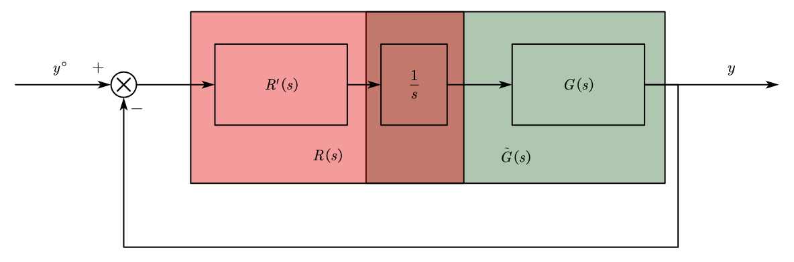

## 1. Pole placement via TF Approach for SISO Linear Systems

Given a system

$$
G(s) = \frac{B(s)}{A(s)} = \frac{b_ns^{n-1}+b_{n-1}s^{n-2}+\dots + b_1s+b_0}{s^{n}+a_{n-1}s^{n-1}+\dots + a_1s+a_0}
$$

We want to design the regulator $R(s)$, given the schematic:

<figure markdown="span">
    { width="400" }
</figure>

To build the state realization, we need to apply the pole-placement method within a RO.

For $R(s)$, it have $n-1$ poles:

$$
R(s) = \frac{F(s)}{\Gamma(s)} = \frac{f_{n-1}s^{n-1}+f_{n-2}s^{n-2}+\dots + f_1s+f_0}{\gamma_{n-1}s^{n-1}+\gamma_{n-2}s^{n-2}+\dots +\gamma_1s+\gamma_0}
$$

And we can design a desired characteristic polynomial $P^*(s)$ for the close loop TF,

$$
P(s) = s^{2n-1} + p_{2n-2}s^{2n-2} + \dots + p_1s + p_0
$$

The characteristic polynomial of the closed loop system is:

$$
P(s) = \Gamma(s)A(s) + B(s)F(s)
$$

We can set the system desired polynomial function the same as our desired one:

$$
P(s) = P^*(s)
$$

Expend it, we have:

$$
\begin{aligned}
\begin{bmatrix}
\begin{matrix} \begin{bmatrix} 1 \\ a_{n-1} \\ \vdots \\ a_0 \end{bmatrix} \\ 0 \\ 0 \\ \vdots \\ 0 \end{matrix} &
\begin{matrix} 0 \\ \begin{bmatrix} 1 \\ a_{n-1} \\ \vdots \\ a_0 \end{bmatrix} \\ 0 \\ \vdots \\ 0 \end{matrix} & \cdots &
\begin{matrix} 0 \\ 0 \\ \vdots \\ 0 \\ \begin{bmatrix} 1 \\ a_{n-1} \\ \vdots \\ a_0 \end{bmatrix} \end{matrix}
\begin{matrix} \begin{bmatrix} 0 \\ b_{n-1} \\ \vdots \\ b_0 \end{bmatrix} \\ 0 \\ 0 \\ \vdots \\ 0 \end{matrix} & \cdots &
\begin{matrix} 0 \\ 0 \\ \vdots \\ 0 \\ \begin{bmatrix} 0 \\ b_{n-1} \\ \vdots \\ b_0 \end{bmatrix} \end{matrix}
\end{bmatrix}
\begin{bmatrix} \gamma_{n-1} \\ \vdots \\ \gamma_0 \\ f_{n-1} \\ \vdots \\ f_0\end{bmatrix} = 
\begin{bmatrix} 1 \\ p_{2n-2} \\ p_{2n-3} \\ \vdots \\ p_0 \end{bmatrix}
\end{aligned}
$$

### 1.1 Regulator with Integral Actions
For the regulator with integral actions, we can treat it as one part of the controller or the part of the system:

<figure markdown="span">
    { width="500" }
</figure>

Move the integrator inside the system, thus:

$$
\tilde G(s) = \frac{1}{s}G{s} = \frac{B(s)}{sA(s)}
$$

$\tilde G(s)$ have the order of $n+1$, And we want to design $R(s)$ of order $n$,

$$
R(s) = \frac{F'(s)}{\Gamma'(s)}
$$

The desired polynomial TF $P^*(s)$ have a order of $2n+1$, the characteristic polynomial function of the system is:

$$
P(s) = P(s) = \Gamma'(s)\underbrace{sA(s)}_{\tilde A(s)} + B(s)F'(s) = P^*(s)
$$

### 1.2 Zeros of the Close-Loop System
For the close-loop system, there have:

<figure markdown="span">
    { width="400" }
</figure>

To calculate the zeros, we need to calculate the complementary sensitive functions

!!! warning
    Because in the previous part, we already use the $F(s)$, which is not the complementary sensitivity function, so here we rename it to $H(s)$ to resolve the naming conflict

$$
H(s) = \frac{\frac{H(s)B(s)}{\Gamma(s)A(s)}}{1 + \frac{H(s)B(s)}{\Gamma(s)A(s)}} = \frac{F(s)B(s)}{\Gamma(s)A(s) + F(s)B(s)} = \frac{F(s)B(s)}{P^*(s)}
$$

<figure markdown="span">
    { width="500" }
</figure>

The chosen $\Delta$ should be the order of $n-1$, $\Delta$ is stable polynomial:

$$
\Delta(s) = s^{n-1} \delta_{n-2}s^{n-2}+\dots +\delta_1s + \delta_0
$$

And the loop transfer function is:

$$
L(s) = \frac{F(s)}{\Gamma(s)} \frac{B(s)}{A(s)}
$$

Calculate the TF from $y^\circ$ to $y$:

$$
W(s) = \frac{F(0)}{\Delta(0)} \frac{\frac{\Delta(s)}{\Gamma(s)}\frac{B(s)}{A(s)}}{1+\frac{F(s)B(s)}{\Gamma(s)A(s)}} = \frac{F(0)}{\Delta(0)}\frac{\Delta(s)B(s)}{P^*(s)}
$$

### 1.3 How to cancel the poles in the system
Given the system with negative poles:

$$
G(s) = \frac{B(s)}{\underbrace{(s+a)A'(s)}_{A(s)}}
$$

We can give the control schematic:

<figure markdown="span">
    { width="500" }
</figure>

The desired polynomial function is:

$$
P^*(s) = \underbrace{(s+a)\tilde P^*(s)}_{2n-1}
$$

For the system polynomial function:

$$
\begin{aligned}
P(s) &= (s+a)A'(s)\Gamma(s) + B(s)F(s) = (s+a)\tilde P^*(s) \\
B(s)F(s) &= (s+a)[\tilde P^*(s) - A'(s)]
\end{aligned}
$$

For the condition that $F(s)$ has a root in $a$, which $F(s) = (s+a)F'(s)$,

$$
L(s) = R(s)G(s) = \frac{(s+a)F'(s)}{\Gamma(s)} \frac{B(s)}{(s+a)A'(s)}
$$

For the system disturbance $d_u \to y$, there have the TF:

$$
\begin{aligned}
V(s) &= \frac{G(s)}{1+R(s)G(s)} \\
&= \frac{\frac{B(s)}{(s+a)A'(s)}}{1+\frac{B(s)}{(s+a)A'(s)} \frac{(s+a)F'(s)}{\Gamma(s)}} \\
&= \frac{A'(s)\Gamma(s)B(s)}{\underbrace{\underbrace{(A'(s)\Gamma(s)+B(s)F'(s))}_{\tilde P^*(s)}(s+a)A'(s)}_{P^*(s)}}
\end{aligned}
$$

Apply the step signal in the input, with the disturbance inserted in some time after the system stabilizing,

<figure markdown="span">
    { width="500" }
</figure>

We can get that after inserting the disturbance, the system is stabilizing with oscillation. The system have 2 conjugate poles in the negative plane.

!!! example
    Given the system:

    $$
    G(s) = \frac{1}{s-1}
    $$

    Design a regulator which include an integral action such that all the close loop poles are $-1$

    1. State space approach

        We can separate the system into different parts to reconstruct the system design:
        <figure markdown="span">
            { width="500" }
        </figure>

        $$
        \begin{aligned}
            \dot x &= x + u \\
            y &= x
            \dot v= -x
        \end{aligned}
        $$

        $$
        \begin{bmatrix} \dot x \\ \dot v \end{bmatrix} = 
        \underbrace{\begin{bmatrix} 1&0 \\ -1&0 \end{bmatrix}}_{\tilde A}
        \begin{bmatrix} x \\ v \end{bmatrix} + 
        \underbrace{\begin{bmatrix} 1 \\ 0 \end{bmatrix}}_{\tilde B} u
        $$

        $$
        u = -K \begin{bmatrix} x \\ v \end{bmatrix} = -K_xx - K_vv
        $$

        The closed loop system is:

        $$
        \begin{bmatrix} \dot x \\ \dot v \end{bmatrix} =
        \underbrace{(A-BK)}_{\hat L} \begin{bmatrix} x \\ v \end{bmatrix} 
        $$

        The characteristic polynomial is:

        $$
        P_{\tilde A - \tilde BK}(\lambda) = \det
        \begin{bmatrix} \lambda - 1+ K_x & K_v \\ 1&\lambda \end{bmatrix} =
        \lambda^2 + (K_x - 1)\lambda - K_v
        $$

        And the desired polynomial function is:
        
        $$
        P^*(\lambda) = (\lambda + 1)^2 = \lambda^2 + 2\lambda + 1
        $$

        And the result is:

        $$
        \begin{aligned}
        K_x &= 3 \\
        K_v &= -1
        \end{aligned}
        $$

    2. Pole placement with TF

        <figure markdown="span">
            { width="500" }
        </figure>

        $$
        \begin{aligned}
        &\tilde G(s) = \frac{1}{s(s-1)} & R'(s) = \frac{f_1s + f_0}{\gamma_1s + \gamma_0}
        \end{aligned}
        $$

        $$
        \begin{aligned}
        P(s) &= (s^2 - s)(\gamma_1s + \gamma_0) + f_1s + f_0 \\
        P^*(s) &= (s+1)^3 = s^3 + 3s^2 + 3s + 1
        \end{aligned}
        $$

        $$
        \begin{bmatrix} 
        \begin{matrix} \begin{bmatrix} 1 \\ -1 \\ 0 \end{bmatrix} \\ 0 \end{matrix} & 
        \begin{matrix} 0 \\ \begin{bmatrix} 1 \\ -1 \\ 0 \end{bmatrix} \end{matrix} & 
        \begin{matrix} \begin{bmatrix} 0 \\ 0 \\ 1 \end{bmatrix} \\ 0 \end{matrix} & 
        \begin{matrix} 0 \\ \begin{bmatrix} 0 \\ 0 \\ 1 \end{bmatrix} \end{matrix}
        \end{bmatrix}
        \begin{bmatrix} \gamma_1 \\ \gamma_0 \\ f_1 \\ f_0 \end{bmatrix} = 
        \begin{bmatrix} 1 \\ 3 \\ 3 \\ 1 \end{bmatrix}
        $$

        $$
        \begin{aligned}
        &\gamma_1 = 1 & f_1 = 7 \\
        &\gamma_2 = 4 & f_0 = 1
        \end{aligned}
        $$

        $$
        R'(s) = \frac{f_1s+f_0}{\gamma_1s+\gamma_0} = \frac{7(s+\frac17)}{s+4}
        $$

    3. $R(s) = p\frac{s+\alpha}{s}$

        $$
        \begin{aligned}
        1 + R(s)G(s) &= 0 \\
        s(s-1) + p(s+\alpha) &= (s+1)^2
        \end{aligned}
        $$