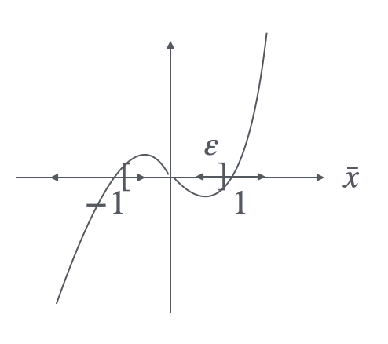

# 2. Stability of Linear Systems
## 2.1 Stability Definitions
Since we have find the trajectory of the equilibrium in the last part, it gives $\dot{x}(t) = \varphi(x(t))$, take the equilibrium $\bar x$ into the equation, we can get $\varphi(\bar x) = 0$, this is a function of $\bar x$.

1. When $\bar u$ is not considered in calculating the equilibrium, $\bar x$ is a stable equilibrium if $\forall \varepsilon > 0$, $\exists \delta > 0$, $\forall x_0 \in B_\delta(\bar{x})$, and $x_0$ satisfy $||x_{x_0}(t)-\bar{x}||\leq \varepsilon, \forall t \geq 0$. For a second order system, this should be like the figure: 
    <figure markdown="span">
        { width="200" }
    </figure>
    And the equilibrium is __asympototically stable__ (A.S.) if:
    * $\bar x$ is stable
    * $\exists \delta > 0$ that when $\lim\limits_{t\to \infty}||x_{x_0}(t)-\bar{x}|| = 0$, $\forall x_0 \in B_\delta(\bar x)$
    Thus, $\bar x$ is convergent and A.S. 

    !!!abstract "Example"
        $$
        \begin{aligned}
        \dot x_1(t) &= x_1^2(t) - x_2(t)\\
        \dot x_2(t) &= 2x_1(t)x_2(t)
        \end{aligned}
        $$

        $\bar x = \begin{bmatrix} 0 \\ 0 \end{bmatrix}$ is an equilibrium but not a stable equilibrium.
    
    !!!warning "Remarks"
        A.S is a local property

    !!!abstract "Example"
        $$
        \begin{aligned}
        \dot x (t) &= x(t)(x(t) - 1)u(t)\\
        u(t) &= 1, t\geq 0
        \end{aligned}
        $$

        Calculate the equilibrium:

        $$
        \begin{aligned}
        \dot x(t) &= x(t)(x^2(t) -1)\\
        \bar x (\bar x^2 -1) &= 0\\
        \Rightarrow &\left\{ \begin{aligned}
        \bar x &= 0, \text{ A.S.} \\
        \bar x &= \pm 1 \text{ unstable}
        \end{aligned}\right.
        \end{aligned}
        $$

        <figure markdown="span">
            { width="200" }
        </figure>
        
        $D=(-1,1)$ is the region of attraction for $\bar x = 0$.

    To make the system A.S. globally, $\bar x$ should meet the condition: $\lim_{t\to \infty}||x_{x_0}(t)-\bar{x}|| = 0$, $\forall x_0 \in \mathbb{R}^n$.

2. Considering the stability properities depend on $\bar u$, we can give a similar example below:

    !!!abstract "Example"
        $$
        \begin{aligned}
        \dot x(t) &= x^3(t) +u(t)x(t) \\
        u(t) &= \bar u, t\geq 0
        \end{aligned}
        $$

        We can plot $\dot x$ as a function of $x$, $f(x, u) = -x^3 + \bar u x$.
        
        | $u \leq 0$ | $u > 0$ |
        |------------|---------|
        | { height="160" } | { height="160" } |
        | $x = 0$ is __globally A.S.__ (G.A.S.) | $x = 0$ is unsatble |

3. For the A.S. system, there have the properity of convergence rate, give the defination of exponential convergence rate (aka. exponential stability) for the system $\dot x(t) = \varphi (x(t))$,
    * Giving $\bar x$ that is an equilibrium of $\varphi(\bar x ) = 0$, if $\exists \delta >0$, $\forall x_0 \in B_\delta (\bar x)$, $\exists a >0$ and $\lambda > 0$, that makes $||x_{x_0} - \bar x || \leq a||x_0 - \bar x||e^{-\lambda t}, t\geq 0$, then $\bar x$ is an exponentially stable equilibrium
    * exponential stability (E.S.) $\in$ A.S.
        <figure markdown="span">
            { width="200" }
        </figure>

## 2.2 Stability of Linear Systems
For a linear system, there have following features:

1. The system is G.A.S. if it satisfied A.S. conditions
2. All equilibrium shares the same stability properties, stability is a property of the system
3. The system is E.S. when it is A.S.

Here we proove the above points, giving a linear system:

$$
\dot x(t) = Ax(t) + Bu(t)
$$

suppose $\bar x$ is an equation associated with $u(t) = \bar u$, when $t \geq 0$, there have:

$$
\begin{aligned}
&A\bar x +B\bar u = 0 \\
\Rightarrow &\left\{
\begin{aligned}
\delta x(t) = x(t) - \bar x \\
\delta u(t) = u(t) - \bar u
\end{aligned}
\right.\\
\end{aligned}
$$

$$
\begin{aligned}
\delta \dot x(t) &= A (\delta x(t)+\bar x) + B(\delta u(t) +\bar u) \\
 &= A\delta x(t) + B \delta u(t)
\end{aligned}
$$

And since we does not consider the perturbance from the inputs,

$$
\begin{aligned}
&\delta \dot x(t) = A\delta x(t)\\
\Rightarrow &\delta x(t) = e^{At}\delta x(t)
\end{aligned}
$$

in this equation, $e^{At} = \sum_{i=0}^n K_i e^{\lambda_i t}$, where $\lambda_i$ is the eigen value of $A$, the system is G.A.S. when $\lambda_i < 0$.