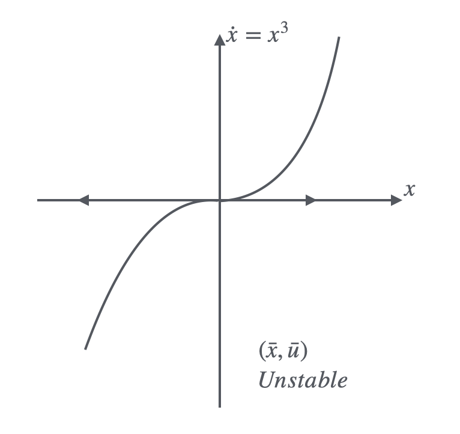
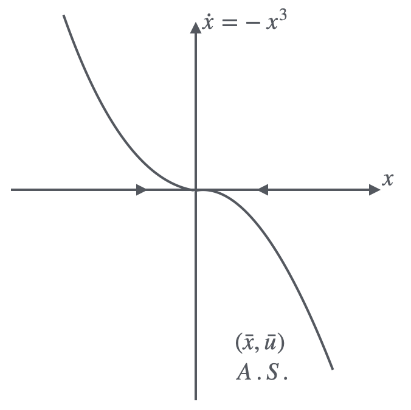
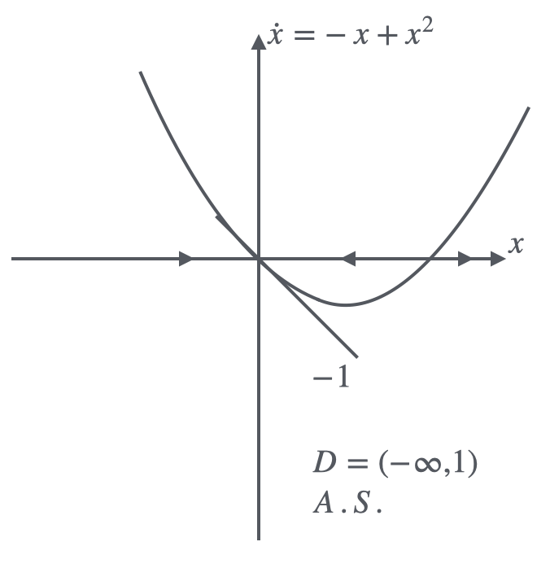
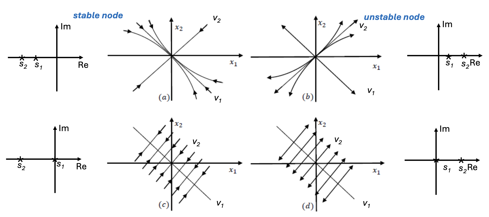
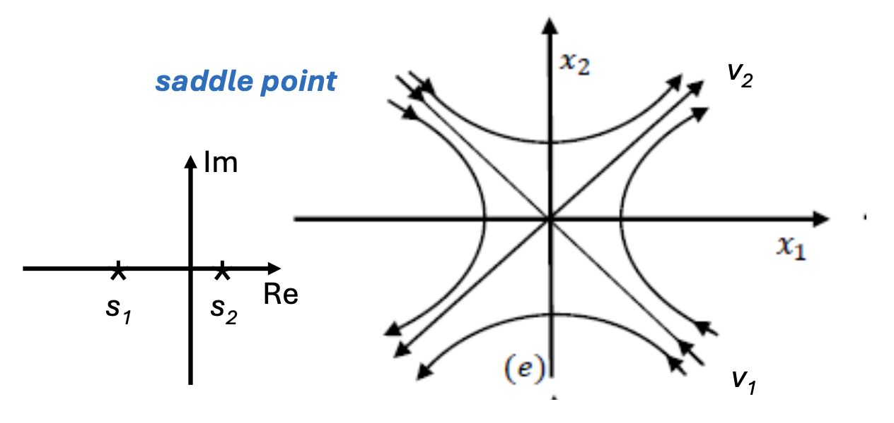
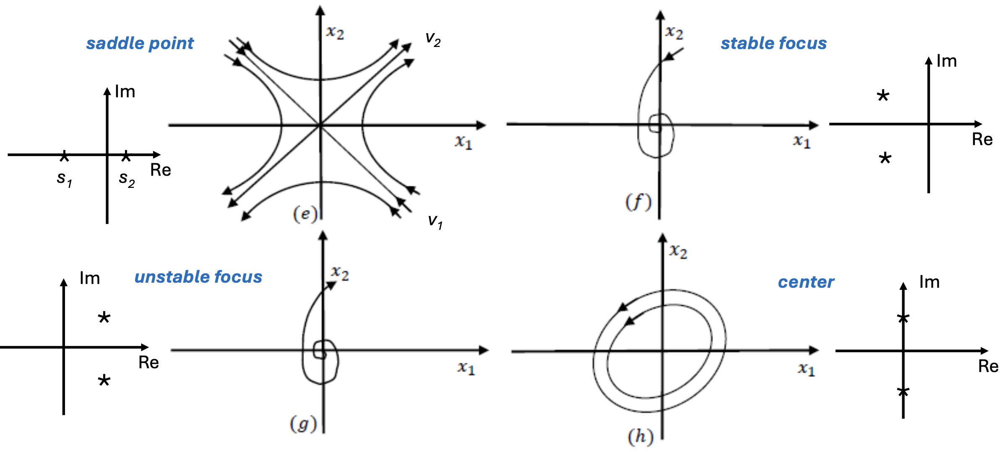
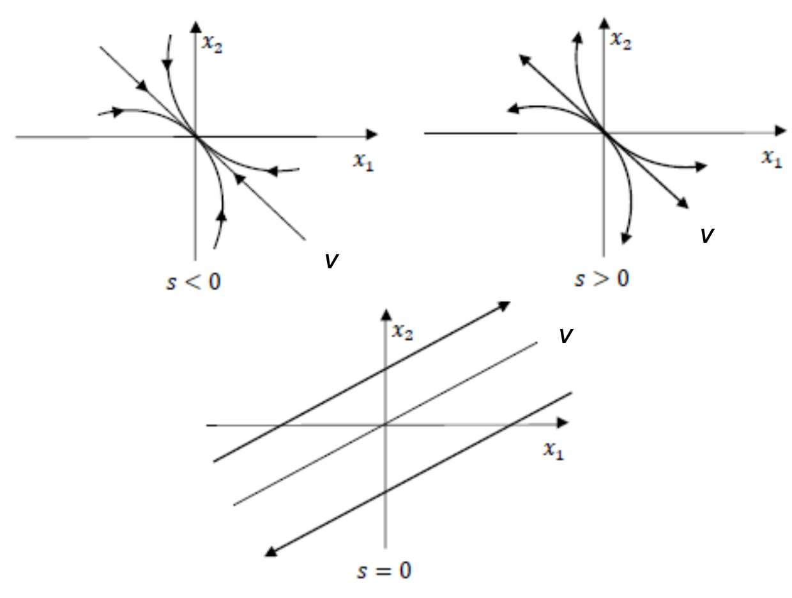
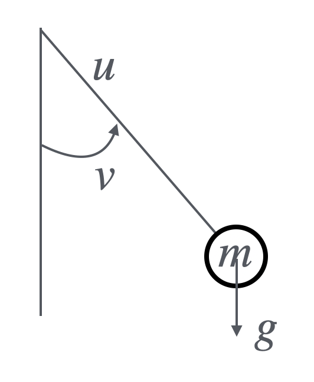
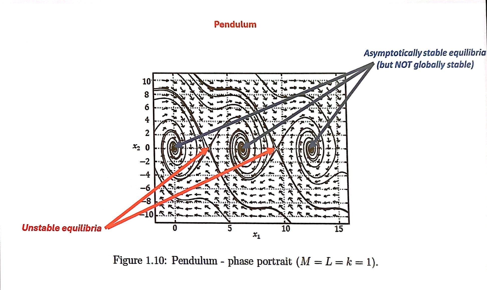

From last part, we have known how to define the stability of linear systems, for solving the stability question of nonlinear systems, we could apply the linearization to the nonlinear systems,

$$
\dot x(t) = f(x(t), u(t)), x \in \mathbb R^n, u \in \mathbb R^m \Rightarrow \dot x(t) = Ax(t) + Bu(t)
$$

## 3.1 Linearization
We know that for a linear system, 

* Stability is a property of the system
* The system is A.S. if and only if all the eigenvalues of its dynamic matrix $A$ have negative real parts

So for defining the stability of nonlinear systems, the idea is how to convert it into a linear system. Giving the nonlinear system of the following form:

$$
\dot x(t) = f(x(t), u(t))
$$

Assumed that $f \in C^1$, $(\bar x, \bar u)$ is an equilibrium pair if $\varphi(\bar x, \bar u) = 0$. Now we assume at time $t$, there exists small perturbance close to the equilibrium pair:

$$
\begin{aligned}
\delta u(t) &= u(t) - \bar u\\
\delta \dot x(t) &= A\delta x (t) + B\delta u(t)\\
\end{aligned}
$$

Where $A = \frac{\delta f}{\delta x}|_{x=\bar x, u = \bar u}, B = \frac{\delta f}{\delta u}|_{x=\bar x, u = \bar u}$. As long as the perturbance is small enough, $A = \frac{\partial f}{\partial x}|_{x=\bar x, u = \bar u}, B = \frac{\partial f}{\partial u}|_{x=\bar x, u = \bar u}$. Which indicates $A$ and $B$ is the Jacobian of the of the point $(\bar x, \bar u)$.

Now the stability of the linearized model can be conclude as:

1. if $A$ has all __eigenvalues with negative real part__ ($\lambda_i < 0$, in this condition, we also called $A$ is __negative definite__ (ND)), then $(\bar x, \bar u)$ is A.S.
2. if $\exists \lambda_i > 0$, then $(\bar x, \bar u)$ is unstable
3. if $\forall \lambda_i \leq 0$, and $\exists \lambda_j = 0$, the stability cannot be defined unless more information were given

About point 3 above, we can introduce an example to explain this:
!!! example
    $$
    \dot x(t) = x(t)\cdot u(t)
    $$

    | $u = 1, t\geq 0$ | $u = -1, t\geq 0$ |
    |------------------|-------------------|
    |$\begin{aligned}x &= x^3(t)\\ \bar x &= 0 \Rightarrow (\bar x, \bar u) = (0,1) \end{aligned}$|$\begin{aligned}x &= -x^3(t)\\ \bar x &= 0 \Rightarrow (\bar x, \bar u) = (0,-1) \end{aligned}$|
    | $A = [3\bar x ^2 \bar u] = 0$, $B = [0]$ | $A = [3\bar x ^2 \bar u] = 0$, $B = [0]$ |
    | { height="160" } | { height="160" } |

!!!warning
    if $f$ is not continues, then it is not linearizable.
    
    !!! example
        $\dot x = |x|$ is not linearizable

Limitation of the linearization approach is:

1. It requires $f \in C^1$
2. If $A$ is __semi-negative definite__ (SND), then no conclusion can be made to the stability analysis
3. If $(\bar x, \bar u)$ is A.S., the domain of attraction is still unknown.

!!! example
    $$
    \dot x(t) = -x(t) +x^2(t) +u(t)
    $$

    Let $u(t) = 0$, at $t \geq 0$,

    $$
    -\bar x +\bar x^2 = 0 \Rightarrow \left\{\begin{aligned} 
    \bar x = 0 \\
    \bar x = 1
    \end{aligned}\right.
    $$

    For $(\bar x, \bar u) = (0,0)$, $\delta \dot x(t) = -\delta x(t) + \delta u(t)$,
    $\lambda = -1 < 0$, the system at $(0,0)$ is A.S.

    <figure markdown="span">
        { width="200" }
    </figure>

## 3.2 Phase Portrait for 2nd Order Systems
For the system:

$$
\dot x (t) = Ax(t), \bar x = 0
$$

Where $A$ is diagonalizable with pure real eigenvalues, $\exists a_1, a_2, T$, $det(T) \neq 0$, $a_1 \neq a_2$, satisfy $TAT^{-1} = \begin{bmatrix} a_1 & 0 \\ 0 & a_2\end{bmatrix}$, let

$$
\begin{aligned}
&z = Tx \\
\Rightarrow &\dot z(t) = \begin{bmatrix}
a_1 & 0 \\
0 & a_2
\end{bmatrix}z(t) \\
\Rightarrow & \left\{\begin{aligned}
z_1(t) &= e^{a_1 t}z_1(0)\\
z_2(t) &= e^{a_2 t}z_2(0)
\end{aligned}\right.
\end{aligned}
$$

$a_1$, $a_2$ can be referred to $v_1$, $v_2$ as eigenvectors.

<figure markdown="span">
    { width="600" }
    { width="320" }
</figure>

When $x(0) = \alpha v_i$,

$$
\begin{aligned}
&x(t) = e^{a_i t} \alpha v_i \\
&\Rightarrow\frac{d}{dt}(e^{a_i t} \alpha v_i) = \alpha a_i e^{a_i t}v_i\\
&\Rightarrow A\alpha e^{a_i t}v_i = \alpha e^{a_i t}Av_i = \alpha e^{a_i t} a_i v_i
\end{aligned}
$$

<figure markdown="span">
    { width="600" }
    { width="400" }
</figure>

!!! example
    <figure markdown="span">
        { width="200" }
    </figure>
    For a pendulum system, the dynamic equation is:

    $$
    \begin{aligned}
    mL^2 \ddot v(t) &= -K\dot v(t) -mgL \sin (v(t)) + u(t)\\
    \dot x_1(t) &= x_2(t) \\
    \dot x_2(t) &= -\frac{K}{mL^2}x_2(t) - \frac{g}{L}\sin (x_1(t)) + \frac{1}{mL^2}u(t)\\
    \end{aligned}
    $$

    Given $u(t) = 0$, $t\geq 0$, find $\bar x$,

    $$
    \left\{\begin{aligned}
    &\bar x_2 = 0\\
    &\sin(\bar x_1) = 0
    \end{aligned}\right. \Rightarrow 
    \left\{\begin{aligned}
    &\bar x_2 = 0\\
    &\bar x_1 = h\pi
    \end{aligned}\right.
    $$

    Linearize the model at equilibrium point,

    $$
    \begin{aligned}
    A &= \begin{bmatrix}
    0 & 1\\
    -\frac{g}{L}\cos(\bar x_1)& -\frac{K}{mL^2}
    \end{bmatrix}\\
    x_A(\lambda) &= det(\lambda I - A) = \lambda^2 + \frac{K}{mL^2}\lambda + \frac{g}{L}\cos(\bar x_1)
    \end{aligned}
    $$

    When $\bar x_1 = 2h\pi$,

    $$
    \begin{aligned}
    x_A(\lambda) &= \lambda^2 + \frac{K}{mL^2}\lambda + \frac{g}{L} = \lambda^2 +\lambda +9.8\\
    \lambda &= \frac{-1\pm i\sqrt{9.8\cdot 4 -1}}{2}, \text{A.S.}
    \end{aligned}
    $$

    When $\bar x_1 = \pi + 2h\pi$,

    $$
    \begin{aligned}
    x_A(\lambda) &= \lambda^2 + \frac{K}{mL^2}\lambda - \frac{g}{L} = \lambda^2 +\lambda -9.8\\
    \lambda_1 &> 0, \lambda_2 < 0, \text{Unstable}
    \end{aligned}
    $$

    <figure markdown="span">
        { width="600" }
    </figure>
