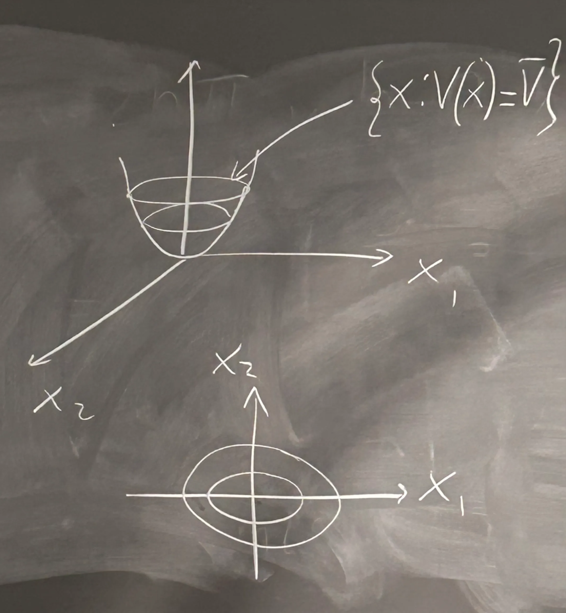
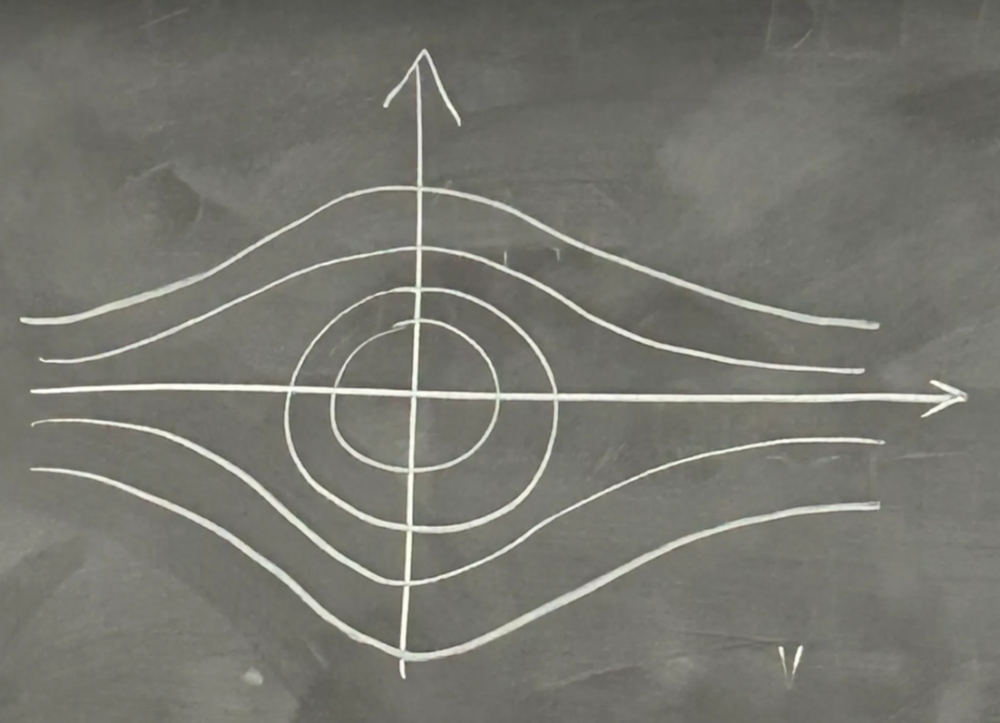
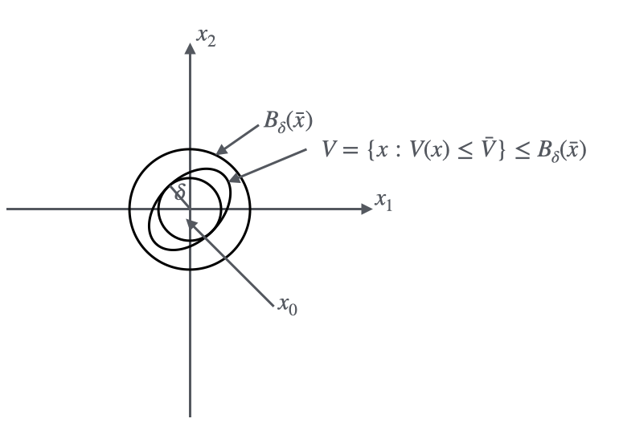
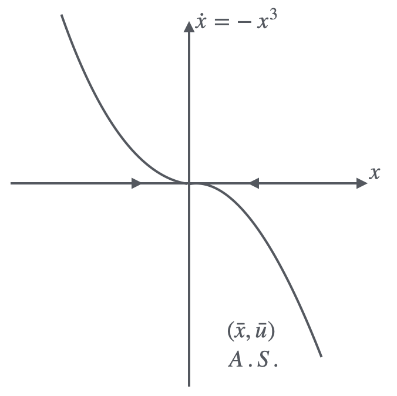

## 4.1 Lyapunov Function
To introduce the Lyapunov Theory, we can start from an example:
!!! example
    <figure markdown="span">
        { width="600" }
    </figure>

    The dynamic equation of a spring-damping system is:
    
    $$
    \begin{aligned}
    m\ddot x(t) &= -K(x(t))h(x(t))+u(t)\\
    K(x) &= K_0x +K_1x^3\\
    h(x) &= b\dot x|\dot x|
    \end{aligned}
    $$

    Give the state variable,
    
    $$\begin{aligned}
    x_1(t) &= x(t) \\
    x_2(t) &= \dot x(t)
    \end{aligned}
    $$

    There have,

    $$
    \left\{\begin{aligned}
    &\dot x_1(t) = x_2(t)\\
    &\dot x_2(t) = \frac{1}{m}(-bx_2(t)|x_2(t)| - K_0x_1(t) - K_1x_1^3(t)+u(t))
    \end{aligned}\right.
    $$

    When $u(t) = 0$, at $t\geq 0$,
    
    $$
    \left\{\begin{aligned}
    &\bar x_2 = 0\\
    &K_0\bar x_1 + K_1 \bar x_1^3 = 0
    \end{aligned}\right. \Rightarrow 
    \left\{\begin{aligned}
    &\bar x_1 = 0\\
    &\bar x_2 = 0
    \end{aligned}\right.
    $$
    
    The system is not differentiable, to find the stability of this system, Lyapunov Theory should be applied. Introducing the Lyapunov function which represents the energy of the system:

    $$
    \begin{aligned}
    V(x) &= \frac{1}{2}mx_2^2 \\
    V(x) &= \int_0^{x_1}(K_0n+K_1n^3)dn\\
    &=\frac12 K_0x_1^2 + \frac14 K_1x_1^4
    \end{aligned}
    $$

    It turns out $V(\begin{bmatrix} 0\\0 \end{bmatrix}) = 0$, and $V(\begin{bmatrix} x_1\\x_2 \end{bmatrix}) > 0, \forall \begin{bmatrix} x_1\\x_2 \end{bmatrix} \neq \begin{bmatrix} 0\\0 \end{bmatrix}$

    Derivate the Lyapunov function,

    $$
    \begin{aligned}
    \dot V(x) &= \frac{d}{dt}V(\begin{bmatrix} x_1(t)\\x_2(t) \end{bmatrix}) \\
    &= \frac{\partial V}{\partial x_1}\dot x_1 + \frac{\partial V}{\partial x_2}\dot x_2 \\
    &= \nabla V \cdot \begin{bmatrix} \dot x_1\\ \dot x_2 \end{bmatrix} \\
    &= -bx_2^2|x_2| \leq 0\\
    \bar x &= \begin{bmatrix} 0\\0 \end{bmatrix}, \text{Stable Equilibrium}
    \end{aligned}
    $$

    The Lyapunov function can be drawn like below
    <figure markdown="span">
        { width="300" }
    </figure>

Now, we can give the definition of Lyapunov function: $V: \mathbb R^n \to \mathbb R$, $V \in C^1$

- $V$ is __positive definite__ (PD) in $\bar x$ if $V(\bar x) = 0$ and $V(x) > 0$, $\forall x \in D\{\bar x\}$ where $D$ is an open neighbor of $\bar x$, if $D = \mathbb R^n \Rightarrow V$ is globally positive definite
- $V$ is __negative definite__ (ND) in $\bar x$ if $-V$ is positive definite in $\bar x$
- $V$ is __positive semi-definite__ (PSD) in $\bar x$ if $V(\bar x) = 0$ and $V(x) \geq 0, \forall x \in D$ where in an open neighbor of $\bar x$
- $V$ is __negative semi-definite__ (NSD) if $-V$ is positive semidefinite

Radially unbounded globally positive definite function

$$
\lim_{||x|| \to \infty} V(x) =+\infty
$$

!!! example
    $$
    V(x) = \frac{x_1^2}{1+x_1^2} +x_2^2 
    $$

    $\bar x=0$, $V(x)$ is globally positive definite

    $$
    \begin{aligned}
    x &= \begin{bmatrix}
    x_1 \\ 0
    \end{bmatrix}\\
    \lim_{|x_1|\to +\infty} \frac{x_1^2}{1+x_1^2} &= 1
    \end{aligned}
    $$

    Lever surface of $V$ positive definite is: $\{x\in \mathbb R^n:V(x) = \bar V\}$
    <figure markdown="span">
        { width="400" }
    </figure>

## 4.2 Lipchitz Continuous
$$
\dot x(t) = \varphi(x(t))
$$

$\bar x$ is a equilibrium of $\varphi(\bar x = 0)$, where $\varphi: \mathbb R^n \to \mathbb R^n$ is lipchitz in a neighbor $D$ of $\bar x$.

Give the definition of Lipchitz Continuous,

$$
\exists L: ||\varphi(x)-\varphi>(y)||\leq L||x-y||, \forall x,y \in D
$$

Where, $\varphi$ is continuous in $D$
!!! example
    - $\varphi (x) = x^{\frac13}$ is not lipchitz
    - $\varphi(x) = |x|$ is lipchitz
    - $\varphi \in C^1 \Rightarrow \varphi$ is lipchitz

## 4.3 Lyapunov Theory
Giving Lyapunov function $V$, $\exists V(x) \in C^1$, that are PD in $\bar x$, and $\dot V$ is NSD in $\bar x$, then $\bar x$ is stable.

!!!info 
    
    Proof
    
    $\bar x = 0$
    <figure markdown="span">
        { width="300" }
    </figure>
    $\delta$ is the minimum distance of $\bar x$ from the boundary of $V$

For the Lyapunov Theory, there have following conditions:

- A.S. $\to$ if $\dot V(x)$ is negative definite in $\bar x$
- G.A.S $\to$ globally positive definite $V(x)$ in $\bar x$, and globally negative definite $\dot V(x)$ in $\bar x$, **Radially unbounded** $V(x)$
- Instability $\to$ positive definite $\dot V (x)$ in $\bar x$

!!! example
    $$
    \begin{aligned}
    \dot x_1(t) &= -x_1(t)\\
    \dot x_2(t) &= x_2(t)(x_1(t) -1)\\
    \bar x &= \begin{bmatrix} 0\\0 \end{bmatrix}
    \end{aligned}
    $$

    $$
    \begin{aligned}
    V(x) &= \frac12(a_1x_1^2 +a_2x_2^2), a_1,a_2 \geq0 \\
    \dot V(x) &= a_1 x_1(-x_1) + a_2 x_2^2(x_1 - 1) \\
    &= -a_1x_1^2 - a_2x_2^2(1-x_1)\\
    D&=\{x:x_1 < 1\}
    \end{aligned}
    $$

    <figure markdown="span">
        { width="300" }
    </figure>

    $\bar x$ is A.S.

## 4.4 Conclusion on Lyapunov Theory
For the system,

$$
\begin{aligned}
\dot x(t) = \varphi (x(t)) \\
\end{aligned}
$$

$\bar x$ is equilibrium $\Rightarrow$ $\varphi (\bar x) = 0$,

* $\varphi: \mathbb R^n \to \mathbb R^n$ 
* Lipschitz on $D$ in the neighbor of $\bar x$

If $\exists V(x) \in C^1$, $\bar x$ is PD,

1. $\bar x$ is stable if $\dot V(x)$ is NSD
2. $\bar x$ is A.S. if $\dot V(x)$ is ND
3. $\bar x$ is unstable if $\dot V(x)$ is PD

If $V(x)$ is globally PD in $\bar x$, $\bar x$ is G.A.S. when:

* $V(x)$ is radially unbounded
* $\dot V(x)$ is globally ND in $\bar x$

## 4.5 Candidate Lyapunov Functions
To choose a suitable Lyapunov function, we should meet the condition below:

* Lyapunov function should be an energy function

One possible option is: $V(x) = (x-\bar x)^TP(x-\bar x)$

$$
\begin{aligned}
P = P^T \succ \mathbf 0 &\Rightarrow V^TPV > 0, \forall V \neq 0\\
&\Rightarrow V^TPV = 0, V = 0
\end{aligned}
$$

!!! example
    $$
    \left\{\begin{aligned}
    \dot x_1 &= x_1 x_2 - x_1\\
    \dot x_2 &= -x_1^2 - x_2^3
    \end{aligned}\right.
    $$
    
    $\bar x = \begin{bmatrix} 0\\0 \end{bmatrix}$ is an equilibrium point, find the stability.

    1. Linearization

        $$
        \left\{\begin{aligned}
        \delta \dot x_1 &= -\delta x_1\\
        \delta \dot x_2 &= 0
        \end{aligned}\right. \Rightarrow A = \begin{bmatrix}
        -1 & 0\\
        0 & 0
        \end{bmatrix}
        $$

    2. Lyapunov Theory

        $$
        V(x) = \frac12 (x_1^2 + x_2^2)
        $$

        Which is globally PD in $\bar x = 0$ and radially unbounded

        $$
        \begin{aligned}
        \dot V(x) &= x_1 \dot x_1 + x_2 \dot x_2 \\
        &= x_1^2 x_2 - x_1^2 -x_2 x_1^2 - x_2^4 \\
        &= -(x_1^2 + x_2^4) \leq 0
        \end{aligned}
        $$

        $\dot V(x)$ is globally ND in $\bar x = 0$

!!! example
    For the pendulum system, give the state space function:

    $$
    \left\{\begin{aligned}
    \dot x_1 &= x_2 \\
    \dot x_2 &= -\frac{g}{L} \sin(x_1) - \frac{K}{mL^2}x_2 + \frac{1}{mL^2}\bar u
    \end{aligned}\right.
    $$
    
    $\bar u = 0$, $\bar x = \begin{bmatrix} 0\\0 \end{bmatrix}$ is an equilibrium point, find the stability.

    $$
    \begin{aligned}
    V(x) &= T(x) + U(x)\\
    &= \frac12 m (x_2L)^2 + mg(L-L\cos(x_1)) \\
    \end{aligned}
    $$

    $V(\bar x) = 0$, $D = \{x \in \mathbb R^2, |x_1| < 2\pi\}$

    $$
    \begin{aligned}
    \dot V(x) &= mL^2 x_2 \dot x_2 + mgL \sin(x_1) \dot x_1 \\
    &= -Kx_2^2
    \end{aligned}
    $$

    is ND in $\bar x = 0$, $\bar x$ is stable, but we cannot find the region of attraction.
 
## 4.6 Krasowski - La Salle Theorem
To solve the example above, we introduce the Krasowski - La Salle theorem, it gives:

$\dot x = \varphi(x)$, $\varphi(x)$ is lipscchitz on $D$, $\bar x$ is a equilibrium, $\varphi(\bar x) = 0$, let:

$V: D \to \mathbb R \in C^1$ is PD in $\bar x$ on $D$ and $\dot V(x)$ is NSD in $\bar x$ on $D$

If set $S = \{x\in D: \dot V(x) = 0\}$ does not contain any perturbed trajectory of the system, $\bar x$ is an A.S. equilibrium.

$$
\dot V (x) = -Kx_2^2
$$

$S = \{x\in D: x_2 = 0\}$

* $\dot x_1 = 0 \to x_1(t) = \bar x_1, \forall t$

    $\begin{aligned}0 = \dot x_2 &= -\frac{g}{L} \sin(x_1) \\ &\Rightarrow \sin(\bar x_1) = 0 \\ &\Rightarrow x_1 = h\pi \\ &\Rightarrow x = 0, \pm1, \pm2 \dots\end{aligned}$

$\Rightarrow$ in $D = \{x: |x_1|<\pi\}$, $\bar x$ is A.S.

If $V$ is globally PD in $\bar x$ and radially unbounded, $\dot V(x)$ is NSD on $D = \mathbb R^n$ and $S = \{x \in \mathbb R^n: \dot V(x) = 0\}$,

* If $S$ does not contain any perturbed trajectory $\bar x$ is G.A.S.

!!! example
    $$
    \left\{\begin{aligned}
    &\dot x_1(t) = x_2(t)\\
    &\dot x_2(t) = \frac{1}{m}(-bx_2(t)|x_2(t)| - K_0x_1(t) - K_1x_1^3(t)+u(t))
    \end{aligned}\right.
    $$

    $\bar x = \begin{bmatrix} 0\\0 \end{bmatrix}$ is an equilibrium point, find the stability.

    $$
    \begin{aligned}
    V(x) = \frac12 m x_2^2 + \frac12 K_0 x_1^2 + \frac14 K_1 x_2^4 \\
    \dot V(x) = -bx_2^2|x_2|
    \end{aligned}
    $$
     
    is ND in $\bar x = 0$, $\bar x$ is stable.

    $$
    \begin{aligned}
    S &= \{x \in \mathbb R^2: \dot V(x) = 0\} \\
    &= \{\begin{bmatrix} \alpha \\ 0 \end{bmatrix}, \alpha \in \mathbb R \}
    \end{aligned}
    $$
    
    $x_2(t) = 0 \Rightarrow \dot x_1 = x_2 = 0 \Rightarrow x_1(t) = \bar x_1$

    $\begin{aligned}0 = \dot x_2 &= \frac{1}{m} (-K_0 \bar x_1 - K_1 \bar x_1^3) \\ &\Rightarrow \bar x_1 (K_0 + K_1 \bar x_1^2 = 0) \\ &\Rightarrow \bar x_1 = 0\end{aligned}$

    $\bar x = \begin{bmatrix} 0\\0 \end{bmatrix}$ is G.A.S.