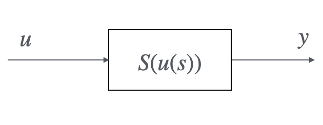

## 8.1 L-Norm of a Vector

Given $e = \begin{bmatrix} e_1 & \dots & e_m \end{bmatrix}^T$, the L-norm of the vector is:

| Description | Formulation|
|----|----|
| $L_2$ norm | $\left\lVert e \right\rVert_2 = \sqrt{e^Te} = \sqrt{\sum_{i=1}^m e_i^2}$ |
| $L_n$ norm | $\left\lVert e \right\rVert_n = (\sum_{i=1}^m\left\lvert e_i \right\rvert ^n)$ |
| $L_\infty$ norm | $\left\lVert e \right\rVert_\infty = \sup_i \left\lvert e_i \right\rvert$|

## 8.2 L2-Norm of a Matrix
Given $m\times n$ matrix $A$, the __induced 2-norm__ of this matrix is:
    
$$
||A||_{i2} = \sup_{x \neq 0} \frac{||Ax||_2}{||x||_2} 
=\underbrace{\sqrt{\lambda_{max}(A^TA)}}_{\text{max singular value of } A}
$$

!!!notes

    * Singular value:

        Given $A \in C^{m,n}$, $i = 1, 2, \dots \min{\{m,n\}}$, the singular values of $A$ are the largest roots between $\lambda_i(A^*A)$ and $\lambda_i(AA^*)$: 

        $$
        \begin{aligned}
        \sigma_i (A) &= \sqrt{\lambda_i(A^*A)} = \sqrt{\lambda_i(AA^*)}, &m=n \\
        \sigma_i (A) &= \sqrt{\lambda_i(A^*A)}, &m<n\\
        \sigma_i (A) &= \sqrt{\lambda_i(AA^*)}, &m>n
        \end{aligned}
        $$

    !!!notes

        * SVD decomposition:

            Given the SVD decomposition: $A = U\Sigma V^*$, where $\Sigma \in \mathbb R^{m\times n}$, $U \in C^{m,m}$, $V\in C^{n,n}$, and $U$, $V$ are unitary matrices, thus, there have:

            $$
            \begin{aligned}
            U^*U &= UU^* = I \\
            V^*V &= VV^* = I
            \end{aligned} \quad \Rightarrow \quad \begin{aligned}
            \sigma_i(U) &= 1 \\
            \sigma_i(V) &= 1
            \end{aligned}
            $$

            |Condition|Formulation|
            |---|---|
            |$m > n$|$\Sigma = \begin{bmatrix}\Sigma_1 \\ \mathbf 0\end{bmatrix}$|
            |$m < n$|$\Sigma = \begin{bmatrix}\Sigma_1 & \mathbf 0\end{bmatrix}$|
            |$m = n$|$\Sigma = \Sigma_1$|

            where $\Sigma_1 \in \mathbb R^{k\times k}$, $k = \min{\{m,n\}}$, it has:
            
            $$
            \Sigma_1 = \begin{bmatrix}
            \sigma_1(A) && \\
            &\ddots& \\
            &&\sigma_k(A)
            \end{bmatrix}
            $$

            $\sigma_1(A) \geq \sigma_2(A) \geq \dots \geq \sigma_k(A) \geq 0$ and we can know that:

            $$
            \begin{aligned}
            \bar \sigma(A) &= \max_i \sigma_i (A) = \sigma_1(A) \\
            \underline \sigma(A) &= \left\{\begin{aligned} \min_i \sigma_i &= \sigma_k &m>n \\ &0 &m<n\end{aligned}\right.
            \end{aligned}
            $$

!!! info

    Proof:

    $$
    \begin{aligned}
    ||Ax||_2^2 &= x^TA^TAx \leq \lambda_{max}(A^TA)||x||_2^2 \\
    ||Ax||_2 &\leq \sqrt{\lambda_{max}(A^TA)}||x||_2 \\
    \frac{||Ax||_2}{||x||_2} &\leq \sqrt{\lambda_{max}(A^TA)}
    \end{aligned}
    $$

## 8.2 L-Norm of a Signal

### 8.2.1 L-norm for signal
Given $e = \begin{bmatrix} e_1 & \dots & e_m \end{bmatrix}^T$, the L-norm of a signal is:

| Description | Formulation|
|----|----|
| $L_2$ norm | $\left\lVert e \right\rVert_2 = \sqrt{\int_{-\infty}^{+\infty} e^T(t)e(t)}$ |
| $L_\infty$ norm | $\left\lVert e \right\rVert_\infty = \sup_t (\sup_i \left\lvert e_i(t) \right\rvert)$|

### 8.2.2 L2-gain for system
From $L_2$ norm of the system, we can give the $L_2$ Gain:

* Given a general system,
    <figure markdown="span">
        { width="300" }
    </figure>

    We assume that $u(t) = 0, t < 0$, and the input is boundary, which satisfy:

    $$
    \int_{0}^{+\infty} u^T(t)u(t)dt < \infty
    $$

    if $u\in L_2$,

    $$
    ||u||_2 = \sqrt{\int_0^{+\infty} u^T(t)u(t)dt}
    $$

    Thus, we can get the $L_2$ gain of the system:

    $$
    \begin{aligned}
    \gamma_2 &= \sup_{u\in L_2, ||u||_2 \neq 0} \frac{||y||_2}{||u||_2} = \sup_{u\in L_2, ||u||_2 \neq 0} \frac{S(u(s))}{||u||_2} \\
    \gamma_2||u||_2 &\geq ||y||_2, \forall u \in L_2
    \end{aligned}
    $$

    The system is input output $L_2$ stable if its $L_2$ gain is finite.

!!! example
    Given the system,

    $$
    \begin{aligned}
    y(t) &= \int_0^{+\infty} u(\tau) d\tau \\
    u(t) &= \left\{\begin{aligned} 
    1,\quad 0<t<1\\
    0,\quad \text{otherwise}
    \end{aligned}\right.
    \end{aligned}
    $$

    We can find the $L_2$ norm and $L_2$ gain of the system,

    $$
    \begin{aligned}
    ||u||_2 &= \sqrt{\int_0^{+\infty} u^2(t)dt} = 1 \Rightarrow u \in L_2 \\
    ||y||_2 &= \sqrt{\int_0^{+\infty}y^2(t)dt} = +\infty \\
    \gamma_{2} &= \sup_{u\in L_2, ||u||_2 \neq 0} \frac{||y||_2}{||u||_2} = +\infty
    \end{aligned}
    $$

    The system is not $L_2$ stable.

!!! example
    Given a cascaded system,

    $$
    y(s) = G(s)U(s)
    $$

    Where, $u \in L_2$ $\to$ $U(j\omega)$, with the __Fourier Transform (FT)__,

    $$
    y(j\omega) = G(j\omega)U(j\omega)
    $$

    Within the Parseval Theorem, we have:

    $$
    \begin{aligned}
    ||y||_2^2 &= \int_{-\infty}^{+\infty}y^2(t)dt \\
    &= \frac{1}{2\pi} \int_{-\infty}^{+\infty}|y(j\omega)|^2 d\omega \\
    &= \frac{1}{2\pi} \int_{-\infty}^{+\infty}|G(j\omega)|^2|U(j\omega)|^2 d\omega
    \end{aligned}
    $$

    if $|G(j\omega)| \leq k$, with $|G(j\bar \omega)| = k$,

    $$
    \begin{aligned}
    ||y||_2^2 &\leq k^2\frac{1}{2\pi} \int_{-\infty}^{+\infty}|U(j\omega)|^2 d\omega\\
    ||y||_2 &\leq k ||u||_2 \\
    \gamma_2 &= \sup_{u\in L_2, ||u||_2 \neq 0} \frac{||y||_2}{||u||_2} \leq k \\
    &= \sup_\omega |G(j\omega)|
    \end{aligned}
    $$

## 8.3 H-Norm

### 8.3.1 H-infinity norm for SISO system
Given a SISO A.S. linear system and its $H_\infty$ norm,

$$
\gamma_2 = \underbrace{||G||_\infty}_{H_\infty \text{ norm of } G} = \sup_\omega |G(j\omega)|
$$

### 8.3.2 H-infinity norm for MIMO system
To extend this result to MIMO A.S. linear system,

$$
G(j\omega) = \begin{bmatrix}
G_{11}(j\omega) & \cdots & G_{1n} \\
\vdots & & \vdots \\
G_{m1} & \cdots & G_{mn}
\end{bmatrix}
$$

if $m=3$, $n = 4$, there have $k = \min(m,n) = 3$ singular values,

$$
\gamma_2 = ||G||_\infty = \sup_{\omega} \bar \sigma(G(j\omega))
$$

At the position when $m=n=1$, we get the upper bound of the singular value,

$$
\bar \sigma(G(j\omega)) = \sqrt{G^*(j\omega)G(j\omega)} = |G(j\omega)|
$$

!!! info

    Proof:

    $$
    \begin{aligned}
    ||y||_2^2 &= \int_{-\infty}^{+\infty}y^T(t)y(t)dt \\
    &= \frac{1}{2\pi} \int_{-\infty}^{+\infty}y(j\omega)^*y(j\omega) d\omega \\
    &= \frac{1}{2\pi} \int_{-\infty}^{+\infty} U(j\omega)^*G(j\omega)^*G(j\omega)U(j\omega)d\omega \\
    &\leq \underbrace{\lambda_{max}(G(j\omega)^*G(j\omega))}_{\bar \sigma^2(G(j\omega))} \frac{1}{2\pi} \int_{-\infty}^{+\infty} U(j\omega)^*U(j\omega) d\omega\\
    &\leq \sup_\omega \bar \sigma^2(G(j\omega)) ||u||_2^2
    \end{aligned}
    $$

    $$
    \underline{\sigma}(G(j\omega)) \leq \frac{||G(j\omega)U(j\omega)||_2}{||U(j\omega)||_2} \leq \bar \sigma(G(j\omega))
    $$

### 8.3.3 H-2 norm for SISO system
If system $S$ is an A.S. strictly proper system, we can define the $H_2$ norm of $G$,

If the system is SISO,

$$
||G||_2 = \sqrt{\frac{1}{2\pi}\int_{-\infty}^{+\infty}\underbrace{|G(j\omega)|^2}_{G(j\omega)^*G(j\omega)}d\omega}
$$

Here, $||G||_2$ equals to the impulse response $||\delta||_2$, to evaluate it in bode plot, we let:

$$
|G(j\omega)|_{\text{dB}}^2 = 20\log_{10}|G(j\omega)|^2 = 2|G(j\omega)|_{\text{dB}}
$$

!!!example
    $$
    \begin{aligned}
    G(j\omega) &= \frac{1}{j\omega+a}, a > 0\\
    ||G||_\infty &= \sup_\omega |G(j\omega)| = \frac{1}{a}\\
    ||G||_2 &= \sqrt{\frac{1}{2\pi}\int_{-\infty}^{+\infty}|\frac{1}{j\omega+a}|^2d\omega} \\
    &= \sqrt{\frac{1}{2\pi}\int_{-\infty}^{+\infty}\frac{1}{\omega^2+a^2}d\omega} \\
    &= \sqrt{\frac{1}{2\pi}\int_{-\infty}^{+\infty}\arctan\frac{\omega}{a}d\omega} \\
    &= \sqrt{\frac{1}{2a}}
    \end{aligned}
    $$

### 8.3.4 H-2 norm for MIMO system
If the system is MIMO

$$
||G||_2 = \sqrt{\frac{1}{2\pi}\int_{-\infty}^{+\infty}\underbrace{\text{tr}(G(j\omega)G^*(j\omega))}_{\sum_i \sigma_i^2(G(j\omega))}d\omega}
$$

### 8.3.5 Conclusion
| Description | Formulation|
|----|----|
| $H_2$ norm for SISO | $\left\lVert G \right\rVert_2 = \sqrt{\frac{1}{2\pi}\int_{-\infty}^{+\infty} \left\lvert G(j\omega) \right\rvert^2 d\omega}$ |
| $H_2$ norm for MIMO | $\left\lVert G \right\rVert_2 = \sqrt{\frac{1}{2\pi}\int_{-\infty}^{+\infty} \text{tr}(G(j\omega)G^*(j\omega)) d\omega}$ |
| $H_\infty$ norm | $\left\lVert G \right\rVert_\infty = \sup_\omega \left\lvert G(j\omega) \right\rvert$|