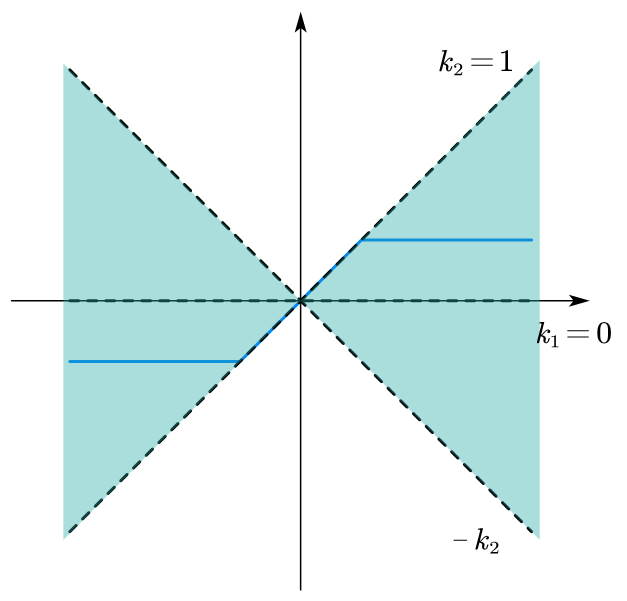
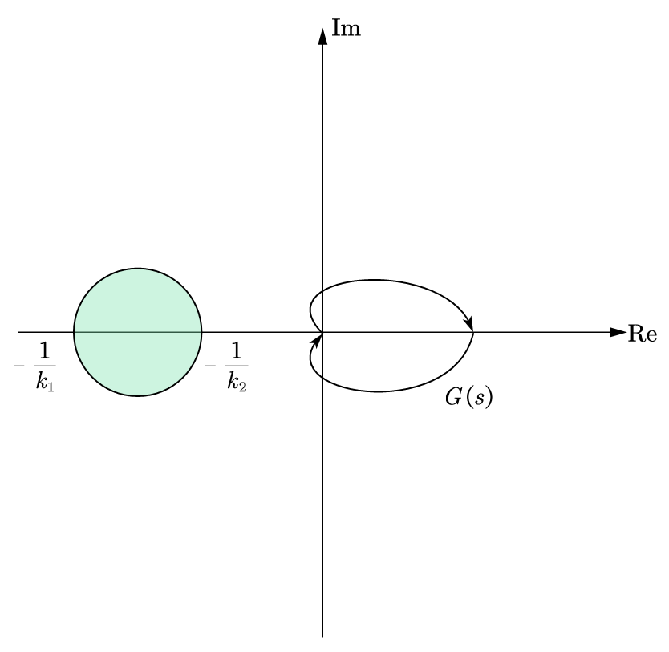
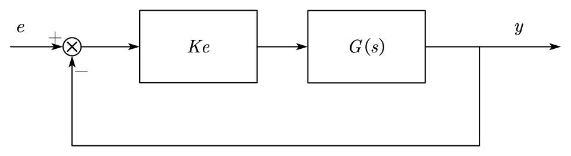
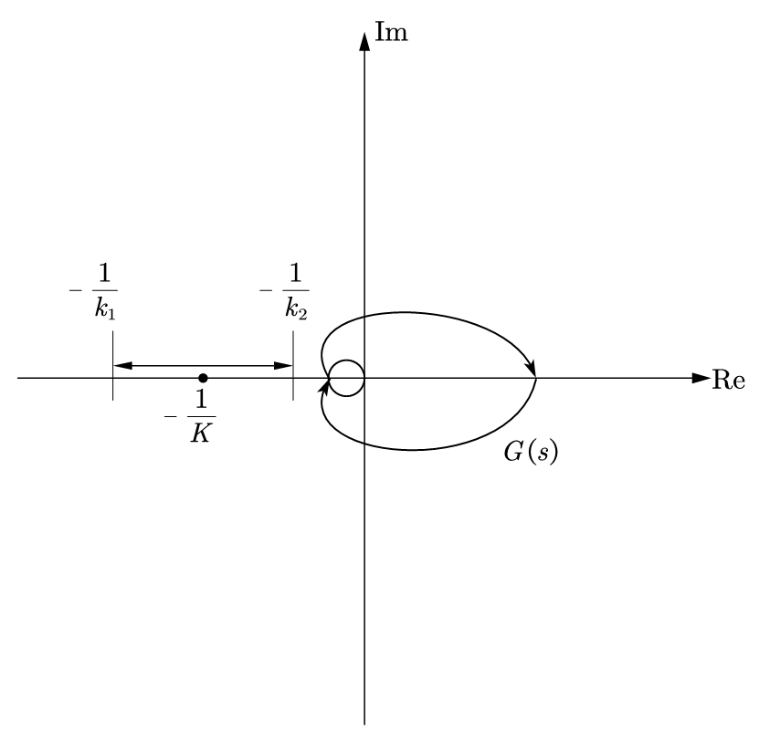
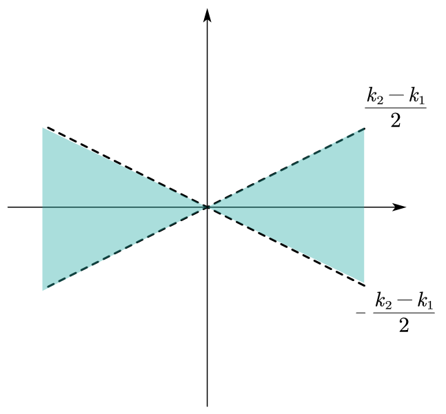
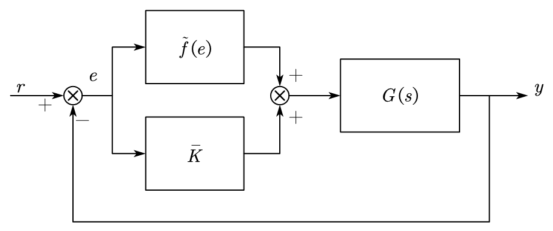
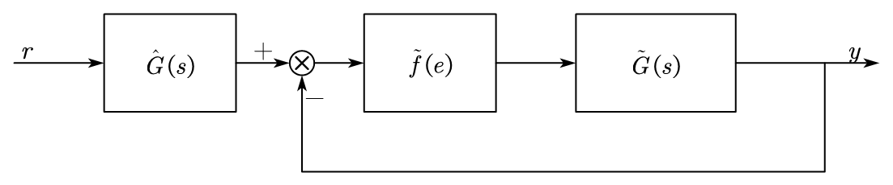
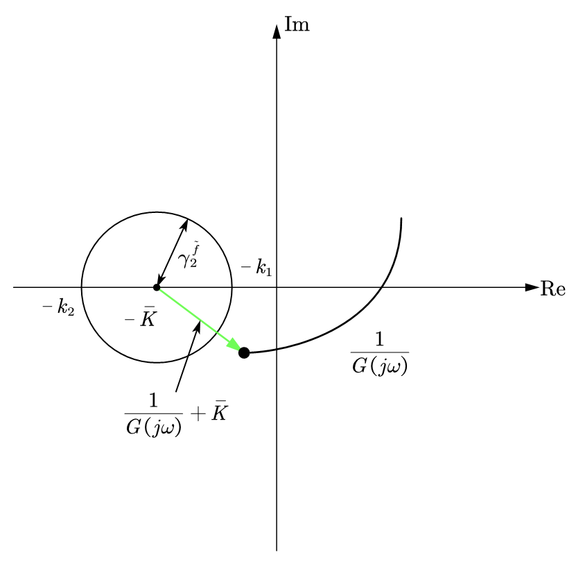
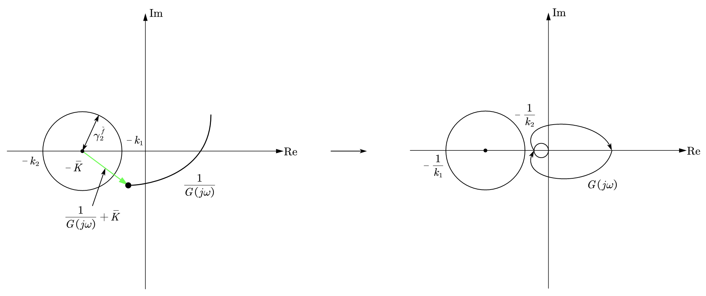

## 1. Small Gain Theorem
### 1.1 for MIMO Linear Systems
Given the system schmetic below,

<figure markdown="span">
    { width="400" }
</figure>

where $S_1$ and $S_2$ are IO $L_2$ stable, if $\gamma_2^{(1)}\gamma_2^{(2)} < 1$, then the feedback system is IO $L_2$ stable.

!!! info

    Proof

    $$
    \begin{aligned}
    y_1 &= S_1(e_1) \\
    ||y_1||_2 &\leq \gamma_2^{(1)} ||e_1||_2
    \end{aligned}
    $$

    Where, $e_1 = u_1 + S_2(y_1 + u_2)$, thus, we have:

    $$
    \begin{aligned}
    ||e_1||_2 &\leq ||u_1||_2 + ||S_2(y_1+u_2)||_2 \\
    &\leq ||u_1||_2 + \gamma_2^{(2)} (||y_1||_2 + ||u_2||_2) \\
    &\leq ||u_1||_2 + \gamma_2^{(1)}\gamma_2^{(2)}||e_1||_2 + \gamma_2^{(2)}||u_1||_2 \\
    (1-\gamma_2^{(1)}\gamma_2^{(2)})||e_1||_2 &\leq ||u_1||_2+\gamma_2^{(2)}||u_2||_2 \\
    ||e_1||_2 &\leq \frac{||u_1||_2+\gamma_2^{(2)}||u_2||_2}{1-\gamma_2^{(1)}\gamma_2^{(2)}}
    \end{aligned} 
    $$

    We can get the result,

    $$
    ||y_1||_2 \leq \gamma_2^{(1)}||e_1||_2 \leq \frac{\gamma_2^{(1)}}{1-\gamma_2^{(1)}\gamma_2^{(2)}}||u_1||_2 + \frac{\gamma_2^{(1)}\gamma_2^{(2)}}{1-\gamma_2^{(1)}\gamma_2^{(2)}}||u_2||_2
    $$

    Similarly, we have:

    $$
    ||y_2||_2 \leq \frac{\gamma_2^{(2)}}{1-\gamma_2^{(1)}\gamma_2^{(2)}}||u_2||_2 + \frac{\gamma_2^{(1)}\gamma_2^{(2)}}{1-\gamma_2^{(1)}\gamma_2^{(2)}}||u_1||_2
    $$

    If $S_1$ and $S_2$ are linear systems, within the following conditions:

    $$
    \begin{aligned}
    ||S_1S_2||_\infty &< 1 \\
    \underbrace{||S_1||_\infty}_{\gamma_2^{(1)}}\underbrace{||S_2||_\infty}_{\gamma_2^{(2)}} &< 1 
    \end{aligned}
    $$

    The system is A.S., $||S_1S_2||_\infty < 1$ is a less restirctive condition.

### 1.2 for SISO Linear Systems
We try to extend this result into SISO systems, given $G_1(s)$ and $G_2(s)$ are SISO A.S. systems

<figure markdown="span">
    { width="400" }
</figure>

The sign here does not metter because we use the triangular inequality, and we have:

$$
\begin{aligned}
L(s) &= G_1(s)G_2(s) \\
||L||_\infty &< 1 \\
||L||_\infty &= \sup_\omega |L(j\omega)| < 1
\end{aligned}
$$

Given a example Nyquist plot figure:

<figure markdown="span">
    { width="400" }
</figure>

In this example, the system have the Nyquist plot in orange trajectory, the gain is always smaller than 1, which satisfy the condition $||L||_\infty < 1$, the system is A.S.

But even if the system does not satisfy the condition (the pink trajectory), the system is still A.S.

As long as the Nyquist plot the system does not includes the $(-1,0)$ point, the system is stable.

### 1.3 for Nonlinear SISO Systems
Considering the nonlinear system,

<figure markdown="span">
    { width="400" }
</figure>

Where $G$ is the __transfer function (TF)__ that are A.S., and $f$ is a sector of nonlinearity, where $f: \mathbb R \to \mathbb R, f \in C^1$, and satisfy: $k_1 e \leq f(e) \leq k_2 e, \forall e$. We can draw the figure:

<figure markdown="span">
    { width="400" }
</figure>

* if we have $\gamma_2^f ||G||_\infty < 1$ $\Rightarrow$ the system is IO $L_2$ stable

    Where, $\gamma_2^f = \sup_{e \in L_2, ||e||_2 \neq 0} \frac{||f(e)||_2}{||e||_2}$. because $f(e)$ has an upper bound of $k_2e$ such that:

    $$
    \begin{aligned}
    \gamma_2^f &= \sup_{e \in L_2, ||e||_2 \neq 0} \frac{||f(e)||_2}{||e||_2} \\
    &\leq \frac{k_2||e||_2}{||e||_2} \\
    &\leq k_2
    \end{aligned}
    $$

    and $\gamma_2^f ||G||_\infty \leq k_2 ||G||_\infty < 1$

    !!! warning
        When we increase $k_2$, above condition of stability is still satisfied, which means this condition does not considered the width of the sector.

        <figure markdown="span">
            { width="300" }
        </figure>

        If we want to get the actual width of the sector, we can find the intermidate line of the sector, which gives: $\bar k = \frac{k_1 + k_2}{2}$, we can rotate this line to find the actual width of the sector.

We consider a SISO system case with the same schematics:
<figure markdown="span">
    { width="400" }
</figure>

Where $f$ is a sector of nonlinearity, where $f: \mathbb R \to \mathbb R, f \in C^1$, and satisfy: $k_1 e \leq f(e) \leq k_2 e, \forall e$. We consider a saturation function here, draw the sector for this function:
<figure markdown="span">
    { width="300" }
</figure>

The saturation function can be embedded into a sector, we can have a wider sector that satisfy the small gain theorem,
<figure markdown="span">
    { width="300" }
</figure>

Now we introduce the circle ciriterion.

!!! quote

    The closed loop system is IO $L_2$ stable if: the Nyquist diagram of $G(s)$ does not encompass, intersect or touch the circle with center on the real axis that intersects it in $-\frac{1}{k_1}$ and $-\frac{1}{k_2}$.

    <figure markdown="span">
        { width="300" }
    </figure>

    !!! info
        Proof:
        
        Given the schematics a cascaded system:

        <figure markdown="span">
            { width="400" }
        </figure>

        Where $K = \begin{bmatrix} k_1 & k_2 \end{bmatrix}$, the nonlinear part was replaced with an linear function. Thus, we can use the Nyquist Theorem, $L(s) = KG(s)$, and draw the Nyquist plot,

        <figure markdown="span">
            { width="300" }
        </figure>

        The system is A.S. when $G(s)$ does not pass though the point $-\frac{1}{K}$, if $K$ is a changing value, we should check all the possible value of $K$ to make sure it meets the Nyquist stability.

        Because $f$ can be nonlinear, so we should extened the range in the real axis to a circle, which gives a more strict restriction to the stability.

    If $k_1 \to 0$, then the circle will be infinity large, and the area of the circle becomes the plane of $x < -\frac{1}{k_2}$.

We can replace $f$ in the previous part with:

$$
f(e) = \tilde f(e) + \bar k e
$$

with $\bar k = \frac{k_1 + k_2}{2}$, $\tilde f$ is a sector of nonlinearty we can reduce range of the sector of nonlinearity:

$$
(k_1 - \bar k)e \leq \tilde f(e) \leq (k_2 - \bar k)e
$$

<figure markdown="span">
    { width="400" }
</figure>

And redraw the scheme within the replaced $f$,

<figure markdown="span">
    { width="400" }
</figure>

From the figure, we can give the following equations:

$$
\begin{aligned}
e &= r - G(s)(\bar ke + \tilde f(e)) \\
&= \underbrace{\frac{1}{1+\bar k G(s)}}_{\hat G(s)} r - \underbrace{\frac{G(s)}{1+\bar k G(s)}}_{\tilde G(s)} \tilde f(e)
\end{aligned}
$$

Redraw the system schematics again,

<figure markdown="span">
    { width="600" }
</figure>

Based on circle criterion, we can find $\hat G(s) = \frac{1}{1+\bar k G(s)}$ is A.S., and $\tilde G(s) = \frac{G(s)}{1+\bar k G(s)}$ is also A.S., the casecaded system is stable if each part of the system is stable, thus, we want to prove that the closed loop system for $\tilde f$ and $\tilde G(s)$ is stable. We can apply the small gain theorem to this subsystem,

$$
\begin{aligned}
\gamma_2^{\tilde f} ||\tilde G||_\infty &< 1 \\
\gamma_2^{\tilde f} ||\tilde G||_\infty &< 1 \\
\gamma_2^{\tilde f} |\tilde G(j\omega)| &< 1, \forall \omega \\
|\frac{1}{\tilde G(j\omega)}| &> \gamma_2^{\tilde f} \\
|\frac{1}{G(j\omega)} + \bar k| &> \gamma_2^{\tilde f}, \forall \omega
\end{aligned}
$$

From above equation, we can draw the figure in complex plane,

<figure markdown="span">
    { width="400" }
</figure>

To evalute the result in circle criterion, we transform the figure to Nyquist plot,

<figure markdown="span">
    { width="800" }
</figure>