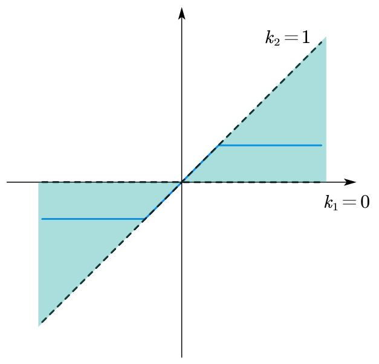

## 1. Small Gain Theorem
### 1.1 for MIMO Linear Systems
Given the system schmetic below,

<figure markdown="span">
    { width="400" }
</figure>

where $S_1$ and $S_2$ are IO $L_2$ stable, if $\gamma_2^{(1)}\gamma_2^{(2)} < 1$, then the feedback system is IO $L_2$ stable.

!!! info

    Proof

    $$
    \begin{aligned}
    y_1 &= S_1(e_1) \\
    ||y_1||_2 &\leq \gamma_2^{(1)} ||e_1||_2
    \end{aligned}
    $$

    Where, $e_1 = u_1 + S_2(y_1 + u_2)$, thus, we have:

    $$
    \begin{aligned}
    ||e_1||_2 &\leq ||u_1||_2 + ||S_2(y_1+u_2)||_2 \\
    &\leq ||u_1||_2 + \gamma_2^{(2)} (||y_1||_2 + ||u_2||_2) \\
    &\leq ||u_1||_2 + \gamma_2^{(1)}\gamma_2^{(2)}||e_1||_2 + \gamma_2^{(2)}||u_1||_2 \\
    (1-\gamma_2^{(1)}\gamma_2^{(2)})||e_1||_2 &\leq ||u_1||_2+\gamma_2^{(2)}||u_2||_2 \\
    ||e_1||_2 &\leq \frac{||u_1||_2+\gamma_2^{(2)}||u_2||_2}{1-\gamma_2^{(1)}\gamma_2^{(2)}}
    \end{aligned} 
    $$

    We can get the result,

    $$
    ||y_1||_2 \leq \gamma_2^{(1)}||e_1||_2 \leq \frac{\gamma_2^{(1)}}{1-\gamma_2^{(1)}\gamma_2^{(2)}}||u_1||_2 + \frac{\gamma_2^{(1)}\gamma_2^{(2)}}{1-\gamma_2^{(1)}\gamma_2^{(2)}}||u_2||_2
    $$

    Similarly, we have:

    $$
    ||y_2||_2 \leq \frac{\gamma_2^{(2)}}{1-\gamma_2^{(1)}\gamma_2^{(2)}}||u_2||_2 + \frac{\gamma_2^{(1)}\gamma_2^{(2)}}{1-\gamma_2^{(1)}\gamma_2^{(2)}}||u_1||_2
    $$

    If $S_1$ and $S_2$ are linear systems, within the following conditions:

    $$
    \begin{aligned}
    ||S_1S_2||_\infty &< 1 \\
    \underbrace{||S_1||_\infty}_{\gamma_2^{(1)}}\underbrace{||S_2||_\infty}_{\gamma_2^{(2)}} &< 1 
    \end{aligned}
    $$

    The system is A.S., $||S_1S_2||_\infty < 1$ is a less restirctive condition.

### 1.2 for SISO Linear Systems
We try to extend this result into SISO systems, given $G_1(s)$ and $G_2(s)$ are SISO A.S. systems

<figure markdown="span">
    { width="400" }
</figure>

The sign here does not metter because we use the triangular inequality, and we have:

$$
\begin{aligned}
L(s) &= G_1(s)G_2(s) \\
||L||_\infty &< 1 \\
||L||_\infty &= \sup_\omega |L(j\omega)| < 1
\end{aligned}
$$

Given a example Nyquist plot figure:

<figure markdown="span">
    { width="400" }
</figure>

In this example, the system have the nyquist plot in orange trajectory, the gain is always smaller than 1, which satisfy the condition $||L||_\infty < 1$, the system is A.S.

But even if the system does not satisfy the condition (the pink trajectory), the system is still A.S.

As long as the nyquist plot the system does not includes the $(-1,0)$ point, the system is stable.

### 1.3 for Nonlinear Systems
Considering the nonlinear system,

<figure markdown="span">
    { width="400" }
</figure>

Where $G$ is the __transfer function (TF)__ that are A.S., and $f$ is a sector of nonlinearity, where $f: \mathbb R \to \mathbb R, f \in C^1$, and satisfy: $k_1 e \leq f(e) \leq k_2 e, \forall e$. We can draw the figure:

<figure markdown="span">
    { width="400" }
</figure>

* if we have $\gamma_2^f ||G||_\infty < 1$ $\Rightarrow$ the system is IO $L_2$ stable

    Where, $\gamma_2^f = \sup_{e \in L_2, ||e||_2 \neq 0} \frac{||f(e)||_2}{||e||_2}$. because $f(e)$ has an upper bound of $k_2e$ such that:

    $$
    \begin{aligned}
    \gamma_2^f &= \sup_{e \in L_2, ||e||_2 \neq 0} \frac{||f(e)||_2}{||e||_2} \\
    &\leq \frac{k_2||e||_2}{||e||_2} \\
    &\leq k_2
    \end{aligned}
    $$

    and $\gamma_2^f ||G||_\infty \leq k_2 ||G||_\infty < 1$

    !!! warning
        When we increase $k_2$, above condition of stability is still satisfied, which means this condition does not considered the width of the sector.

        <figure markdown="span">
            { width="300" }
        </figure>

!!! example
    We consider a SISO system case with following schematics:
    <figure markdown="span">
        { width="400" }
    </figure>

    We can draw the boundary for this system:
    <figure markdown="span">
        { width="300" }
    </figure>

    

Circle criterion:

The closed loop system is IO $L_2$ stable if the nyquist diagram of $G(s)$ does not encompass, intersect or touch, the circle with center on the real axis taht intersects it in $-\frac{1}{k_1}$ and $-\frac{1}{k_2}$

$$
f(e) = \tilde f(e) + \bar k e
$$

with $\bar k = \frac{k_1 + k_2}{2}$, $\tilde f$ is a sector of nonlinearty

$$
(k_1 - \bar k)e \leq \tilde f(e) \leq (k_2 - \bar k)e
$$

$$
\begin{aligned}
e &= r - G(s)(\bar ke + \tilde f(e)) \\
&= \underbrace{\frac{1}{1+\bar k G(s)}}_{\hat G(s)} r - \underbrace{\frac{G(s)}{1+\bar k G(s)}}_{\tilde G(s)} \tilde f(e)
\end{aligned}
$$

$$
\begin{aligned}
\gamma_2^{\tilde f} ||\tilde G||_\infty &< 1 \\
\bar \gamma ||\tilde G||_\infty &< 1 \\
\bar \gamma |\tilde(j\omega)| < 1, \forall \omega \\
|\frac{1}{\tilde G(j\omega)}| > \bar \gamma \\
|\frac{1}{\tilde G(j\omega)} + \bar k| > \bar \gamma
\end{aligned}
$$