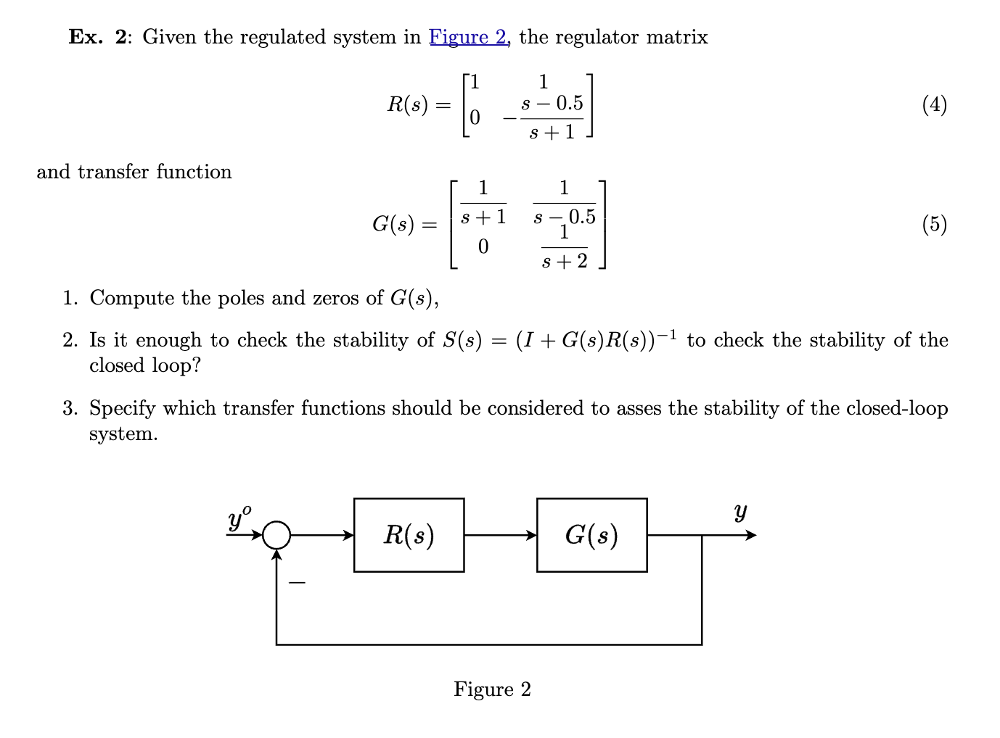

## __Ex. 1__: Given the discrete-time system:

$$
G(z) = \begin{bmatrix} 
\frac{z-1}{(z-0.5)^2} \\ \frac{z}{(z-0.5)^2}
\end{bmatrix}
$$

and the state space representation

$$
\begin{bmatrix} 
x_1(k+1) \\ x_2(k+1)
\end{bmatrix} = 
\begin{bmatrix} 
0 & 1 \\ -0.25 & 1
\end{bmatrix}
\begin{bmatrix} 
x_1(k) \\ x_2(k)
\end{bmatrix} +
\begin{bmatrix} 
0 \\ 1
\end{bmatrix} u(k)
$$

$$
\begin{bmatrix} 
y_1(k) \\ y_2(k)
\end{bmatrix} = 
\begin{bmatrix} 
-1 & 1 \\ 0 & 1
\end{bmatrix}
\begin{bmatrix} 
x_1(k) \\ x_2(k)
\end{bmatrix}
$$

Find

1. Find the poles and zeros of $G(s)$,

    1. Poles

        __1.1 Find Minors__

        $$
        M_{11} = \frac{z-1}{(z-0.5)^2}
        $$

        $$
        M_{12} = \frac{z}{(z-0.5)^2}
        $$

        __1.2 Least Common Denominator $\rightarrow$ $\varphi(z)$__

        $$
        \varphi(z) = (z-0.5)^2
        $$

        __1.3 Roots__

        $$
        z_{1,2} = 0.5
        $$

    2. Zeros

        __2.1 Normal order__

        1

        __2.2 All minors of order 1__
        
        $M_{11}$, $M_{12}$

        __2.3 Max common devisor when $\varphi(z)$ is denominators__

        $z(z) = 1$, no zeros

2. Determine how many outputs can be regulated to constant references,

    Control 

    $$
    \begin{aligned}
    p\leq m \\
    \text{No derivative action} \begin{aligned} s=0 \\ z=1 \end{aligned}
    \end{aligned}
    $$

    considor only $y_1$

    check conditions integration

    $$
    G_1(z) = \frac{z-1}{(z-0.5)^2} \left\{\begin{aligned} &1 \leq 1 \\
    &\text{Derivative action}
    \end{aligned}\right.
    $$

    consider $y_2$

    $$
    G_2(z) = \frac{z}{(z-0.5)^2} \left\{\begin{aligned} &1 \leq 1 \\
    &\text{No derivative action}
    \end{aligned}\right.
    $$

    Static gains, find $u_\infty$

    $$
    G(z=1) = \begin{bmatrix} 0\\4 \end{bmatrix}
    $$

    $$
    y_\infty = G(1)u_\infty 
    $$

    $$
    y_\infty = [0]u_\infty \text{(No)} \quad 
    y_\infty = 4u_\infty \text{(Yes)}
    $$

3. Verify there are no invariant zeros in $z=1$, using the state space model.

    $$
    P(z) = \begin{bmatrix} 
    zI - A & -B \\ C & D
    \end{bmatrix} = \begin{bmatrix} 
    z & -1 & 0 \\
    0.25 & z-1 & -1 \\
    -1 & 1 & 0 \\
    0 & 1 & 0
    \end{bmatrix}
    $$

    $$
    P(z=1) =  \begin{bmatrix} 
    1 & -1 & 0 \\
    0.25 & 0 & -1 \\
    -1 & 1 & 0 \\
    0 & 1 & 0
    \end{bmatrix}
    $$

    No zeros in 1

4. Assume the states are measurable, show how to design a pole placement scheme guaranteeing zero error robust regulation (refer to Figure 1)

    Enlarged system

    $$
    \dot{\tilde x} = \tilde A \tilde x + \tilde B u + \tilde M d \leftarrow \text{goal}
    $$

    $$
    \tilde x = \begin{bmatrix} 
    x_1 \\ x_2 \\ \eta
    \end{bmatrix} \quad \dot{\tilde x} = \begin{bmatrix} 
    \dot x_1 \\ \dot x_2 \\ \dot\eta
    \end{bmatrix}
    $$

    $$
    \eta = \frac{1}{z-1}(y_2^\circ - y_2) = \frac{e_2}{z-1}
    $$

    $$
    \begin{aligned}
    \eta(k+1) &- \eta(k) = e_2(k) \\
    \eta(k+1) &= y_2^\circ - y_2(k) + \eta(k) \\
    &= y_2^\circ + \eta(k) - C_2x(k)
    \end{aligned}
    $$

    $$
    \begin{aligned}
    x(k+1) &= Ax(k) + Bu(k) \\
    \eta(k+1) &= y_2^\circ + \eta(k) - C_2x(k)
    \end{aligned}
    $$

    $$
    \tilde x(k+1) = \begin{bmatrix} 
    A & \begin{bmatrix} 0 \\ 0 \end{bmatrix} \\
    C_2 & 1
    \end{bmatrix} 
    \begin{bmatrix} x_1 \\ x_2 \\ \eta \end{bmatrix} + 
    \begin{bmatrix} B \\ 0 \end{bmatrix}u + 
    \begin{bmatrix} 0 \\ 0 \\ 1 \end{bmatrix} y_2^\circ
    $$

    To do the pole-palcement, we need to check the reachablility of $(\tilde A, \tilde B)$, which is equilvant to $(A, B)$,

    $$
    \begin{aligned}
    M_R &= \begin{bmatrix} B & AB \end{bmatrix} \\
    &= \begin{bmatrix} 0&1 \\ 1&1 \end{bmatrix} \text{(ok)}
    \end{aligned}
    $$

    We can use the matlab function `K = place(A_tilde, B_tilde, [P_1, P_2, P_3])` toplace the poles,

    $$
    K = \begin{bmatrix} K_1 & K_2 & K_\eta \end{bmatrix}
    $$

5. In case the state are not measurable, can we use a static observer?

Staic Observer

$$
y = Cx + Du = Cx
$$

$$
\hat x = C^{-1} y
$$

Conditions of static observer: $C$ is suqare, $C$ is non-singular

$$
C = \begin{bmatrix} -1 & 1 \\ 0 & 1 \end{bmatrix} \quad 
C^{-1} = C
$$

$$
\hat x = Cy
$$

## __Ex. 3__: Consider the continous system

$$
\left\{\begin{aligned} 
&\dot x = x^3 -xu^2 \\
&y = x
\end{aligned}\right.
$$

and the equilivrium point $\bar x = 1$, $\bar u = 1$. Design a pole-placement 

Point $\bar x = 1$, $\bar u = 1$,

$$
\delta \dot x  = \frac{\partial f}{\partial x}|_{\bar x, \bar u} \delta x + \frac{\partial u}{\partial x}|_{\bar u, \bar x} \delta u = (3\bar x^2 - \bar u^2) \delta x - 2\bar x \bar u \delta u = 2 \delta x - 2\delta u
$$

The system is unstable since we have the pole $=2$,

$A = 2$, $B = -2$, $C = 1$, $D = 0$,

Pole-placement requires the reachability that $M_R = [B] = [-2]$, (ok)

$$
\begin{aligned} 
&\delta u = v - K_x \delta x \\
&\delta \dot x = 2 \delta x - 2 \delta u = (2\delta x - 2 v + 2 K_x \delta x) = \underbrace{(2 + 2K_x)}_{A_{pp}} \delta x - 2 v
\end{aligned}
$$

$p = -1 = 2+2K_x$, $K_x = -\frac32$

Design PI for performances

We treat the feedback controlled system as $\tilde G = \frac{-2}{s+1}$,

The PI regulator have the TF: $K_p \frac{sT_i + 1}{sT_i}$, and we want $R(s) = \frac{s+1}{s}\frac{\omega_c}{\mu}$

And $L(s) = RG = \frac{\omega_c}{s}$

Point 2

Conditions for the enlarged systems 

$p = 1 \leq m = 1$, (ok),

derivative action (no) $G(s) = \frac{-2}{s-2}$

$$
\dot{\tilde x} = \tilde A \underbrace{\tilde x}_{\begin{bmatrix} x \\ \eta \end{bmatrix}} + \tilde B u + \tilde M d
$$

$$
\dot \eta = e = y^\circ - C\delta x
$$

$$
\begin{bmatrix} \delta \dot x \\ \dot \eta \end{bmatrix} = 
\begin{bmatrix} 2&0 \\ -1&0 \end{bmatrix}
\begin{bmatrix} \delta x \\ \eta \end{bmatrix} + 
\begin{bmatrix} -2 \\ 0 \end{bmatrix} u + 
\begin{bmatrix} 0 \\ 1 \end{bmatrix}y^\circ
$$

Point 2

...

Poles = $[-1, -1]$

$$
\begin{aligned}
\varphi^*(s) &= (s+1)^2 = s^2 + 2s + 1 \\
\varphi(s) &= \det(sI+A^*) = \det\begin{bmatrix} 
s-(2+2K_x)&-2K_\eta \\ 1&s \end{bmatrix}
\end{aligned}
$$

Compute $K$

$$
\begin{aligned}
a^* &= a &\rightarrow &1=1\\
b^* &= b &\rightarrow &2=2-2K_x\\
c^* &= c &\rightarrow &1=K_\eta
\end{aligned}
$$

<figure markdown="span">
    { width="800" }
</figure>

1. Poles
    All minous of $G(s)$

    $$
    M_{21} = \det \begin{bmatrix} 
    \frac{1}{s+1}&\frac{1}{s-0.5} \\ 0&\frac{1}{s+2} \end{bmatrix}
    $$

    Least common denominator
    
    $$
    \varphi(s) = \frac{1}{(s+1)(s+2)(s-0.5)}
    $$

    Poles: $s=-1$, $s=-0.5$, $s=-2$

    Zeros:

    normal orders $=2$,

    Minors of order 2 with $\varphi(s)$ at denominator.

    $$
    M_{21} = \frac{1}{(s+1)(s+2)}\frac{s-0.5}{s-0.5}
    $$

    $s = 0.5$

    Does the cancellation happen?

    $$
    L(s) = G(s)R(s) = 
    \begin{bmatrix} 
    \frac{1}{s+1}&\frac{1}{s-0.5} \\ 0&\frac{1}{s+2} 
    \end{bmatrix}
    \begin{bmatrix} 
    1&1 \\ 0&\frac{s-0.5}{s-0.5} 
    \end{bmatrix} = 
    \begin{bmatrix} 
    \frac{1}{s+1}&0 \\ 0&\frac{s-0.5}{(s+1)(s+2)} 
    \end{bmatrix}
    $$

    Poles

    $$
    M_2 = \frac{(s-0.5)}{(s+1)^2(s+2)}
    $$

    Poles $= -1, -1, -2$

    No it is not enough due to control condition

    check all 5 TF: $S(s)$, $T(s)$, $\frac{U(s)}{\partial u}$, $\frac{U(s)}{y}$, $\frac{y}{\partial u}$