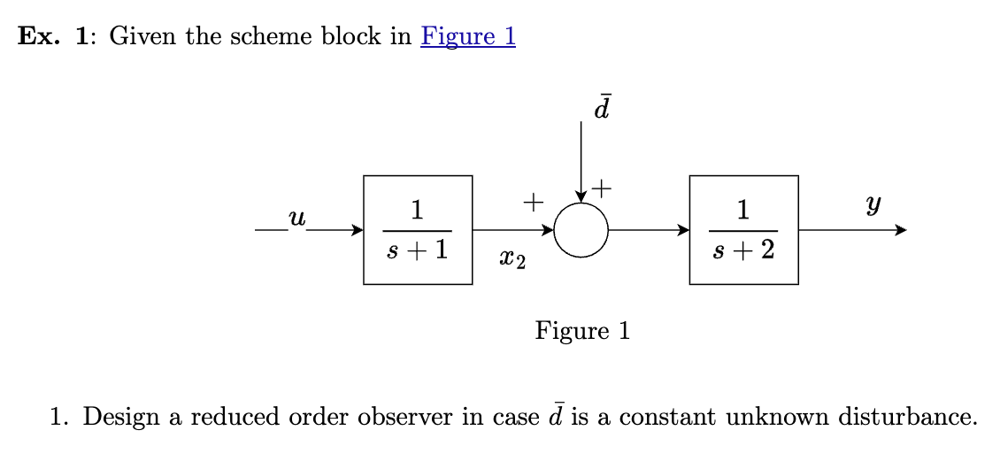
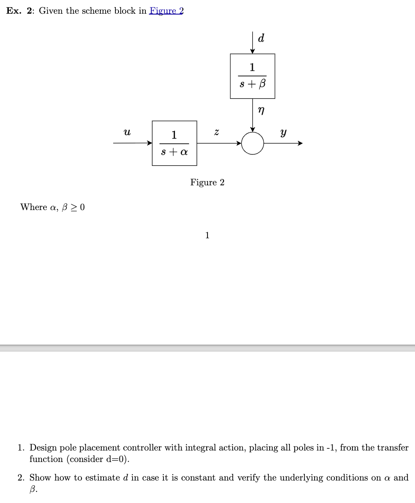

<figure markdown="span">
    { width="800" }
</figure>

$$
\begin{aligned}
x_2 &= \frac{1}{s+1}u \\
y &= \frac{1}{s+2}(x_2 + \bar d)
\end{aligned}
$$

$$
\begin{aligned}
\dot x_2 - x_2 &= u \\
\dot y + 2y &= x_2 + \bar d
\end{aligned}
$$

$$
\begin{aligned}
\dot x_1 &= -2x_1 + x_2 + \bar d \\
\dot x_2 &= -x_2 - u \\
y &= x_1
\end{aligned}
$$

$$
\begin{aligned}
&A = \begin{bmatrix} -2&1\\0&-1 \end{bmatrix}
&C = \begin{bmatrix} 1&0 \end{bmatrix}
\end{aligned}
$$

Reduced observer condition: Observable

$$
M_o = \begin{bmatrix} C \\ CA \end{bmatrix} =
\begin{bmatrix} 1&0\\-2&1 \end{bmatrix}
$$

Unknown disturbances:

$$
p \geq n_d \rightarrow 1=1 \text{(ok)}
$$

Enlarge system with $\dot d$

$d = x_3$, and $\bar d$ is constant

$$
\begin{aligned}
\dot x_1 &= -2x_1 + x_2 + \bar d \\
\dot x_2 &= -x_2 - u \\
\dot x_3 &= 0 \\
y &= x_1
\end{aligned}
$$

$$
\begin{aligned}
&\tilde A = \begin{bmatrix} -2&1&1\\0&-1&0\\0&0&0 \end{bmatrix}
&\tilde C = \begin{bmatrix} 1&0&0 \end{bmatrix}
\end{aligned}
$$

We need to find a suitable $T = \begin{bmatrix} \tilde C \\ T_1 \end{bmatrix} \in R^{n\times n}$, it should be:

* square
* non-singular

$$
T = I_3
$$

From state equation 1, $y = x_1$

$$
\underbrace{\dot y + 2y}_{\eta} = x_2 + x_3
$$

$$
\begin{aligned}
\dot x_2 &= -x_2 - u \\
\dot x_3 &= 0 \\
\eta &= x_2 + x_3
\end{aligned}
$$

$$
\begin{aligned}
\dot x_M &= 
\underbrace{\begin{bmatrix} -1&0\\0&0 \end{bmatrix}}_{A_d}x_M - 
\underbrace{\begin{bmatrix} 1\\0 \end{bmatrix}}_{B_d}u \\
\eta &= \begin{bmatrix} 1\\1 \end{bmatrix}x_M
\end{aligned}
$$

$$
\begin{aligned}
\dot{\hat x}_M &= A_d \hat x_M + B_d u + L(\eta - C_d\hat x_d) \\
&= (A_d - LC_d) \hat x_M + B_d u + L(\dot y + 2y)
\end{aligned}
$$

Dealing with $\dot y$

$$
\begin{aligned}
\dot{\hat x}_M - L\dot y &= (A_d - LC_d) \hat x_M + B_d u + 2Ly \pm (A_d - LC_d)Ly \\
\xi &= \hat x_M - Ly \\
\dot \xi &= \dot{\hat x}_M - L\dot y \\
&= (A_d - LC_d)\xi + B_d u + (A_d - LC_d)Ly + 2Ly
\end{aligned}
$$

<figure markdown="span">
    { width="800" }
</figure>

$$
G(s) = \frac{1}{s+\alpha}
$$

We want to do pole-placement with TF

1. order of $\tilde R = n-1$, $n$ is the order of $\tilde G$, $n-1 = 1$
2. the parameters of $\tilde R$

$$
\tilde R = \frac{\delta_v s^v + \delta_{v-1}s^{v-1}+ \dots + \delta_1s + \delta_0}{s^v + \gamma_{v-1}s^v-1 + \dots + \gamma_1s + \gamma_0}
$$

* $v$ is the order of $\tilde R$
* $\delta_i$, $\gamma_i$: parameter

$$
L(s) = \frac{\delta_1 s + \delta_0}{\gamma_1s + \gamma_0}\frac{1}{s(s+\alpha)}
$$

We have the desired polynomial

$$
\varphi^* = (s+1)^3 = s^3 + 3s^2 + 3s + 1
$$

$$
\begin{aligned}
\varphi_L &= N_L + D_L \\
&= \delta_1s + \delta_0 + (s^2 + s\alpha)(s+\gamma_0) \\
&= s^3 + s^2(\gamma_0 + \alpha) + (\alpha\gamma_0 + \delta_1)s + \delta_0
\end{aligned}
$$

$$
\begin{aligned}
\begin{aligned}
&\gamma_0 + \alpha = 3 \\
&\alpha\gamma_0 + \delta_1 = 3 \\
&\delta_0 = 1
\end{aligned} \Rightarrow 
\begin{aligned}
&\delta_0 = 1 \\
&\gamma_0 = 3-\alpha \\
&3\alpha - \alpha^2 + \delta_1 = 3 \\
&\delta_1 = 3+\alpha^2 - 3\alpha
\end{aligned}
\end{aligned}
$$

$$
\tilde R = \frac{(3+\alpha^2-3\alpha)s + 1}{s+(3-\alpha)}
$$

Alternative way for computing $\tilde R$ parameters

$$
\tilde G = \frac{1}{s(s+\alpha)} = \frac{\tilde B}{\tilde A}
$$

1. coefficient matrix
    
    $$
    \begin{bmatrix} 
    \begin{matrix} 
    \begin{bmatrix} 1\\ \alpha \\ 0 \end{bmatrix} \\ 0 
    \end{matrix} 
    \begin{matrix} 
    0 \\ \begin{bmatrix} 1\\ \alpha \\ 0 \end{bmatrix} 
    \end{matrix}
    \begin{matrix} 
    \begin{bmatrix} 0\\ 0 \\ 1 \end{bmatrix} \\ 0 
    \end{matrix}
    \begin{matrix} 
    0 \\ \begin{bmatrix} 0\\ 0 \\ 1 \end{bmatrix}
    \end{matrix}
    \end{bmatrix} 
    \begin{bmatrix} 1\\ \gamma_0 \\ \delta_1 \\ \delta_0 \end{bmatrix} = 
    \begin{bmatrix} 1\\3\\3\\1 \end{bmatrix}
    $$

    coefficient of $\tilde A = \begin{bmatrix} 1&\alpha&0 \end{bmatrix}$

    $$
    \begin{aligned}
    Fx &= b \\
    x &= F^{-1}b
    \end{aligned}
    $$

Point 2

$$
\begin{aligned}
\begin{aligned}
&\dot z + \alpha z = u \\
&\dot \eta + \beta \eta = \bar d \\
&y = z + \eta
\end{aligned} \Rightarrow
\begin{aligned}
&\dot z = -\alpha z + u \\
&\dot \eta = -\beta \eta + \bar d \\
&y = z + \eta
\end{aligned} 
\end{aligned}
$$

$A = \begin{bmatrix} -\alpha&0\\0&-\beta \end{bmatrix}$, 
$B = \begin{bmatrix} 1\\0 \end{bmatrix}$,
$C = \begin{bmatrix} 1&1 \end{bmatrix}$, 
$M = \begin{bmatrix} 0\\1 \end{bmatrix}$

Disturbance estimation:

* conditions: $p\geq n_d$, $1=1$ (ok)
* $(A,C)$ is observable, 
$M_o = \begin{bmatrix} C\\ CA \end{bmatrix} = \begin{bmatrix} 1&1 \\ -\alpha&-\beta \end{bmatrix}$, if and onlyif $a\neq b$
* enlarged systm

    $$
    \begin{aligned}
    &\dot z = -\alpha z + u \\
    &\dot \eta = -\beta \eta + \bar d \\
    &\dot d = 0 \\
    &y = z + \eta
    \end{aligned} 
    $$
    
    $\tilde A = \begin{bmatrix} -\alpha&0&0\\0&-\beta&1\\0&0&0 \end{bmatrix}$, 
    $B = \begin{bmatrix} 1\\0\\0 \end{bmatrix}$,
    $C = \begin{bmatrix} 1&1&0 \end{bmatrix}$,

* compute state observer

    $$
    \begin{aligned}
    \dot{\hat x} &= \underbrace{\tilde A \hat x + \tilde B u}_{\text{prediction}} + \underbrace{L(y-\tilde C \hat x)}_{\text{correction}} \\
    &= (\tilde A - L\tilde C)\hat x + \tilde B u + Ly
    \end{aligned}
    $$

    We can calculate the $L$ by matlab function: `L'=place(A_tilde',C_tilde',[poles])`

