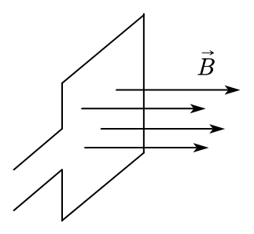
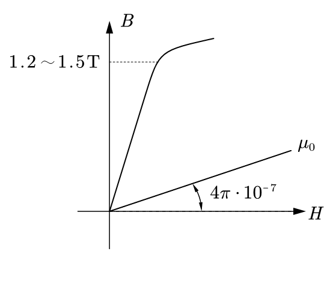
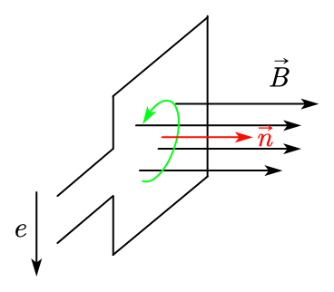
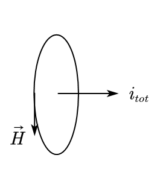
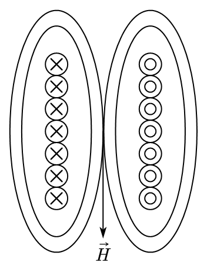

We start with a circuit filled with magnetic fields:

<figure markdown="span">
    { width="300" }
</figure>

Where, $\vec B = \mu \vec H$

* $\vec B$ is the flux density.
* $\vec H$ is magnetic filed strength.
* $\mu$ is the permeability.

## 1. Permeability

Permeability is different for different materials, commonly, we have:

|Materials|Permeability|
|---|---|
|param materials|$\mu \approx \mu_0 = 4\pi \cdot 10^{-7}$|
|ferr materials|$\mu = 1000 \sim 10000 \mu_0$|
|diamag materials|$\mu < \mu_0$|

For the electrical machines, we only consider __param materals__ and __ferr materials__.

## 2. BH Curve

Within the permeability, we can draw the BH curve:

<figure markdown="span">
    { width="300" }
</figure>

In the BH curve, the ferr material keeps linear untill $1.2 \sim 1.5 T$, then due to the material saturates, the slope will be reduced, and after saturation, the slope is similar to $\mu_0$.

## 3. Farady's Law

Farady's law helps us to find the relations between __flux density__ ($B$) and __electric motive force__ ($e$):

$$
e = \frac{d\psi}{dt}
$$

Where, $\psi = N\phi = \int_S (\vec B \vec n) dS$.

* $\psi$ is flux linkage
* $N$ is the number of turns of the coil
* $\phi$ is flux

We can use the right hand rule to define the direction of $e$:

<figure markdown="span">
    { width="300" }
</figure>

## 4. Ampere's Law

The current can produce a circled magnetic field,

<figure markdown="span">
    { width="200" }
</figure>

This can be expressed by the Ampere's law:

$$
i_{tot} = \oint_l \vec H dl
$$

If we have multiple turns of coils, thus we have: $N_{coils} i = \vec H l$. 

<figure markdown="span">
    { width="200" }
</figure>

And the magnetic permeability have the following relationship with electric permeability:

$$
c = \frac{1}{\sqrt{\mu_0 \varepsilon_0}}
$$

* $c$ is the speed of light.
* $\mu_0$ is the magnetic permeability of vaccum.
* $\varepsilon_0$ is the electric permeability of vaccum.