## 1. EMF

We know that from Faraday's Law, we have:

$$
e = -BS\omega \sin(\omega t)
$$

This is an sinusoidal wave within the part $e < 0$, to have a DC voltage, we need to make EMF positive. We can use a brush to realize this, it will change the direction for the rotors in every $180^\circ$. And we have:

$$
e = \left\{\begin{aligned}
&-BS\omega \sin(\omega t), &0 < \omega t  - 2n \pi \leq \pi \\
&BS\omega \sin(\omega t), &\pi < \omega t  - 2n \pi \leq 2\pi
\end{aligned}\right.
$$

And this can be further derived into: $e = |-BS\omega \sin(\omega t)|$. We can draw the figure of EMF:

<figure markdown="span">
    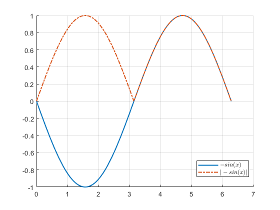{ width="400" }
</figure>

If we add one more winding, each winding have $90^\circ$ angles that crossover each other, and the EMF is:

$$
e = |-BS\omega \sin(\omega t)| + |BS\omega \sin(\omega t + \frac{\pi}{2})|
$$

We can draw the figure:

<figure markdown="span">
    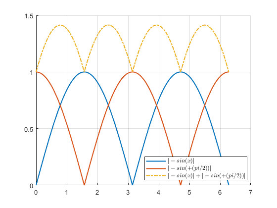{ width="400" }
</figure>

## 2. Machine Structure

The DC machine have the structure:

<figure markdown="span">
    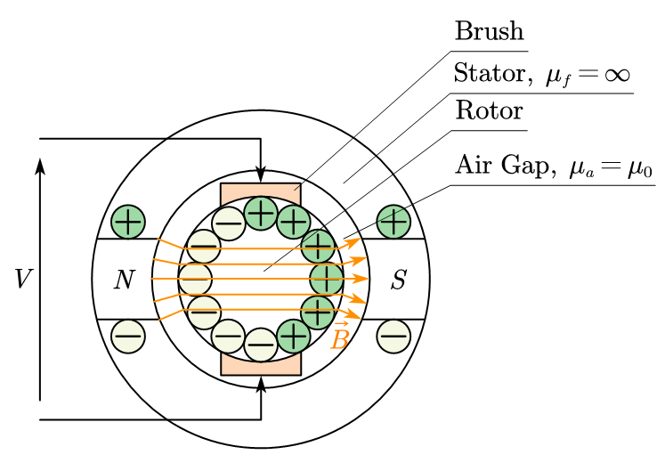{ width="400" }
</figure>

The flux and EMF passing through the rotor have the following relationship with the angle of the rotor:

<figure markdown="span">
    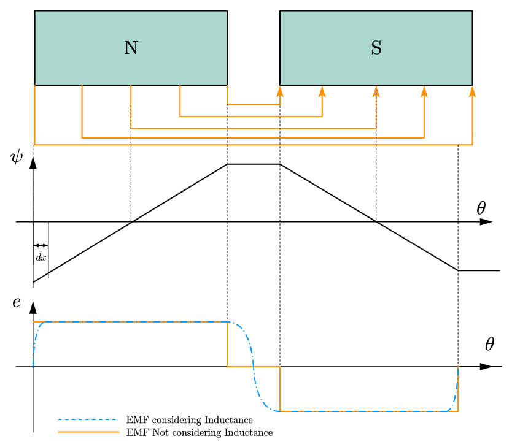{ width="400" }
</figure>

To calculate the EMF,

$$
d\psi = \vec B N_{coil} l dx 
$$

* $l$ is the length of the armature
* $N_{coil}$ is the number of the coils
* $dx = Rd\theta$, $R$ is the radius of the armature

$$
e = N_{coil} e_{coil} = N_{coil} \frac{d\phi}{dt} = N_{coil} \vec B N_{turns} R l \frac{d\theta}{dt} 
$$

* $N_{turns}$ is the number of turns in each coil

We can get the final equation of the EMF:

$$
e = N_{coils} \underbrace{N_{turns} \vec B R l}_{\psi_{ae}} \omega = \underbrace{K \psi_{ae}}_{K_e} \omega
$$

* $\omega$ is the angular speed of the rotor
* $\psi_{ae}$ is the flux between the rotor and stator
* $K_{e}$ is a constant of the DC machine

## 3. Equivalent Circuit of DC Machine

We first assume an ideal DC Machine, which only have the EMF, the equivalent circuit of this machine is:

<figure markdown="span">
    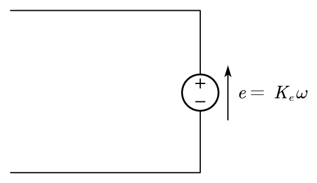{ width="300" }
</figure>

And we know that windings have the resistance and inductance, we can add these components into the circuit:

<figure markdown="span">
    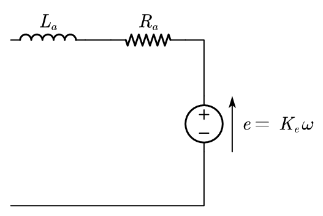{ width="300" }
</figure>

And this is the simplified circuit for DC machine armature windings.

## 4. Mechanical Characteristics of DC Machine
We look at the armature structures:

<figure markdown="span">
    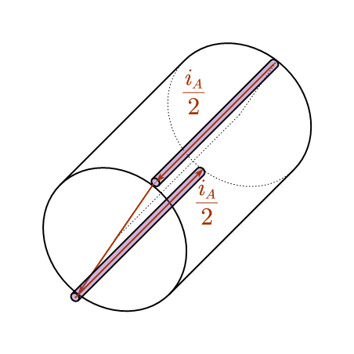{ width="300" }
</figure>

We can find that the current have opposite directions, if we short circuit the armature windings, we will get $\sum e = 0$. By using the Lorentz Law, we can define the force generated by the DC machine,

<figure markdown="span">
    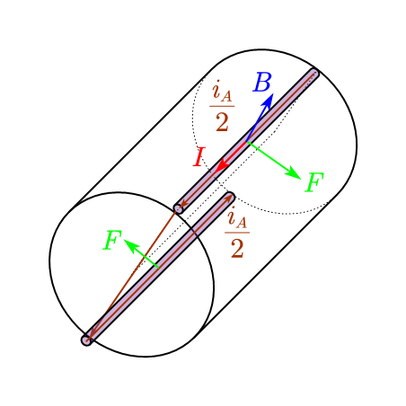{ width="300" }
</figure>

The torque and the force have the following relationships:

$$
T = 2FR
$$

This converts the electrical power into mechanical power,

* Electrical Power: $P_{elec} = vi$
* Mechanical Power: $P_{mech} = T \omega = F v = \frac{W_m}{t}$

If there have no power loss between electrical and mechanical conversion, there have:

$$
\begin{aligned}
vi &= T\omega \\
ei &= T\omega \\
K\psi \omega i &= T\omega \\
K\psi i &= T
\end{aligned}
$$

And from the same equation, we can also get $e = K\psi \omega$.

Now considering other components in the electric circuits,

<figure markdown="span">
    { width="300" }
</figure>

* $P_{R} = i^2R$, $R = \frac{\rho l}{A}$
* $W_L = \frac12 Li^2$, $L = \frac{N^2}{\Theta}$, where $\Theta = \frac{l}{\mu A}$

And the time constant is: $\tau = \frac{L}{R}$.

The voltage of the armature winding is:

$$
v_a = R_a i_a + L_a \frac{di_a}{dt} + e
$$

And we look at the stator part, we can also use a circuit to generate the magnetic fields,

<figure markdown="span">
    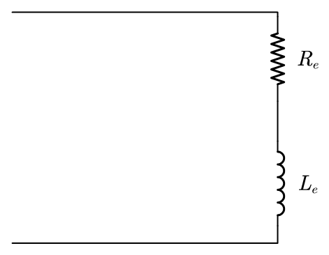{ width="200" }
</figure>

Thus we have,

$$
v_e = R_e i_e + L_e \frac{di_e}{dt}
$$

* $L_e = \frac{\psi_e}{i_e}$

## 5. Dynamic Equations of DC Machine 
The dynamic equations of DC machine are:

$$
\left\{\begin{aligned}
&v_a = R_a i_a + L_a \frac{di_a}{dt} + e \\
&v_e = R_e i_e + L_e \frac{di_e}{dt} \\
&e = k \psi \omega\\
&T = k \psi i_a
\end{aligned}\right.
$$

And $L_e >> L_a$ because the flux pass through more path on the iron, and the permeability of iron is much larger than the air.

For the mechanical part:

$$
T - T_{RES} = J \frac{d\omega}{dt} (+ G\omega)
$$

* $T_{RES}$ is the external torque
* $T$ is the torque generated by the electrical machine
* $J$ is the moment of inertia
* $G$ is the damping effect coefficient

## 6. Transfer Function Model

Within the dynamic equations, we can write them into transfer function,

$$
\left\{\begin{aligned}
&v_a = R_a i_a + L_a si_a + e \\
&v_e = R_e i_e + L_e si_e \\
&e = k \psi \omega\\
&T = k \psi i_a \\
&T - T_{RES} = (J s + G)\omega
\end{aligned}\right.
$$

## 7. System Schematics of the DC Machine

By obtaining the TF of the system, the schematics can be given:

<figure markdown="span">
    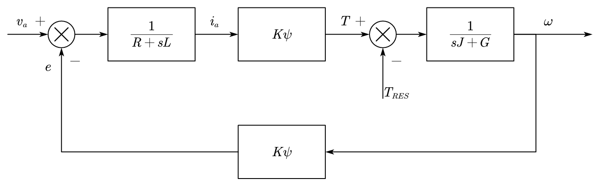{ width="600" }
</figure>

And for the DC machine that using the excitation circuit, the schematics is:

<figure markdown="span">
    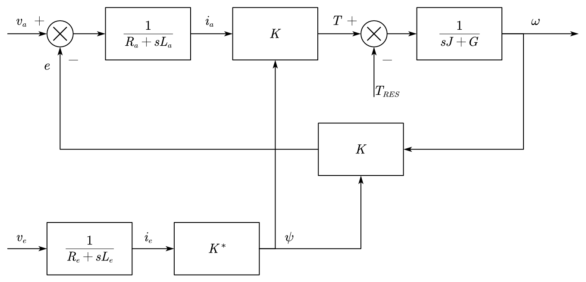{ width="600" }
</figure>