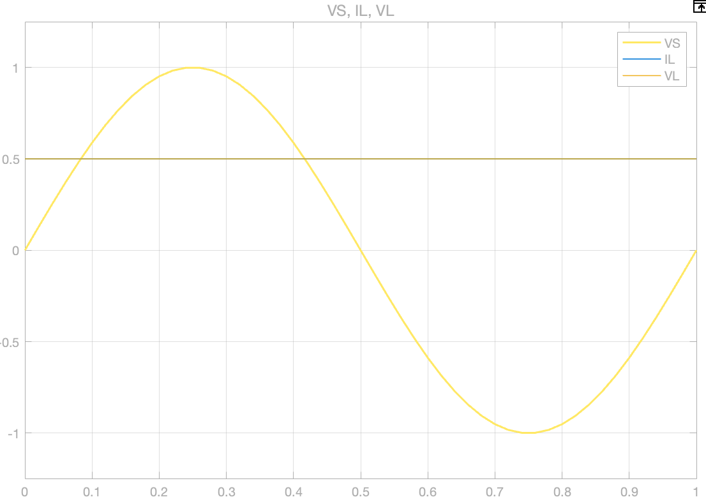

A power converter is a module that accepts the voltage inputs and output a controllable voltage to control the loads.
<figure markdown="span">
    { width="400" }
</figure>

## 3.1 DC-DC Buck Converter
### 3.1.1 Diodes
Diodes is used for cut off the voltage under 0, for the circuit below:
<figure markdown="span">
    { width="200" }
</figure>
We can give the source voltage and load voltage comparison:
<figure markdown="span">
    { width="400" }
</figure>

### 3.1.2 Inductor
No we introduce the inductor,
<figure markdown="span">
    { width="200" }
</figure>
The voltage changes,
<figure markdown="span">
    { width="400" }
</figure>

### 3.1.3 Full Bridge
If we add more diode to convert the negative part voltage to positive one, we called this device __full bridge__.
<figure markdown="span">
    { width="200" }
</figure>
The voltage passed full bridge would become:
<figure markdown="span">
    { width="400" }
</figure>

### 3.1.4 3-Phase Bridge
If the voltage input is 3-phase voltage instead, we can use 3-phase bridge to convert all of them to positive part.
<figure markdown="span">
    { width="200" }
</figure>
And the voltage becomes:
<figure markdown="span">
    { width="400" }
</figure>

### 3.1.5 Capacitor
For convenient, we keep using single phase to analyze the circuit, and now we add inductor and capacitor together,
<figure markdown="span">
    { width="200" }
</figure>
And the voltage we get likes:
<figure markdown="span">
    { width="400" }
</figure>

### 3.1.6 Large Inductance With Initial Current:
If the inductance becomes very large ($L \to \infty$), and exists the initial current, it behaves like a current source. Connect the circuit like the below:
<figure markdown="span">
    { width="200" }
</figure>
Within the initial current set to $0.5A$, the voltage and current have the figure below:
<figure markdown="span">
    { width="400" }
</figure>

### 3.1.7 Capacitor With Initial Voltage
If capacitor have the initial voltage, it will cause a high current which may break the device, connect the circuit like below:
<figure markdown="span">
    { width="200" }
</figure>
The curve of the device would be:
<figure markdown="span">
    { width="400" }
</figure>
We can find that the current pass though capacitor experienced a huge current in a short time, to solve this problem, one possible way is to connect a large resistor in serial with the capacitor. To improve the energy efficiency, we can add more components like switching device to adjust the time to connect in the resistor, we called this a __brake__.

### 3.1.8 Buck Converter
A buck converter have the simplified diagram below:
<figure markdown="span">
    { width="200" }
</figure>
We also called it step-down converter, and in buck converter, $V_{out} < V_{in}$ always.

And for the converter which $V_{out} > V_{in}$, we called it boost converter.

## 3.2 Boost Converter
The boost converter is ued to step-up the voltage
<figure markdown="span">
    { width="200" }
</figure>

## 3.3 Buck-boost Converter 
When 2 switch with diode connected together, it could be called an __arm__ or a __leg__, this structure could realize the stepping down or stepping up the voltage, it could be called buck-boost converter.
<figure markdown="span">
    { width="200" }
</figure>

It should be mentioned that the 2 switch cannot close at the same time, otherwise it will cause a short circuit.

## 3.4 Full Bridge Converter
The full bridge contains 2 arms, within the load connected the middle part together:
<figure markdown="span">
    { width="200" }
</figure>

The output voltage of full bridge converter is:
<figure markdown="span">
    { width="400" }
</figure>

$$
V_{mean} = \frac{V_{DC}T_{ON} - V_{DC}T_{OFF}}{T_{ON}+T_{OFF}}
$$

The voltage on the figure is called __bi-polar PWM__.