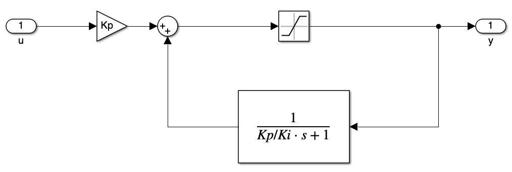

## 4.1 System Model and Controller Schemes
The transfer function model of DC electrical machine is:

<figure markdown="span">
    { width="600" }
</figure>

For the motor that uses Permanent Magnet as its exciting source, the model becomes the figure below:

<figure markdown="span">
    { width="600" }
</figure>

We can design a PI controller to control the input voltage of the system,

<figure markdown="span">
    { width="400" }
</figure>

Since we don't know the EMF, we do the estimation for the approximate EMF,

$$
E_{est} = K \psi \omega 
$$

Moreover, we add speed controller to control the rotation speed of the DC machine,

<figure markdown="span">
    { width="400" }
</figure>

To use the PI controller correctly, we need to consider the load of the machine, which gives $\frac{1}{sJ + G}$

## 4.2 Anti-windup Configuration
It should be mentioned that the input voltage should __never__ exceed the maximum voltage provided by the source. To avoid this problem, we can apply the anti-windup configuration for the PI controller. 

<figure markdown="span">
    { width="400" }
</figure>

We can calculate the system configuration:

* When the system not exceeds the limit of the saturation, the saturation part could be treated as 1, thus, the close loop transfer function of the system is:

    $$
    \begin{aligned}
    H(s) &= K_p\cdot \frac{1}{1 - \frac{1}{\frac{K_p}{K_i}s + 1}} \\
    &= K_p + K_i \frac{1}{s}
    \end{aligned}
    $$

    This system has no difference with a normal PI controller

## 4.3 Operation Region
For a DC motor, the operating region have the following figure below:

<figure markdown="span">
    { width="400" }
</figure>