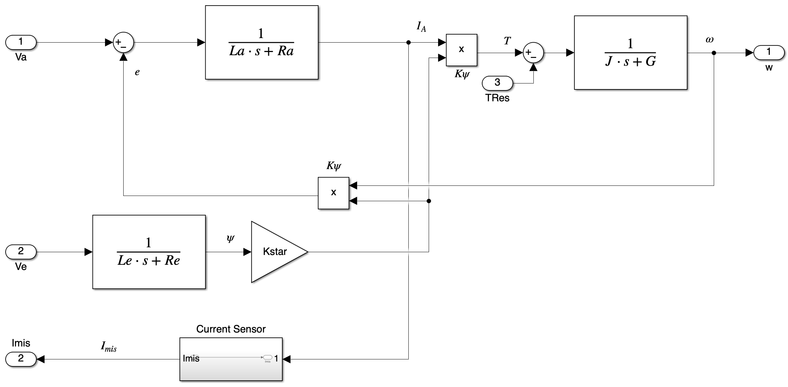
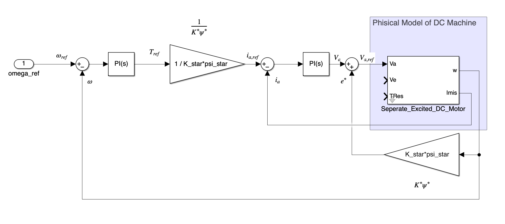
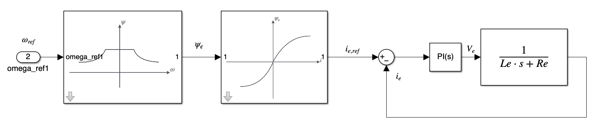
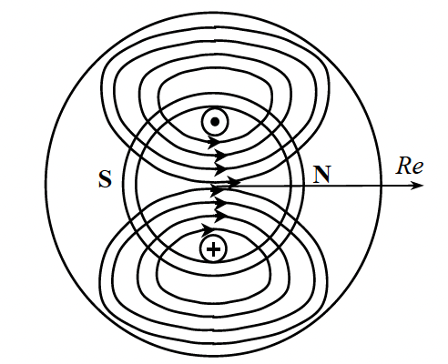
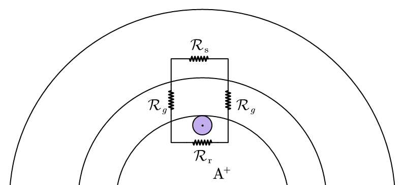
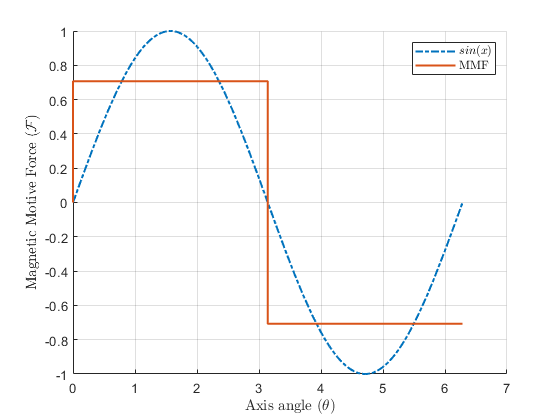

## 4.1 Review on DC Machine Dynamics
The dynamics of DC Machines:

$$
\left\{\begin{aligned}
&V_a = R_a i_a + L_a \frac{d i_a}{dt} + e \\
&V_e = R_e i_e + L_e \frac{d i_e}{dt} \\
&e = K \psi_e \omega \\
&T = K \psi_e i_a \\
&T - T_\delta = J \frac{d \omega}{dt} (+ G \omega) \\
&\psi_e = L_e i_e
\end{aligned}\right.
$$

The system model for the DC machine is:
<figure markdown="span">
    { width="600" }
</figure>

Give the PI controller design for DC machine:
<figure markdown="span">
    { width="600" }
</figure>

!!! warning
    * Commonly we use sensor to measure the current instead of the speed because the installation of speed sensor may introduce vibration to the shaft.
    * Between the controller and electrical machine there have the power converter, but we often ignore it because compared with the controll loop, the power converter module have a fast response.
    * The system is not fesiable when $\frac{1}{R_a + s L_a} = \frac{1}{sJ + G}$

If the DC machine is seperately excited, then the controller for the exciting loop should be:
<figure markdown="span">
    { width="600" }
</figure>

## 4.2 Space phasors

### 4.2.1 Field distributions of fixed magnetic fields
Given the rotating machine with single windings, 
<figure markdown="span">
    { width="300" }
</figure>

We can find the magnetic field $B$ of the rotor that are relevent to the angle of the space $\theta$:

<figure markdown="span">
    { width="300" }
</figure>

The magnetic field pass though the rotor is a square wave, the magnitude of the square wave is the average of the sinosoidal wave $B_{avg}$

As the winding number increases and distributed in the space, the magnetic field pass though the windings would be:

<figure markdown="span">
    { width="300" }
</figure>

It approaches the sinosoidal wave, for a multiple winding machine, we commonly treat this as a sinosodial wave, ignoring the higher order harmonics.

### 4.2.2 Field distributions of rotating magnetic fields
If we add different group of windings in different angle, the magnetic field of different groups of windings will have the same shape with different phase.

$$
\begin{aligned}
B_a &= \frac{4}{\pi} \frac{Ni}{2\delta}\cos(\theta) \\
B_b &= \frac{4}{\pi} \frac{Ni}{2\delta}\cos(\theta - \alpha)
\end{aligned}
$$

And we can represent them in the pasor:

$$
\begin{aligned}
B_a &= Re(B_{max} e^{j\theta}) \\
B_b &= Re(B_{max} e^{j(\theta - \alpha)})
\end{aligned}
$$

Now introduce a 3 phase windings, each of them have a 120 degree phase shift,

$$
\left\{\begin{aligned}
i_a &= I_{max} \cos (\omega t) \\
i_b &= I_{max} \cos (\omega t - \frac23 \pi) \\
i_c &= I_{max} \cos (\omega t + \frac23 \pi) \\
\end{aligned}\right.
$$

We can define the flux density generated by the primary windings have an 0 degree, and any other flux density generated can be shifted from this axis:

$$
\begin{aligned}
\bar B_a &= \frac{4}{\pi} \frac{Ni_ae^{j0}}{2\delta} \\
B(\alpha) &= Re(\bar B_a e^{j\alpha})
\end{aligned}
$$

For the 3 phase current with 120 degree phase shift, we can get:

$$
\begin{aligned}
\bar B_{tot} &= \bar B_a + \bar B_b + \bar B_c \\
&= \frac{4}{\pi} (i_a e^{j0} + i_b e^{j\frac23 \pi} + i_c e^{j \frac43 \pi}) \\
&= k \bar i
\end{aligned}
$$

Where $i_a = I_{m} \cos(\omega t)$, $\bar i = \frac32 I_{m} e^{j\omega t}$

Thus the current generated flux density that will rotate in the speed of $\omega$. The sum current and phase current have the following relationship: 

$$
i_a = \frac23 Re(\bar i e^{j0})
$$

Similarly, we can have the space vectors for the voltage,

$$
\bar v = (v_a\angle0 + v_b\angle \frac23 \pi + v_c \angle \frac43 \pi)
$$

The more commonly used conversion is the same energy conversion,

$$
\begin{aligned}
\bar i = \sqrt{\frac23} \frac32 I_{m}e^{j\omega t} \\
\bar v = \sqrt{\frac23} \frac32 V_{m}e^{j\omega t}
\end{aligned}
$$

So that, the power is:

$$
P = Re(\bar v \bar i) = 3V_{m}I_{m}
$$

Between stator and the rotor, we have the angle difference $\theta_m$,

we can use the matrix form to represent the electrical machine dynamics:

$$
\begin{aligned}
\begin{bmatrix}
v_a \\ v_b \\ v_c
\end{bmatrix} = \mathbf R \begin{bmatrix}
i_a \\ i_b \\ i_c
\end{bmatrix} + \frac{d}{dt} \begin{bmatrix}
\psi_a \\ \psi_b \\ \psi_c
\end{bmatrix}
\end{aligned}
$$

Where $\mathbf R$ is the resistance matrix.

And we can rotate the matrix within rotating matrix $\sqrt{\frac{2}{3}} \begin{bmatrix} 1 & \alpha & \alpha^2 \end{bmatrix}$, and we have:

$$
\begin{aligned}
\bar v_s^s &= R_s \bar i_s^s + \frac{d}{dt} \bar \psi_s^s \\
\bar v_R^R &= R_R \bar i_s^R + \frac{d}{dt} \bar \psi_R^R
\end{aligned}
$$

And this results in a DC like expression:

$$
\begin{aligned}
v_{sd} = Ri_{sd} + \frac{d}{dt} \psi_{sd} \\
v_{sq} = Ri_{sq} + \frac{d}{dt} \psi_{sq}
\end{aligned}
$$

If there exists a constant current for the 3 phases, the composed current is $0$, but it will consumed power as the form of heat. This is called __Homopolar Current (Voltage)__.

