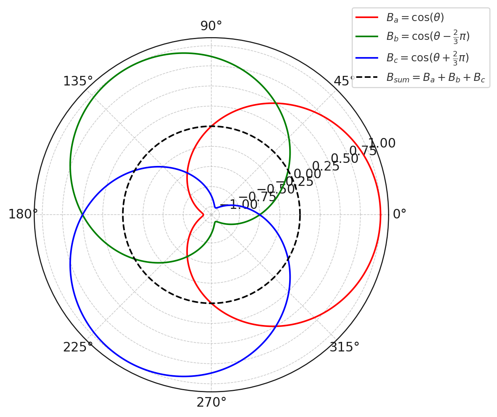

## 1. Review on DC Machine
The dynamics of DC Machines:

$$
\left\{\begin{aligned}
&V_a = R_a i_a + L_a \frac{d i_a}{dt} + e \\
&V_e = R_e i_e + L_e \frac{d i_e}{dt} \\
&e = K \psi_e \omega \\
&T = K \psi_e i_a \\
&T - T_\delta = J \frac{d \omega}{dt} (+ G \omega) \\
&\psi_e = L_e i_e
\end{aligned}\right.
$$

The system model for the DC machine is:
<figure markdown="span">
    { width="600" }
</figure>

Give the PI controller design for DC machine:
<figure markdown="span">
    { width="600" }
</figure>

!!! warning
    * Commonly we don't use the encoder to measure the speed because installing the speed sensor to the rotor part will lead to a vibration to the rotor. In this case, we need to improve our controller design without the speed sensor.
    * Between the controller and electrical machine there have the power converter, but we often ignore it because compared with the controll loop, the power converter module have a fast response.
    * The system is not fesiable when $\frac{1}{R_a + s L_a} = \frac{1}{sJ + G}$

If the DC machine is seperately excited, then the controller for the exciting loop should be:
<figure markdown="span">
    { width="600" }
</figure>

## 2. Magnetic Field of the Isotorpic Machines

### 2.1 Machines that have Concerntrated Windings
First we look at the isotorpic rotor electrical machine with concerntrated winding, which have a constant airgap around the machine:

<figure markdown="span">
    { width="300" }
</figure>

For the concerntrated windings, we only have one __magneticmotive force (MMF)__ source $\mathcal F$ around the machine, where
 
$$
\mathcal F = N_{turns}i
$$

When it is supplied by a constant current source, the MMF is a constant. It only changes the direction when the axis rotates to the opposite direction of magnetic field. So we can give the following relationship with respect to the axis angle:

<figure markdown="span">
    { width="400" }
</figure>

### 2.2 Machines that have Distributed Windings
For the distributed windings electical machine with the following diagram:

<figure markdown="span">
    { width="300" }
</figure>

Because the distributed winding allocation, the MMF of the circuit is the summation of each winding, so the MMF distribution gives a sinosodial like wave form:

<figure markdown="span">
    { width="300" }
</figure>

### 2.3 Flux Density Calculation for Concerntrated Windings
Because of the isotorpic rotor structure, the airgap is constant in all angle, so the reluctance of airgap $\mathcal R_g$ is also a constant. Thus we can draw the magnetic circuit of the electrical machine:

<figure markdown="span">
    { width="400" }
</figure>

The flux density have the following relationship with MMF:

$$
\begin{aligned}
\phi &= \frac{\mathcal F}{\mathcal R_{tot}}  = BS
\end{aligned}
$$

* $S$ is the corss sectional area of the magnetic circuit path

From the equation of reluctance, $\mathcal R = \frac{l}{\mu S}$, 

$$
B = \frac{\mu \mathcal F}{l}
$$

* $l$ is the length of the magnetic field path

Because the stator and rotor material have a very large permeability, we can know that $\mathcal R_g \gg \mathcal R_{s, r}$, thus we have $\mathcal R_{tot} \simeq 2 \mathcal R_g$, the airgap length $l_g$ is the same for all $\theta$, the flux density $B$ and MMF $\mathcal F$ has a linear relationship, $B$ and $\mathcal F$ have the same shape with respect to $\theta$. 

In reality, we ignore the higher harmonics of the waveform, and only look at the first harmonic (sinosodial wave), by using the __Fourier Transform (FT)__, we can get:

$$
\mathcal F(\theta) = \frac{4}{\pi} Ni \cos \theta
$$

Given the airgap length $l_g = \delta$, we can calculate the flux density:

$$
\begin{aligned}
B(\theta) &= \frac{\mathcal F(\theta)}{\mathcal R_{tot} S} \\
&= \underbrace{\frac{4}{\pi}\frac{\mu_0 Ni}{2\delta}}_{B_m} \cos \theta
\end{aligned}
$$

And we can draw $B(\theta)$ in the polar plot to see the flux density distribution:

<figure markdown="span">
    { width="300" }
</figure>

## 3. Phase Vector and Distributed Windings
Now we look at the distributed windings, assume there have one other winding have different angles with the primary winding, the angle between the two windings are $\alpha$,

<figure markdown="span">
    { width="400" }
</figure>

We can represent the flux density:

$$
\begin{aligned}
B_a(\theta) &= B_m \cos \theta = \Re(B_me^{-j\theta}) \\
B_b(\theta) &= B_m \cos (\theta - \alpha) = \Re(B_me^{-j(\theta - \alpha)})
\end{aligned}
$$

And for the winding $B$, there have:

$$
B_b(\theta) = \Re(B_me^{-j(\theta - \alpha)}) = \Re(\underbrace{B_me^{j\alpha}}_{\bar B_b}e^{-j\theta})
$$

If we let $\theta = 0$, thus, we have:

$$
\begin{aligned}
B_a(0) &= B_m \\
B_b(0) &= \bar B_b
\end{aligned}
$$

### 3.1 3 Phase Electrical Machine

For the 3 phase electrical machine, we have:

<figure markdown="span">
    { width="400" }
</figure>

Each phase has $120^\circ$ angle difference, For a constant input current $I_a = I_b = I_c$, we have:

$$
\begin{aligned}
B(\theta) &= \Re(\bar B_a e^{-j\theta}) + \Re(\bar B_b e^{-j\theta}) + \Re(\bar B_c e^{-j\theta}) \\
&= \Re((\bar B_a + \bar B_b + \bar B_c)e^{-j\theta})
\end{aligned}
$$

It is easy to find that within $120^\circ$ angle difference in electrical machine for each winding, there have, 

$$
\bar B_a + \bar B_b + \bar B_c = B_me^{j0} + B_me^{j(\frac23\pi)} + B_me^{j(-\frac23\pi)} = 0
$$

We can also draw this in the polar plot to have a better understanding of the flux distribution:

<figure markdown="span">
    { width="300" }
</figure>

If the input is a 3 phase current which gives:

$$
\begin{aligned}
i_a &= I_m \cos(\omega t) \\
i_b &= I_m \cos(\omega t + \frac23 \pi) \\
i_c &= I_m \cos(\omega t - \frac23 \pi)
\end{aligned}
$$

The flux density in the electrical machine is:

$$
\begin{aligned}
\bar B_a &= \frac{4}{\pi}\frac{\mu_0 NI_m \cos(\omega t)}{2\delta} \Re(e^{j0}) \\
&= \underbrace{\frac{4}{\pi}\frac{\mu_0 NI_m}{2\delta}}_{\bar B_m} \cos(\omega t) \\
&= \bar B_m \Re(e^{-j\omega t})
\end{aligned}
$$

Similarly, we can do this for other 2 phase windings, we have:

$$
\begin{aligned}
\bar B_a & = \bar B_m \Re(e^{-j\omega t}) \\
\bar B_b & = \frac12 \bar B_m \Re(e^{-j\omega t}e^{j(-\frac23\pi)}) \\
\bar B_c & = \frac12 \bar B_m \Re(e^{-j\omega t}e^{j\frac23\pi})
\end{aligned}
$$

Finally, we can get the summation of flux density, it rotates with respect to time:

$$
\begin{aligned}
B(\theta, t) &= \bar B_m\Re(( e^{-j\omega t} + \frac12 e^{-j\omega t}e^{-j\frac23\pi} + \frac12 e^{-j\omega t}e^{j\frac23\pi})e^{-j\theta}) \\
&= \frac32\bar B_m\Re(e^{-j\omega t}e^{-j\theta})
\end{aligned}
$$

And we can draw the figure for this calculation:

<figure markdown="span">
    { width="400" }
</figure>
