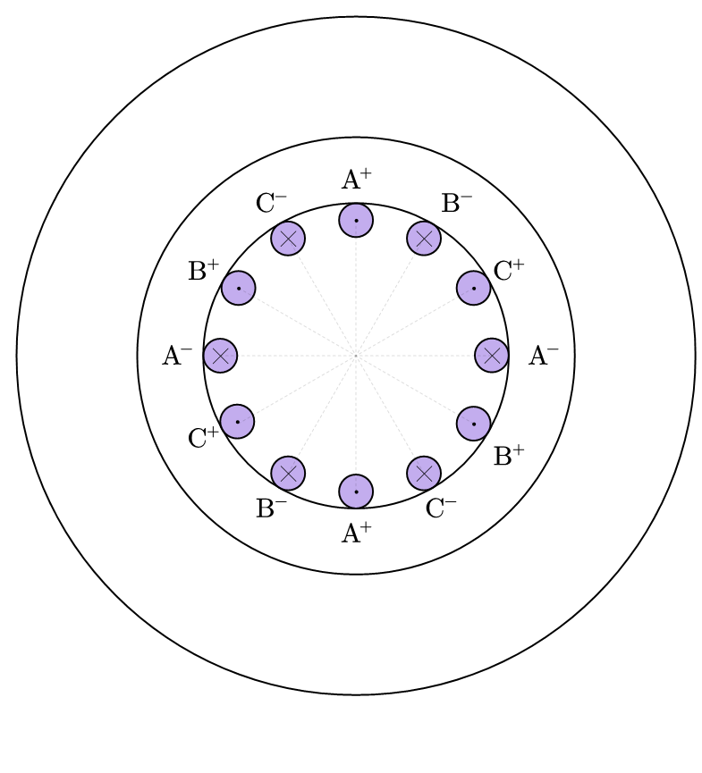

## 1. Review on Phase Vector

From last part, we already get the expression of flux density in a 3 phase machine, giving the current:

$$
\begin{aligned}
i_a &= I_m \cos(\omega t) \\
i_b &= I_m \cos(\omega t - \frac23 \pi) \\
i_c &= I_m \cos(\omega t + \frac23 \pi)
\end{aligned}
$$

The flux density is:

$$
\begin{aligned}
\bar B &= \frac{4}{\pi} \frac{N}{2\delta}(i_ae^{j0} + i_be^{j\frac23\pi} + i_ce^{j(-\frac23\pi)}) \\
&= \frac{4}{\pi} \frac{N}{2\delta} \underbrace{(\frac32 I_me^{j\omega t})}_{\bar i}
\end{aligned}
$$

Thus, we have: $\bar B = k \bar i$, where $\bar i$ is the current space vector. We let $\alpha = e^{j\frac23\pi}$, and we have the expression for $\bar i$:

$$
\bar i = i_a + \alpha i_b + \alpha^2 i_c
$$

And we can also do the same thing to the 3 phase voltage,

$$
\bar v = v_a + \alpha v_b + \alpha^2 v_c = \frac32V_me^{j(\omega t + \varphi)}
$$

## 2. Clarke Transform
By obtainning the current vector, we can simplify the 3 phase machine into 2 phase representation,

<figure markdown="span">
    { width="400" }
</figure>

And we have:

$$
\bar i = i_a + \alpha i_b + \alpha^2 i_c = i_\alpha + j i_\beta
$$

This transforms 3 phase current into 2 perpendicular current, which is called __Clarke Transform__, and we can also convert it back to 3 phase current:

$$
\begin{aligned}
i_a &= \frac23 \Re(\bar i e^{j0}) \\
i_b &= \frac23 \Re(\bar i e^{-j\frac23\pi}) \\
i_c &= \frac23 \Re(\bar i e^{j\frac23\pi}) \\
\end{aligned}
$$

This conversion is called __Inverse Clarke Transform__, with $i_a$, $i_b$ and $i_c$ have a equal amplitude to the real phase current. In reality, we will prefer to use equal power transform, because it is always easier to control the power than control the voltage and current. The equal power transformation gives:

$$
\begin{aligned}
\bar i &= \sqrt{\frac23}(i_a + \alpha i_b + \alpha^2 i_c) \\
\bar v &= \sqrt{\frac23}(v_a + \alpha v_b + \alpha^2 v_c)
\end{aligned}
$$

!!!info
    Proof:

    For equal power transformation, we have:

    $$
    \begin{aligned}
    P &= \Re(\bar v \cdot \underline i) \\
    &=\Re(\frac23(\frac32 V_me^{j(\omega t+\varphi)})(\frac32 I_me^{-j\omega t})) \\
    &=\Re(\frac32 I_mV_me^{j\varphi}) \\
    &=\frac32 I_mV_m \cos(\varphi)
    \end{aligned}
    $$

    * $\varphi$ is the electrical angle between $v$ and $i$
    * $\underline i$ is the conjugate vector of $\bar i$

    For the sinosoidal wave, there have: $V_m = \sqrt{2}V_{RMS}$, $I_m = \sqrt{2}I_{RMS}$,

    And the power is: $P = 3I_{RMS}V_{RMS} \cos(\varphi)$, which is the same as the 3 phase power

And the equal power inverse transform gives:

$$
\begin{aligned}
i_a &= \sqrt{\frac23} \Re(\bar i e^{j0}) \\
i_b &= \sqrt{\frac23} \Re(\bar i e^{-j\frac23\pi}) \\
i_c &= \sqrt{\frac23} \Re(\bar i e^{j\frac23\pi}) \\
\end{aligned}
$$

## 3. Induction Machine
### 3.1 Phase Vector Representation
For the induction machine, we have 3 phase windings for both stator and rotor, which gives:

* Stator:

    $$
    \begin{aligned}
    \bar i_s &= \sqrt{\frac23}(i_{as} + \alpha i_{bs} + \alpha^2 i_{cs}) \\
    \bar v_s &= \sqrt{\frac23}(v_{as} + \alpha v_{bs} + \alpha^2 v_{cs})
    \end{aligned}
    $$

* Rotor:

    $$
    \begin{aligned}
    \bar i_r &= \sqrt{\frac23}(i_{ar} + \alpha i_{br} + \alpha^2 i_{cr}) \\
    \bar v_r &= \sqrt{\frac23}(v_{ar} + \alpha v_{br} + \alpha^2 v_{cr})
    \end{aligned}
    $$

And we can perform the Clarke Transform for both stator part and rotor part:

<figure markdown="span">
    { width="400" }
</figure>

The phase vector voltage and current have following relationship:

$$
\bar v = R\bar i + \frac{d}{dt} \bar \psi
$$

* $R$ here represents phase resistance, which gives: $R = \begin{bmatrix} R_a&0&0 \\ 0&R_b&0 \\ 0&0&R_c\end{bmatrix}$

The equation for rotator and stator are the same:

$$
\begin{aligned}
\bar v_s^s &= R_s^s\bar i_s^s + \frac{d}{dt} \bar \psi_s^s \\
\bar v_r^r &= R_r^r\bar i_r^r + \frac{d}{dt} \bar \psi_r^r
\end{aligned}
$$

We short circuit the rotor part, there have:

$$
\bar v_r^r = R_r^r\bar i_r^r + \frac{d}{dt} \bar \psi_r^r = 0
$$

It is important to know that these equations exist only the equation for stator is referenced to the stator frame, and for the equation for rotor is referenced to the rotor frame.

!!! example
    To better explain induction machine, we can look at a rotating winding and magnetic model, 

    <figure markdown="span">
        { width="400" }
    </figure>

    We need to consider the following condition:

    * $\omega_m = 0$, $\omega \neq 0$:

        $$
        e = K\sin(\omega t) = \frac{d\psi}{dt}
        $$

    * $\omega_m < \omega$:

        $$
        e = \frac{d\psi}{dt} = K\sin((\omega-\omega_m) t)
        $$

    This shows that the changing flux linage has the relationship with rotating speed $\omega$.

### 3.2 Clarke Transform Frame Representation
We can do the Clarke Transform for the phase vector, and we can get the $\alpha$-$\beta$ axis representation for stator and rotor respectively:

$$
\begin{aligned}
(\Re): v_{s\alpha} &= R_s i_{s\alpha} + \frac{d}{dt} \psi_{s\alpha} \\
(\Im): v_{s\beta} &= R_s i_{s\beta} + \frac{d}{dt} \psi_{s\beta} \\
\end{aligned}
$$

Consider the condition $I_0 + \alpha I_0 + \alpha^2 I_0 = 0$, $I_0 \neq 0$, $I_0$ is __homopolar current__, which contributes a power that not generating mechanical rotations. 

For our design, homopolar current should be 0: $I_0 = \frac{i_a + i_b + i_c}{3} = 0$.

### 3.3 Park Transform for Induction Machine
Assuming for the stator part, the $\alpha$-$\beta$ axis have rotated a general angle $\theta_s$, the new frame we called d-q axis, and we continue rotate for $\theta_r$ to the rotor frame,

<figure markdown="span">
    { width="400" }
</figure>

Given the expression for stator voltage:

$$
\bar v_{s} = R_s \bar i_{s} + p \bar \psi_{s} \\
$$

* $p = \frac{d}{dt}$, for easy representation

And if we have a non $0$ phase angle for the phase vector $\bar v_{s}$, the phase angle is $\theta$, we have:

$$
\bar v_{sd} = \bar v_{s} e^{j\theta_s} = v_se^{j(\theta_s+\theta)}
$$

We substitude it into stator voltage representation:

$$
\begin{aligned}
\bar v_{s}e^{j\theta_s} &= R_s \bar i_{s}e^{j\theta_s} + p (\bar \psi_{s}e^{j\theta_s}) \\
&= R_s \bar i_{s}e^{j\theta_s} + e^{j\theta_s}p \bar \psi_{s} + j\dot \theta_s \bar \psi_{s}e^{j\theta_s}
\end{aligned}
$$

And we can eliminate all $e^{j\theta_s}$ term,

$$
\begin{aligned}
\bar v_{s} &= R_s \bar i_{s} + p \bar \psi_{s} + \underbrace{j\dot \theta_s \bar \psi_{s}}_{\text{motional term}}
\end{aligned}
$$

Similarly, for the rotor part,

$$
\begin{aligned}
\bar v_{r} &= R_r \bar i_{r} + p \bar \psi_{r} + j\dot \theta_r \bar \psi_{r}
\end{aligned}
$$

And for convient calculation, we often fixed stator frame to the phase $A$, thus, $\theta_s = 0$, $\theta_r = \theta_s - \theta_m = -\theta_m$, this rotates the rotator frame to the d-q axis, and we can get the representation for stator voltage and rotor voltage both in d-q axis:

$$
\begin{aligned}
\bar v_{s} &= R_s \bar i_{s} + p \bar \psi_{s} \\
\bar v_{r} &= R_r \bar i_{r} + p \bar \psi_{r} - j\dot \theta_m \bar \psi_{r}
\end{aligned}
$$

For the flux linkage, we have:

$$
\begin{aligned}
\bar \psi_s &= L_s \bar i_s + M \bar i_r \\
\bar \psi_r &= L_r \bar i_r + M \bar i_s \\
\end{aligned}
$$

* $L_s$, $L_r$ is the self-inductance of stator and rotor
* $M$ is the mutual inductance

For the above equation, we create a d-q axis for both stator and rotor, where the equivalent windings of the stator and rotor have no relative rotation, thus, the inductance between 2 coils is a constant value.

We can rewrite the equation:

$$
\begin{aligned}
\bar v_{s} &= R_s \bar i_{s} + L_s p\bar i_s + M p\bar i_r \\
\bar v_{r} &= R_r \bar i_{r} + L_r p\bar i_r + M p\bar i_s - j\dot \theta_m \bar \psi_r \\
\bar i_s &= i_se^{j\omega t} \\
\bar i_r &= i_re^{j\omega t}
\end{aligned}
$$

Replace $p\bar i_s$ and $p\bar i_r$, at steady steate, we have:

$$
\begin{aligned}
\bar v_{s} &= R_s \bar i_{s} + j\omega L_s \bar i_s + j\omega M \bar i_r \\
\bar v_{r} &= R_r \bar i_{r} + j\omega L_r \bar i_r + j\omega M \bar i_s - j\dot \theta_m \bar \psi_r = 0 \\
\end{aligned}
$$

### 3.4 Equivalent Circuit Model
To simplify the model, we can add extra terms for the induction machine equations:

$$
\begin{aligned}
&\left\{\begin{aligned}
\bar v_{s} &= R_s \bar i_{s} + L_s p\bar i_s + M p\bar i_r + Mp\bar i_s - Mp\bar i_s\\
\bar v_{r} &= R_r \bar i_{r} + L_r p\bar i_r + M p\bar i_s - j\omega_m \bar \psi_r + Mp\bar i_r - Mp\bar i_r \\
\end{aligned}\right. \\
\Rightarrow &\left\{\begin{aligned}
\bar v_{s} &= R_s \bar i_{s} + (L_s - M) p\bar i_s + M p(\bar i_s+\bar i_r)\\
\bar v_{r} &= R_r \bar i_{r} + (L_r - M) p\bar i_r + M p(\bar i_s+\bar i_r) - j\omega_m \bar \psi_r \\
\end{aligned}\right.
\end{aligned}
$$

With these equations, it is possible to draw the equivalent cirucit:

<figure markdown="span">
    { width="500" }
</figure>

Since we know that in the induction machine, the rotor circuit is short circuited, thus we have $\bar v_r = 0$:

We can define the slip ratio for the induction machine:

$$
X = \frac{\omega - \omega_m}{\omega_m}
$$

* $\omega$ is the electrical speed
* $\omega_m$ is the mechanical electrical speed

Rewrite the dynamic equation using this definition,

$$
\begin{aligned}
\bar \psi_r &= L_r \bar i_r + M \bar i_s \\
\bar v_{r} &= R_r \bar i_{r} + (L_r - M) p\bar i_r + M p(\bar i_s+\bar i_r) - j\omega_m \bar \psi_r \\
&= R_r \bar i_{r} + j\omega(L_r - M) \bar i_r + j\omega M (\bar i_s+\bar i_r) - j(\omega - X\omega)(L_r \bar i_r + M \bar i_s) \\
&= R_r \bar i_{r} + jX\omega\bar \psi_r  = 0\\
\end{aligned}
$$

Which gives: $-j\omega\bar \psi_r = \frac{1}{X} R_r \bar i_{r}$, and because $\omega_m = (1-X)\omega$, the replacement for the motional term is: $-j\omega_m\bar \psi_r = \frac{1-X}{X} R_r \bar i_{r}$. We can redraw the equivalent circuit:

<figure markdown="span">
    { width="500" }
</figure>

It is easy to find that the 2 resistors can be sumed together,

<figure markdown="span">
    { width="500" }
</figure>

### 3.5 Mechanical Charactistics
We look at the equivalent circuit below:

<figure markdown="span">
    { width="500" }
</figure>

From the euqivalent circuit, the mechanical power can be given:

$$
\begin{aligned}
P_m &= \Re(-j\omega_m\bar \psi_r \cdot \underline{i_r}) \\
&= -\Im(\omega_m\bar \psi_r \cdot \underline{i_r}) \\
&= -\omega_m\Im(\bar \psi_r \cdot \underline{i_r})
\end{aligned}
$$

* $\underline{i_r}$ is the conjugate current of $\bar i_r$.

We consider the number of pole pairs $n_p$, and we look back at the machine structure,

When $n_p$ = 1,

<figure markdown="span">
    { width="400" }
</figure>

We can find for each winding, when the current moves for $180^\circ$, the current vector will change the direction, which will also rotates for $180^\circ$ degree,

<figure markdown="span">
    { width="400" }
</figure>

And when $n_p = 2$, the structure looks like:

<figure markdown="span">
    { width="400" }
</figure>

When the current moves for $180^\circ$ degree, the current will move to a horizontal axis, which gives $90^\circ$ rotation, is $\frac12 \omega t$.

<figure markdown="span">
    { width="400" }
</figure>

And we know that $\omega_m = (1 - X)\omega$, it has no relationship to the polepairs, it only relevant to the electrical speed and slip ratio. Thus, we can give the mechanical speed of the induction machine:

$$
\Omega_m = \frac{\omega_m}{n_p}
$$

For the mechanical power, 

$$
P_m = -\omega_m\Im(\bar \psi_r \cdot \underline{i_r}) = T\Omega_m = T\frac{\omega_m}{n_p}
$$

### 3.6 Reduced Parameters for Induction Machine
We can introduce new parameters that not changing the power,

$$
\frac{v_r^*}{v_r} = \frac{i_r}{i_r^*} =\frac{\psi_r^*}{\psi_r} = k
$$

There have: $v_r i_r = v_r^*i_r^*$.

Recall on the voltage equation:

$$
\left\{\begin{aligned}
\bar v_{s} &= R_s \bar i_{s} + (L_s - M) p\bar i_s + M p(\bar i_s+\bar i_r)\\
\bar v_{r} &= R_r \bar i_{r} + (L_r - M) p\bar i_r + M p(\bar i_s+\bar i_r) - j\omega_m \bar \psi_r \\
\end{aligned}\right.
$$

Within the above equation, we can have the new parameter equations:

$$
\begin{aligned}
\frac{v_r^*}{k} &= R_r ki_r^* + (L_r - M) pki_r^* + M p(\bar i_s+ki_r^*) - j\omega_m \bar \psi_r \\
v_r^* &= R_r k^2i_r^* + (L_r - M) pk^2i_r^* + M p(k\bar i_s+k^2i_r^*) - jk\omega_m \bar \psi_r \\
&= R_r k^2i_r^* + L_rpk^2i_r^* + Mpk\bar i_s - jk\omega_m \bar \psi_r + Mpki_r^* - Mpki_r^* \\
&= R_r k^2i_r^* + (k^2L_r - kM)pi_r^* + kM(\bar i_s + i_r^*) - jk\omega_m \bar \psi_r
\end{aligned}
$$

If we select $k = \frac{M}{L_r}$,

$$
v_r^* = R_r k^2i_r^* + kM(\bar i_s + i_r^*) - jk\omega_m \bar \psi_r
$$

And for $\bar v_s$, we have:

$$
\begin{aligned}
\bar v_{s} &= R_s \bar i_{s} + (L_s - M) p\bar i_s + M p(\bar i_s+ki_r^*) \\
&= R_s \bar i_{s} + (L_s - kM) p\bar i_s + kM p(\bar i_s+i_r^*)
\end{aligned}
$$

We can draw the equavalent circuit:

<figure markdown="span">
    { width="400" }
</figure>

* $L_{ks} = L_s - kM$

