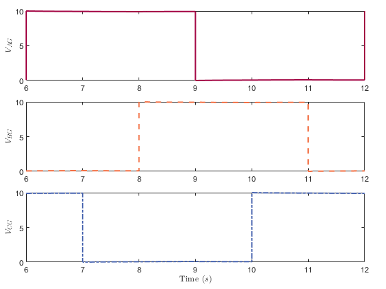
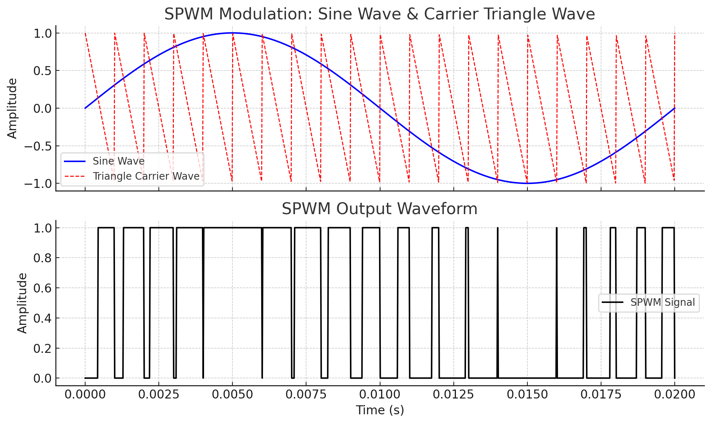
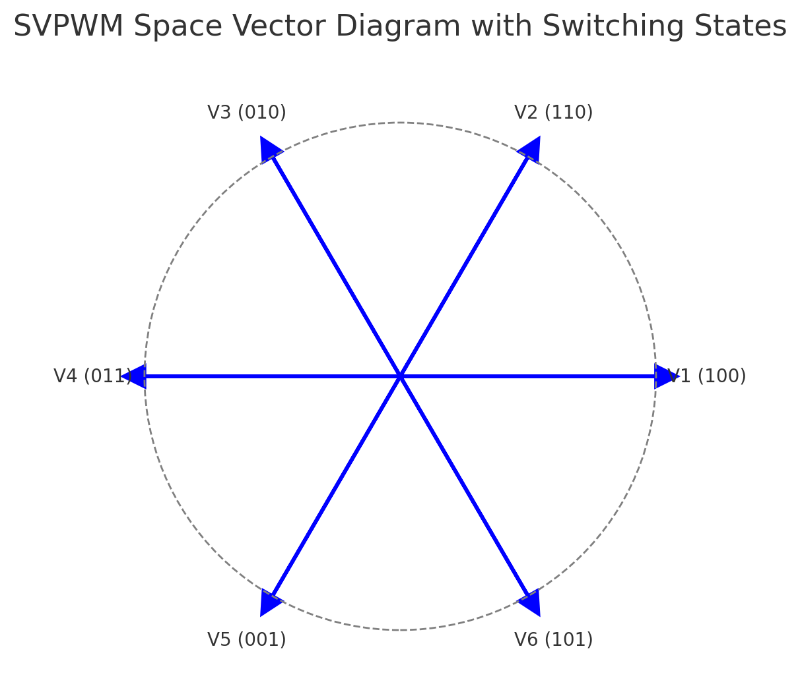

## 1. Review on 4 Parameter Model of Induction Machine

Give the stator and rotor representation:

$$
\begin{aligned}
\bar v_s &= R_s \bar i_s + p \bar \psi_s + j\dot \theta_s \bar \psi_s \\
\bar v_r &= 0 = R_r \bar i_r + p \bar \psi_r + \dot \theta_s \bar \psi_r \\
\bar \psi_s &= L_{ks}\bar i_s + \bar \psi_r \\
\bar \psi_r &= M\bar (i_s + \bar i_r) \\
T &= n_p \Im(\bar \psi_r \underline {i_r})
\end{aligned}
$$

From these equations, we can get: $\bar i_r = \frac{\bar \psi_r}{M} - \bar i_s$, And we substitute the equation into $v_s$ and $v_r$:

$$
\begin{aligned}
\bar v_s &= R_s \bar i_s + p(L_{ks}\bar i_s + \psi_r) + j\dot \theta_s (L_{ks}\bar i_s + \psi_r) \\
0 &= R_r (\frac{\bar \psi_r}{M} - \bar i_s) + p \bar \psi_r + j\dot \theta_r \bar \psi_r \\
\end{aligned}
$$

!!! bug
    missing equation

And we can further simplify the equation:

!!! bug 
    incorrect equation

    $$
    \begin{aligned}
    \bar v_s &= R_s \bar i_s + p(L_{ks}\bar i_s + \psi_r) + j\dot \theta_s (L_{ks}\bar i_s + \psi_r) \\
    &= R_s \bar i_s + L_{ks}p\bar i_s + (R_r \bar i_s - \frac{R_r\bar \psi_r}{M} - j\dot \theta_r \bar \psi_r) + j\dot \theta_s L_{ks}\bar i_s + j\dot \theta_s \bar \psi_r\\
    \psi_r &= R_r \bar i_s(\frac{\bar \psi_r}{M} - \bar i_s) + p \bar \psi_r + \dot \theta_r \bar \psi_r \\
    \end{aligned}
    $$

!!! bug 
    missing equation

And we can get the equation of induction machine:

$$
\begin{aligned}
\bar v_s &= (R_s + R_r)\bar i_s + L_{ks}p\bar i_s - \frac{R_r\bar \psi_r}{M} + j\dot \theta_s L_{ks}\bar i_s + j\dot \theta_m \bar \psi_r \\
p\bar\psi_r &= R_r \bar i_s - \frac{R_r \bar \psi_r}{M} - j\dot \theta_r \bar \psi_r \\
\end{aligned}
$$

$$
\begin{aligned}
p\psi_r &= R_r i_{sd} - \frac{R_r \psi_r}{M} \\
0 &= R_r i_{sq} - \dot\theta_r\psi_r \\
\dot\theta_r &= \frac{R_r \bar \psi_r}{M}
\end{aligned}
$$

It's possible to control the flux just controlling the input current $i_{sd}$.

And we have:

$$
\begin{aligned}
T &= n_p\Im(\bar\psi_r \underline{i_r}) = n_p\Im(\bar\psi_r(\frac{\underline{\psi_r}}{M}\underline{i_s})) = n_p\Im(-\bar\psi_r\underline{i_s}) = n_p\Im(\bar i_s \psi_r) = n_p\Im((i_{sd}+ji_{sq})\psi_r) = n_p i_{sq} \psi_r\\
\end{aligned}
$$

The final equation are:

$$
\begin{aligned}
v_{sd} &= \underbrace{R_k}_{R_s+R_r} i_{sd} + L_{ks}pi_{sd} - \frac{R_r}{M}\psi_r - \dot\theta_s L_{ks}i_{sq} \\
v_{sq} &= R_k i_{sq} + L_{ks}pi_{sq} + \dot\theta_s L_{ks}i_{sd} + \dot\theta_m\psi_r
\end{aligned}
$$

## 2. Controller Design for Induction Machine
Within $v_{sd}$ and $v_{sq}$, we can draw the scheme for induction machine:

<figure markdown="span">
    { width="400" }
</figure>

We can design the PI controller for dq axis,

<figure markdown="span">
    { width="600" }
</figure>

Within the 3 phase power inverter, we can supply the 3 phase voltage to the induction machine within the DC voltage source.

<figure markdown="span">
    { width="400" }
</figure>

!!! bug
    missing figure

And the summation of the voltage is: $V_{AG} + V_{BG} + V_{CG} = 0$

* $V_{AG} = V_{AN} - V_{NG}$
* $V_{BG} = V_{BN} - V_{NG}$
* $V_{CG} = V_{CN} - V_{NG}$

!!! bug
    missing figure

And this technique is called __6-step modulation__.

To get the measured dq axis voltage and current, we need to measure the 3 phase voltage and current and apply the park transform to it.

$$
\bar i_s = \sqrt{\frac23}(i_a + \alpha i_b + \alpha^2 i_c)e^{-j\dot \theta_s}
$$

We can express this in matrix form:

$$
\begin{bmatrix}
i_\alpha \\ i_\beta \\ i_0
\end{bmatrix} = \sqrt{\frac23}\begin{bmatrix} 
1&-\frac12&-\frac12 \\
0&\frac{\sqrt3}{2}&\frac{\sqrt3}{2} \\
\frac{\sqrt2}{2}&\frac{\sqrt2}{2}&\frac{\sqrt2}{2}
\end{bmatrix} \begin{bmatrix} 
i_a \\ i_b \\ i_c
\end{bmatrix}
$$

And for park transform, we have:

$$
\begin{bmatrix}
i_d \\ i_q \\ i_0
\end{bmatrix} = \sqrt{\frac23}
\begin{bmatrix} 
\cos\theta & \sin\theta & 0 \\
-\sin\theta & \cos\theta & 0 \\
0 & 0 & 1 \\
\end{bmatrix} 
\begin{bmatrix}
i_\alpha \\ i_\beta \\ i_0
\end{bmatrix} = 
\begin{bmatrix} 
\cos\theta & \sin\theta & 0 \\
-\sin\theta & \cos\theta & 0 \\
0 & 0 & 1 \\
\end{bmatrix} 
\begin{bmatrix} 
1&-\frac12&-\frac12 \\
0&\frac{\sqrt3}{2}&\frac{\sqrt3}{2} \\
\frac{\sqrt2}{2}&\frac{\sqrt2}{2}&\frac{\sqrt2}{2}
\end{bmatrix}
\begin{bmatrix} 
i_a \\ i_b \\ i_c
\end{bmatrix}
$$

To perform the inverse transform, we use the inverse matrix to do so.

## 3. SPWM
To generate the sinusoidal wave, we compare the sinusoidal wave with the triangular wave using the comparator, and the output is SPWM wave：

<figure markdown="span">
    { width="500" }
</figure>

## 4. SVPWM
Another modulation method is space vector modulation, it base on the real inverter design only have 6 different steps, we have 6 MOSFET, and we control it in 3 control signals: $S_1$, $S_2$ and $S_3$, which was shown in the figure:

<figure markdown="span">
    { width="400" }
</figure>

The switch state have the following relationship to the space vector:

<figure markdown="span">
    { width="400" }
</figure>

## 5. Estimator Design

Since we cannot measure the flux in the airgap, and the stator angle, we need to design an estimator to get $\psi_r$ and $\theta_s$,

$$
\begin{aligned}
\theta_s &= \theta_r + \theta_m \\
\dot \theta_s &= \dot \theta_r + \dot \theta_m
\end{aligned}
$$

There have 2 main estimators for induction machine $I$-$\Omega$ and $V$-$I$ estimators.

1. For the $I$-$\Omega$ estimator, 

    we measured 3 phase current and transformed them into $i_{sd}$ and $i_{sq}$. 

    From the equation $p\psi_r = R_r i_{sd} - \frac{R_r}{M}\psi_r$, we get $\psi_r$. And from equation:

    $$
    \begin{aligned}
    0 &= R_r i_{sq} - (\dot \theta_s - \dot \theta_m)\psi_r \\
    \dot\theta_s &= \frac{R_ri_{sq}}{\psi_r} + \dot \theta_m
    \end{aligned}
    $$

    We can calculate the stator speed $\dot \theta_s$ and integrating it, we can get $\theta_s$, the whole estimator block have the schematic:

    <figure markdown="span">
        { width="600" }
    </figure>

2. $V$-$I$ estimator:

    $$
    \begin{aligned}
    v_{s\alpha} &= R_s i_{s\alpha} + p\psi_\alpha \\
    v_{s\beta} &= R_s i_{s\beta} + p\psi_\beta
    \end{aligned}
    $$

    And we know: 

    $$
    \theta_s = atan(\frac{\psi_{s\beta}}{\psi_{s\alpha}})
    $$

    Where:

    $$
    \begin{aligned}
    \bar\psi_{s} &= \bar\psi_r+L_{ks}\bar i_s \\
    \bar\psi_{\alpha\beta} &= \bar\psi_{s\alpha\beta}+L_{k}\bar i_{s\alpha\beta}
    \end{aligned}
    $$

    And we can draw the schematics:
    <figure markdown="span">
        { width="600" }
    </figure>

## 6. Scalar Control (V/F Control)
We start from the voltage equation:

$$
\begin{aligned}
v_{sq} &= \underbrace{R_si_{sq} + L_{ks}i_{sq} + \theta_s L_{ks}i_{sq}}_{\text{voltage drop on} Z_s} + \underbrace{\dot \theta_m \psi_r}_{EMF} \\
\end{aligned}
$$

<figure markdown="span">
    { width="600" }
</figure>

<figure markdown="span">
    { width="300" }
</figure>

## 7. DSC/DTC
!!! bug
    missing figure

### 7.1 Direct Self Control

* Fix reference frame

$$
\bar v_s \simeq \frac{d\psi_s}{dt} \Rightarrow \Delta \bar \psi_s \simeq \bar v_s \Delta t
$$

It is impossible to follow the circle strictly, we can define the upper boundary and lower boundary to make flux move between 2 circles.

<figure markdown="span">
    { width="400" }
</figure>