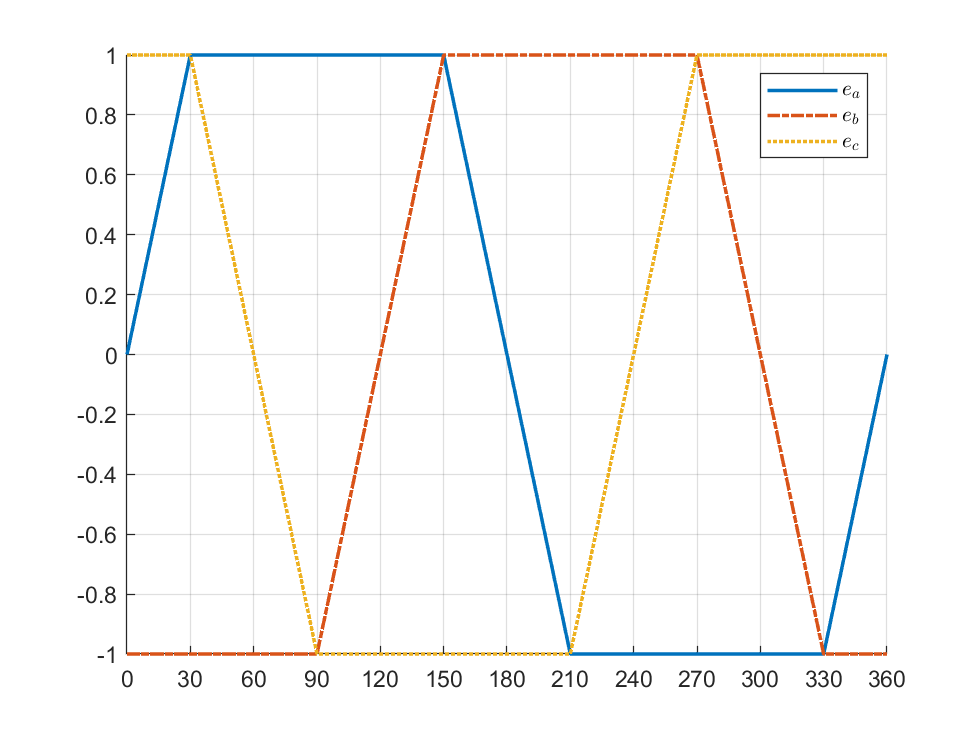

## 1. AC Brushless, DC Brushless and Switch Reluctance Machine
BLDC, BLAC and SR Machines are all synchronous machines, 

* BLDC and BLAC are the machine within permanent magnet, SR machine does not have permanent magnets
* BLDC is the PMSM that optimized the design for apply the DC controller
* BLAC is the PMSM that optimized the design for apply the AC controller

### 1.1 The difference between BLAC and BLDC

|BLAC|BLDC|
|----|----|
|distributed winding|concentrated winding|
|sinusoidal wave magnetic field|triangular wave magnetic field|
|sinusoidal wave EMF|square wave EMF|

## 2. Surface Mounted PMSM

For BLAC machine the magnetic field have sinusoidal waveform, with a surface mounted structure, to obtain this magnetic field, the field strength of the magnetic is different in different position,

## 3. Internal Mounted PMSM

$$
\begin{aligned}
\bar v_s &= R_s \bar i_s + p \bar \psi_s \\
\bar \psi_s &= L_s \bar i_s + \bar \psi_{pm}
\end{aligned}
$$

at steady state, 

$$
\bar v_s = R_s \bar i_s + p(L_s \bar i_s + \bar \psi_{pm}) = R_s \bar i_s + j\omega L_s \bar i_s + j\omega \bar \psi_{pm}
$$

$$
\begin{aligned}
\psi_{sd} &= L_d i_{sd} +\psi_{pm} \\
\psi_{sq} &= L_q i_{sq} \\
L_d &\gg L_q
\end{aligned}
$$

## 4. FOC Control
The dynamics of synchronous machine is:

$$
\begin{aligned}
\bar v_s &= R_s \bar i_s + p \bar \psi_s \\
\bar v_s &= R_s \bar i_s + p \bar \psi_s + j \dot \theta_s \bar \psi_s \\
&= R_s \bar i_s + p \bar \psi_s + j \dot \theta_m \bar \psi_s \\
\end{aligned}
$$

For dq axis, there have:

$$
\begin{aligned}
v_d + jv_q &= R_s(i_{sd} + ji_{sq}) + p(\psi_{sd} + j\psi_{sq}) + j\dot \theta_m(\psi_{sd} + j\psi{sq}) \\
\psi_{sd} &= L_{sd}i_{sd} + \psi_{pm} \\
\psi_{sq} &= L_{sq}i_{sq} \\
v_d + jv_q &= R_si_{sd} + jR_si_{sq} + p\psi_{sd} + jp\psi_{sq} + j\dot \theta_m(L_{sd}i_{sd} + \psi_{pm} + jL_{sq}i_sq) \\ \hfill \\
\Rightarrow&\left\{\begin{aligned}
v_{sd} &= R_si_{sd} + L_{sd}pi_{sd} - \dot \theta_m L_{sq}i_{sq} \\ 
v_{sq} &= R_si_{sq} + L_{sq}pi_{sq} + \dot \theta_m L_{sd}i_{sd} + \psi_{pm}\dot \theta_m
\end{aligned}\right.
\end{aligned}
$$

$$
\Re(\bar v_s i_s) = \Re(R_s \bar i_s \bar i_s^*) + \Re(p\psi_s \bar i_s^*) + \Re(j\dot \theta_m \bar \psi_s \bar i_s^*)
$$

$$
\begin{aligned}
P_m &= -\dot \theta_m \Im(\bar i_s \bar i_s^*) \\
&= -\dot \theta_m \Im(L_{sd}i_{sd} + \psi_{pm} + jL_{sq}i_{sq})(i_{sd} - ji_{sq}) \\
&= -\dot \theta_m \Im(L_{sd}i_{sd}^{2} + \psi_{pm}i_{sd} + j(L_{sq}i_{sq}i_{sd} - \psi_{pm}i_{sq} + L_{sq}i_{sq}^{2} - L_{sd}i_{sd}i_{sq})) \\
&= -\dot \theta_m \Im(L_{sd}i_{sd}^2 + L_{sd}i_{sq}^2 + \psi_{pm}i_{sd} + j(-\psi_{pm}i_{sq} + (L_{sq} - L_{sd})i_{sd}i_{sq}))
\end{aligned}
$$

$$
\begin{aligned}
v_{sd} + jv_{sq} &= j \dot \theta_m (L_{sd}i_{sd} + \psi_{pm} + j L_{sq}i_{sq}) \\
&=  j \dot \theta_m L_{sd} i_{sd} +  j \dot \theta_m \psi_{pm} - \dot \theta_m L_{sq} i_{sq} \\
v_{sd} &= - \dot \theta_m L_{sq} i_{sq} \\
v_{sq} &= \dot \theta_m L_{sd}i_{sd} + \dot \theta_m \psi_{pm}
\end{aligned}
$$

We consider $L_{sd} = L_{sq}$, and we let $i_{sd} = 0$

!!! warning
    Not all PMSM can apply the field weakening control, if the hysteresis is nonlinear, after many times of magnetizing and demagnetizing, the magnetics will loss its magnetic field.

## 5. BLDC Machine Control

### 5.1 2-Phase Working Condition
$$
\begin{aligned}
\psi &= \int_{\frac{-\pi}{2}}^{\frac{\pi}{2}} B(\theta)Rld\theta = BRl\int_{\frac{-\pi}{2} + 2\theta_m}^{\frac{\pi}{2}}d\theta \\
&= BRl(\pi - 2\theta_m)
\end{aligned}
$$

The flux have a triangular shape, and because $e = p\psi$, the EMF have a square wave shape. And because the flux cannot have a perfect triangular wave, we approximate the EMF with trapezoidal wave. When designing the BLDC machine, it is necessary to make sure there have $120^\circ$ constant part.

<figure markdown="span">
    { width="400" }
</figure>

The power of the BLDC have:

$$
\begin{aligned}
P &= e_a i_a + e_b i_b + e_c i_c \\
&= 2K_e \Omega_m I_c
\end{aligned}
$$

And the generated torque have:

$$
T = \frac{P}{\Omega_m} = 2K_e I_c
$$

So we only need 3 hall sensor to identify the position of the rotor

### 5.2 3-Phase Working Condition
$$
\begin{aligned}
&\begin{aligned}
&V_{DC} = R_s i_b + L_s pi_b + e_b - e_a -L_s pi_a - R_s i_a \\
&0 = R_s i_a + L_s pi_a + e_a - e_c - L_s pi_c -R_s i_c \\
&i_a + i_b + i_c = 0
\end{aligned} \\
\Rightarrow
0 &= R_s i_a + L_s pi_a + e_a - e_c - L_s p(-i_a -i_b) - R_s(-i_a -i_b) \\
L_s pi_b + R_s i_b &= -2R_s i_{sa} - 2L_s i_{sa} + e_c - e_a \\
V_{DC} &= -2R_s i_{sa} - 2L_s i_{sa} + e_c - e_a + e_b - e_a - L_s pi_a - R_s i_a\\
V_{DC} &= -3R_s i_{sa} - 3L_s i_{sa} - 2k\Omega_m \\
R_s i_{sa} + L_s i_{sa} &= \frac{V_{DC} + 2k\Omega_m}{3} \\
R_s i_{sb} + L_s i_{sb} &= \frac{2V_{DC} - 2k\Omega_m}{3} \\
\end{aligned}
$$

When phase A and phase B have the same speed of transient,

$$
-\frac{V_{DC} + 2k\Omega_m}{3} = \frac{2V_{DC} - 2k\Omega_m}{3}
$$